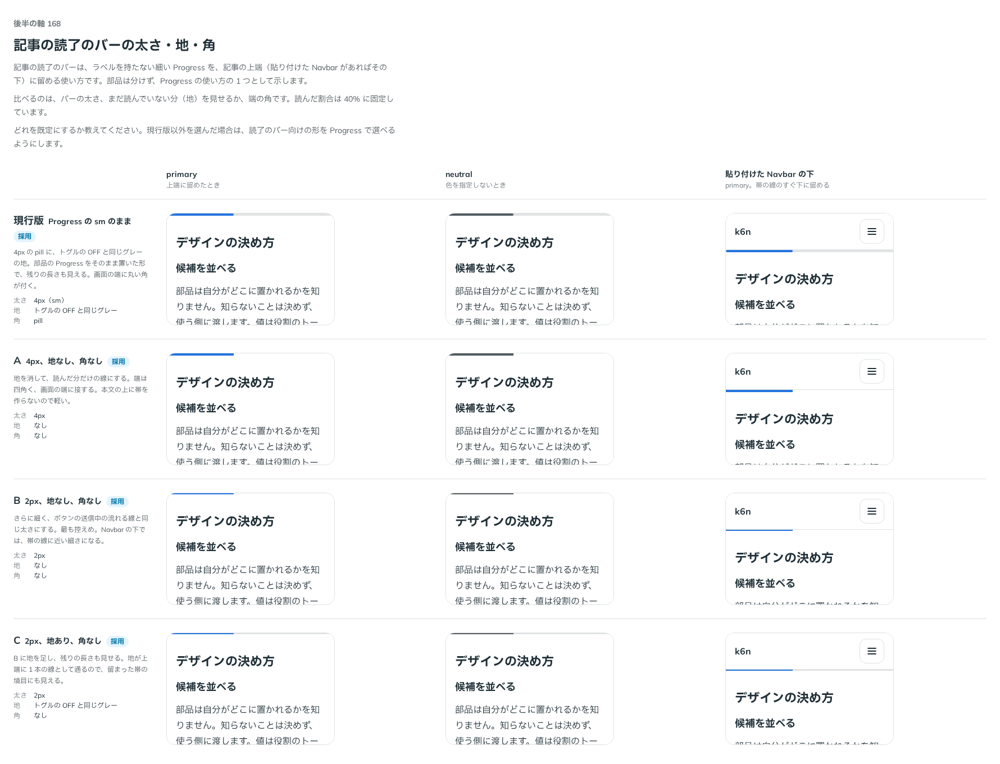

# 0185. 記事の読了のバー

- ステータス: Accepted
- 日付: 2026-09-20
- ラウンド: 後半 軸168

## 背景

記事をどれだけ読んだかを、上端に留めた細いバーで見せる「読了のバー」を、部品にするか、既存の部品の使い方として示すかを決めます。あわせて、太さ・地・端の角を決めます。読了のバーは、ラベルを持たない細い Progress（`size="sm"`）を Affix で上端に留める使い方で作りました。読んだ割合は 40% に固定して比べました。

## 候補

読了のバーを部品にするか

| 案  | 内容                                                       |
| --- | ---------------------------------------------------------- |
| 1   | 部品にせず、Progress＋Affix の使い方として Docs に例を置く |

太さ・地・端の角

| 案     | 内容                                                               |
| ------ | ------------------------------------------------------------------ |
| 現行版 | 4px（`size="sm"`）・地あり（トグルの OFF と同じグレー）・端は pill |
| A      | 4px・地なし・端は角なし                                            |
| B      | 2px・地なし・端は角なし                                            |
| C      | 2px・地あり・端は角なし                                            |

primary（上端に留めたとき）・neutral（色を指定しないとき）・貼り付けた Navbar の下の 3 列で比べました。

## 決定

**読了のバーは部品にせず、Progress を Affix で上端に留める使い方として Docs に例を置きます。** 太さ・地は、**既定を 4px・地ありとし、太さ 2px（`size="xs"`）と地なし（`track={false}`）を選べるようにします。** 端の角は、**丸めない形（`shape="square"`）だけにします。** 現行版の pill な角は、読了のバーの使い方としては選べる形にしません。

## 理由

ユーザーの返事の原文です。

> 1: OK です

> 168: デフォルト4px地あり、2px/4px選択可、地ありなし選択可

端の形は、軸 167 の返事と同じやり取りの中で確かめました（「角なしのみで」）。

> 167: しましまのDを選べるようにしたいです。Eはなしよりですが、一応選択肢として。角なしのみで。color は secondary もありで。

- **部品にしない理由**: 返事のとおりです。Progress の色・太さ・地の props をそのまま使い、Affix で上端に留めるだけで作れるので、新しい部品は要りません
- **既定 4px・地ありの理由**: 返事のとおりです。太さと地があるほうが、まだ読んでいない分も見え、既存の Progress の見た目に近く軽い直しで済みます
- **2px・地なしも選べる理由**: 返事のとおりです。もっと控えめにしたい記事に応えます
- **端は角なしだけの理由**: 訂正の返事のとおりです。画面の端に接する線なので、丸い端が浮いて見えないようにします。現行版の pill は、読了のバーの使い方としては選びません

## 却下した案と理由

- 現行版の端（pill）: 画面の端に接する線として、丸い角が浮いて見えるため、読了のバーの使い方としては選べる形にしません

## 影響

- `src/components/progress/Progress.tsx`: `size`（`ProgressSize` に `xs`（2px）を足す。`sm`・`md`・`lg` は `internal/bar` と共有）・`track`（既定 `true`）・`shape`（`round`（既定）・`square`）
- `src/components/progress/reading-scene.tsx`: `ReadingProgress`（読了のバーの見本。`shape="square"`・`showValue={false}`・`aria-hidden` を固定し、`color`・`size`・`track` は使う側が選ぶ）を Docs の例として置きます。部品としては公開しません（`src/index.ts` に足しません）
- `design/tokens.css`: `--progress-height-xs` を Progress の区画に持ちます
- **原則にない判断**（backlog に残す）: 終わった（`value` が `max`）ときも見た目は変えない。読了のバーは読み上げから外す（`aria-hidden`）

## 原則への反映

反映なし。原則 20（部品は知らないことを決めない。既定を 1 つ決め、ほかの形は選べるようにする）の範囲内の決定です。

## 比較画像

比較のストーリーは決めた時点のコミット `f4d5aef` にあります（端を角なしだけにする訂正は `3ffbb98` の時点）。`git checkout f4d5aef && pnpm storybook` で開けます。

