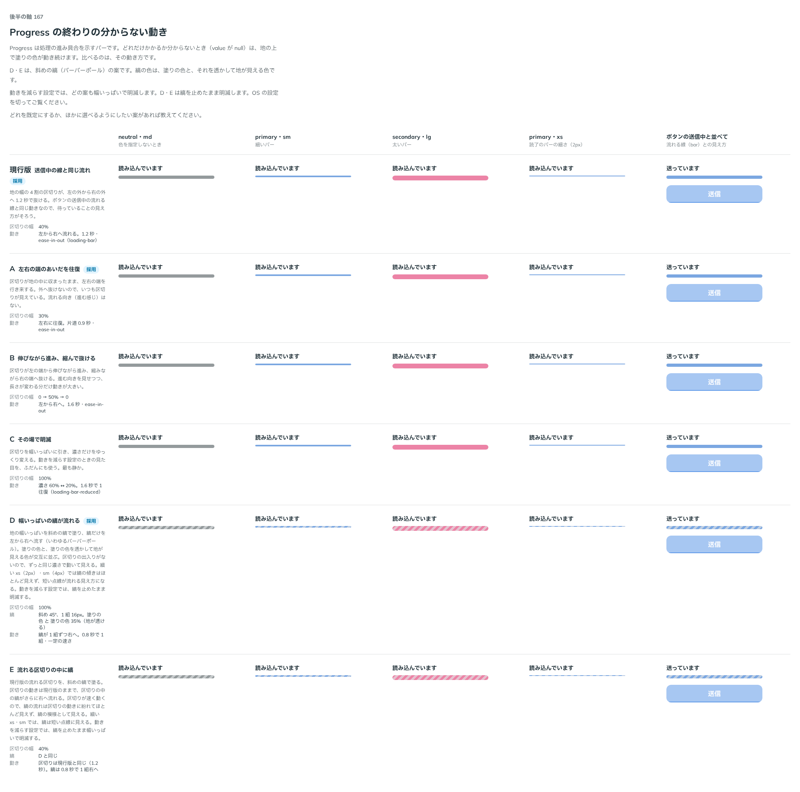

# 0186. 終わりの分からない Progress の動き

- ステータス: Accepted
- 日付: 2026-09-20
- ラウンド: 後半 軸167（第 2 ラウンド）

## 背景

Progress は処理の進み具合を示すバーです。どれだけかかるか分からないとき（`value` が `null`）は、地の上で塗りの色が動き続けます。その動き方を決めます。動きを減らす設定では、どの案も幅いっぱいで明滅します（[原則 14](../principles.md#14-動きは手応えと待ちを伝える)）。

はじめのラウンドで現行版（送信中の線と同じ流れ）・A（左右の端を往復）・B（伸びながら進み縮んで抜ける）・C（その場で明滅）を比べたところ、しましま（バーバーポール）の案も見たいという返事があり、D（幅いっぱいの縞が流れる）・E（流れる区切りの中に縞）を足して第 2 ラウンドで比べ直しました。

## 候補

| 案     | 内容                                                                               |
| ------ | ---------------------------------------------------------------------------------- |
| 現行版 | 地の幅の 4 割の区切りが、左の外から右の外へ 1.2 秒で抜ける（送信中の線と同じ動き） |
| A      | 区切りが地の中に収まったまま、左右の端を行き来する（往復）                         |
| B      | 区切りが左の端から伸びながら進み、縮みながら右の端へ抜ける                         |
| C      | 区切りを幅いっぱいに引き、濃さだけをゆっくり変える（その場で明滅）                 |
| D      | 地の幅いっぱいを斜めの縞で塗り、縞だけを左から右へ流す（バーバーポール）           |
| E      | 現行版の流れる区切りを、斜めの縞で塗る                                             |

neutral・md（色を指定しないとき）・primary・sm（細いバー）・secondary・lg（太いバー）・primary・xs（読了のバーの細さ）・ボタンの送信中と並べての 5 列で比べました。

## 決定

**現行版（送信中の線と同じ流れ。`animation="sweep"`）を既定とし、A（往復。`shuttle`）・D（幅いっぱいの縞が流れる。`stripes`）も選べるようにします。** B・C・E は選べる形にしません。

## 理由

ユーザーの返事の原文です。

はじめのラウンド:

> 167: デフォルト現行、しましまってできますか？見てみたいです

第 2 ラウンドで D・E を足したあとの返事です。

> 167: しましまのDを選べるようにしたいです。Eはなしよりですが、一応選択肢として。角なしのみで。color は secondary もありで。

訂正の返事です。

> 現行、A、しましま流れる、ですかね

- **現行版を既定に**: ボタンの送信中の流れる線と同じ動きなので、待っていることの見え方がそろいます
- **A（往復）も選べる理由**: はじめのラウンドから、B・C より軽い動きとして残っていました
- **D（幅いっぱいの縞）も選べる理由**: 返事のとおりです。長く待つ処理で、止まっていないことをはっきり見せたいときに使えます
- **E を選ばない理由**: いったん「一応選択肢として」との返事がありましたが、訂正で外れました。区切りの動きに縞の流れが紛れて見分けにくいことも確かめました
- **B・C を選ばない理由**: どちらの返事にも挙がりませんでした

## 却下した案と理由

- B（伸びながら進み縮んで抜ける）: 返事に挙がらず、選ばれませんでした
- C（その場で明滅）: 返事に挙がらず、選ばれませんでした。動きを減らす設定の見た目をふだんにも使う案でしたが、ふだんの動きとしては静かすぎました
- E（流れる区切りの中に縞）: いったん候補に挙がりましたが、訂正で外れました。区切りの動きが速く、縞の流れがほとんど見えません

## 影響

- `src/components/progress/Progress.tsx`: `animation`（`ProgressAnimation`。`sweep`（既定）・`shuttle`・`stripes`）
- `design/tokens.css`: `--progress-sweep-width`・`--progress-shuttle-width`・`--progress-shuttle-animation`・`--progress-stripe-size`・`--progress-stripes`・`--progress-stripes-animation` を Progress の区画に持ちます。B・C・E を比べるためだけに置いていたトークンは畳みました
- Progress のストーリーに `animation` の一覧を足しました

## 原則への反映

反映なし。原則 14（動きは手応えと待ちを伝える。動きを減らす設定でも伝えることは減らさない）の範囲内の決定です。

## 比較画像

比較のストーリーは決めた時点のコミット `3ffbb98` にあります。`git checkout 3ffbb98 && pnpm storybook` で開けます。

