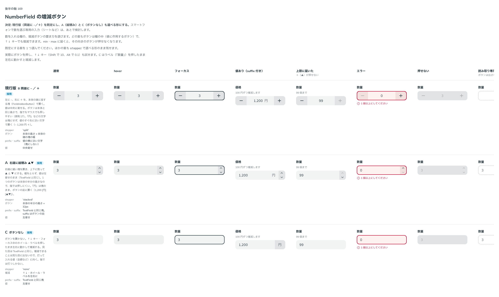

# 0188. NumberField の増減ボタン

- ステータス: Accepted
- 日付: 2026-09-20
- ラウンド: 後半 軸169

## 背景

NumberField（数を入力する欄）の増減ボタンの置き方を決める必要がありました。ボタンは欄の値に作用するので、欄の中（原則 8 の prefix・suffix の仕組み）に置きます（[ADR-0168](./0168-field-suffix-acts-on-value.md)）。

## 候補

比較は Storybook の `Design Review/169 NumberField の増減ボタン` です。通常・hover・フォーカス・値あり（suffix 付き）・上限に届いた・エラー・押せない・読み取り専用の 8 列で比べました。

| 案     | 内容                                                                                                                                                          |
| ------ | ------------------------------------------------------------------------------------------------------------------------------------------------------------- |
| 現行版 | 左に −、右に ＋ を、本体の端に接する塊（`FieldAddonButton`）で置く（`stepper="split"`）。値は中央に寄せる。「円」などの文字は塊にせず、値の横に淡い文字で置く |
| A      | 右端に細い塊を置き、上下に割って ▲ と ▼ にする（`stepper="stacked"`）。値は左寄せのまま。「円」は文字の塊のまま、ボタンの前に置く                             |
| C      | ボタンを置かない（`stepper="none"`）。↑↓ キー・フォーカス中のホイール・ラベルを押したまま左右に動かして増減する                                               |

どの案も、ボタンは欄の中にあり、↑↓ キーでも増減できます。min・max に届くと、その向きのボタンが押せなくなります。

## 決定

**現行版（両端に −／＋、`stepper="split"`）を既定にし、A（縦積み、`stepper="stacked"`）・C（ボタンなし、`stepper="none"`）も選べるようにします。** スマートフォンで数を選ぶ専用の入力（シートなど）は、あとで検討します（backlog）。

## 理由

ユーザーの返事の原文です。

> 169: デフォルト現行、A/C選択可、backlog にスマホ用の専用入力（シートなど）を検討する、としておいてください

3 案とも、打つ値の性質によって向く場面が違うため、いずれも選べる形で残しました。両端に −／＋ を置く現行版は、指でもマウスでも押しやすく、値を中央に置くので数量の増減に向きます。縦積み（A）は幅を取らず、TextField と同じ左寄せの並びを保てます。ボタンなし（C）は、見た目が TextField と変わらず、打って入れる値（金額など）に向きます。

## 却下した案と理由

却下した案はありません。3 案とも `stepper` で選べる形にします。

## 影響

- `src/components/number-field/NumberField.tsx`: `stepper`（`NumberFieldStepper`。`split`（既定）・`stacked`・`none`）を足しました。読み取り専用ではボタンを出しません（`showStepper = stepper !== 'none' && !readOnly`）。`scrub`（ラベルを左右に動かして増減）・`allowWheelScrub`（フォーカス中のホイール）は、既定で `stepper === 'none'` のときだけ効きます
- `src/components/number-field/NumberFieldStepper.tsx`（新規）: `split` のボタン（`FieldAddonButton` そのもの）と `stacked` のボタンを持ちます
- `src/internal/icons.tsx`: `CaretUpIcon`・`MinusIcon`・`PlusIcon`・`ArrowsHorizontalIcon` を足し、既存の `CaretDownIcon` と合わせて増減ボタンに使います
- `design/tokens.css`: `--number-field-stepper-width`（縦積みの幅）・`--number-field-stepper-icon`（▲▼ の大きさ）を NumberField の区画に持ちます
- prefix・suffix の文字（「円」など）は、`split` では値の横に淡い文字として置き（塊にしない）、`stacked` では文字の塊のまま、ボタンの塊の前に置きます。塊の見た目そのもの（グレー地の付け方）は [ADR-0190](./0190-field-addon-kinds.md) で決めました
- backlog に、読み取り専用でボタンを出さないこと（決定済み）に加え、「円」「万」などの単位を打てないこと、ボタンが Tab で止まらないこと、C（ボタンなし）のラベル操作を指で確かめていないことを足しました

## 原則への反映

反映なし。原則 8（入力欄の様式。欄の中のボタンは prefix・suffix の仕組みを使う）の範囲内の決定です。増減ボタンの置き方そのものは、部品の props（`stepper`）です。

## 比較画像

比較のストーリーは決めた時点のコミット `3571614` にあります。`git checkout 3571614 && pnpm storybook` で開けます。

