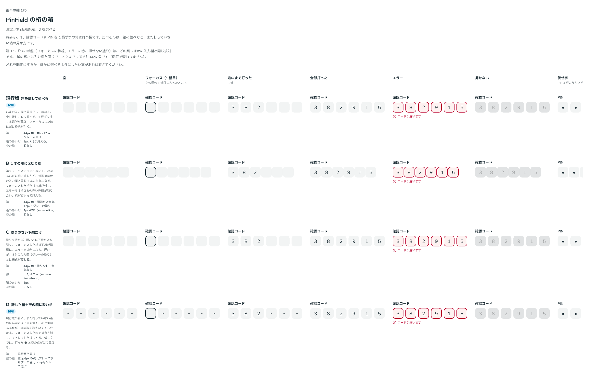

# 0189. PinField の桁の箱

- ステータス: Accepted
- 日付: 2026-09-20
- ラウンド: 後半 軸170

## 背景

PinField（確認コード・PIN を 1 桁ずつ打つ欄）の、桁の箱の並べ方と、まだ打っていない箱の見せ方を決める必要がありました。

## 候補

比較は Storybook の `Design Review/170 PinField の桁の箱` です。空・フォーカス（1 桁目）・途中まで打った・全部打った・エラー・押せない・伏せ字の 7 列で比べました。

| 案     | 内容                                                                                                                |
| ------ | ------------------------------------------------------------------------------------------------------------------- |
| 現行版 | いまの入力欄と同じグレーの箱を、少し離して並べる。1 桁ずつ押せる場所が見え、フォーカスした箱にだけ枠線が付く        |
| B      | 箱をくっつけて 1 本の欄にし、桁のあいだに細い線を引く。エラーでは桁ごとの赤い枠線が隣り合い、線が詰まって見える     |
| C      | 塗りを持たず、桁ごとに下線だけを引く。軽いが、ほかの入力欄（グレーの塗り）とは様式が変わる                          |
| D      | 現行版の箱に、まだ打っていない箱の真ん中に淡い点を置く。あと何桁あるかが、箱の数を数えなくても分かる（`emptyDots`） |

箱 1 つずつの状態（フォーカスの枠線、エラーの赤、押せない塗り）は、どの案もほかの入力欄と同じ規則です。

## 決定

**現行版（箱を離して並べる）を既定にし、D（`emptyDots`）も選べるようにします。** あわせて、区切り（`group`）に置くものを任意の文字にできるようにします（`groupSeparator`）。既定は短い横線です。

- `emptyDots`: まだ打っていない箱の真ん中に淡い点を置きます。伏せ字（`mask`）では、打った ● と見分けられるよう輪（○）にします
- `groupSeparator`: 区切りに置くもの。文字（「-」「/」など）を渡すと、打った文字と同じ大きさで淡い色（`--pin-field-separator-color`）で描きます。`null` は何も置かず、間だけ空けます。既定（渡さないとき）は短い横線です

## 理由

ユーザーの返事の原文です。

> 170: デフォルト現行、D選択可

区切りについては、別のやり取りで次の返事がありました。

> PinField は基本よさそうで、3桁区切りの場合、利用者によって変わると思うので、任意の文字を設定できる、がよさそうですね

- **現行版を既定に**: 箱が離れているので、1 桁ずつ押せる場所がはっきりします。エラーでも赤い枠線が隣と詰まりません
- **D も選べるように**: あと何桁あるかが、箱を数えなくても分かります
- **区切りを任意の文字に**: 3 桁区切り（携帯電話番号など）は、使う場面によって区切りの記号（「-」「/」など、あるいは間だけ）が変わるため、固定せず選べるようにしました

## 却下した案と理由

- **B（1 本の欄に区切り線）**: 返事に挙がらず、選ばれませんでした。エラーでは桁ごとの赤い枠線が隣り合い、線が詰まって見えます
- **C（塗りのない下線だけ）**: 返事に挙がらず、選ばれませんでした。ほかの入力欄（グレーの塗り）と様式が変わります

## 影響

- `src/components/pin-field/PinField.tsx`: `emptyDots`（既定 `false`）・`groupSeparator`（`ReactNode`。既定は短い横線、`null` で間だけ）・`group`（区切りの位置。桁の数の並び）を足しました
- `design/tokens.css`: `--pin-field-box-width`・`--pin-field-gap`・`--pin-field-dot-size`・`--pin-field-text`・`--pin-field-group-gap`・`--pin-field-dash-width`・`--pin-field-separator-color` を PinField の区画に持ちます。B・C を比べるためだけに置いていた切り替えのトークン（`--pin-field-seam`・`--pin-field-radius-inner`・`--pin-field-fill-amount`・`--pin-field-edge-width`・`--pin-field-underline`・`--pin-field-dot-color` など）は畳みました
- backlog に、読み取り専用の破線が並ぶと見え方がうるさくないか、伏せ字の ● が小さいことを足しました

比較画像を撮ったのは、切り替えのトークンを畳んだあとです。そのため、**画像の B・C の行は、比べたときの見た目（区切り線・下線）ではなく、いまの部品（現行版と同じ離した箱）で描かれています**。決めた時点のコミットでも同じトークンは畳んであるため、B・C を比べたときの見た目は、上の「候補」の説明の文でしか残っていません。

## 原則への反映

反映なし。原則 8（入力欄の様式。グレーの塗り、フォーカス・エラー・押せないときの規則はほかの入力欄と同じ）の範囲内の決定です。

## 比較画像

比較のストーリーは決めた時点のコミット `3571614` にあります。`git checkout 3571614 && pnpm storybook` で開けます。B・C の行は、上に書いたとおりトークンを畳んだあとの見た目です。

