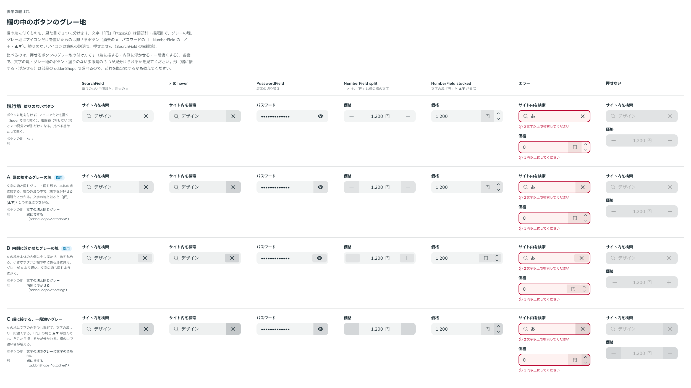

# 0190. 欄の端に付くものの 3 種

- ステータス: Accepted
- 日付: 2026-09-20
- ラウンド: 後半 軸171（第 2 ラウンド）

## 背景

NumberField・PinField・SearchField・PasswordField を作るにつれ、入力欄の端に付くものが増えました。「円」「https://」のような文字、消去やパスワードの表示切り替えのボタン、SearchField の虫眼鏡のような塗りのないアイコンです。これらを見た目でどう見分けるかを決める必要がありました。

はじめは、ボタンに地を付けない案（現行版）を基準に、グレー地の付け方（端に接する・内側に浮かせる・一段濃くする）を比べるつもりでした。しかしユーザーから、次の認識が示されました。

> 171: 基本的な認識は、prefix, suffix に文字＝単に入力文字の接頭辞、接尾辞、prefix, suffix にグレー地＋アイコンのみ＝押せるボタン、prefix, suffix にアイコンのみ＝意味の説明、です。なので、×ボタンにはグレー地が必要です。なので、どれも現状は正しくありません。これを元に軸を書き直してもらえますか？

[ADR-0035](./0035-field-addon.md) は、prefix・suffix のボタンを「平らな要素（[原則 3](../principles.md#3-hover-は手応え押すと沈む)）」としており、ふだんは地を持たず、hover ではじめて文字の色を淡く敷く形でした。この認識と食い違うため、軸を書き直しました。

## 候補

比較は Storybook の `Design Review/171 欄の中のボタンのグレー地` です。SearchField・× に hover・PasswordField・NumberField（split・stacked）・エラー・押せないの 7 列で比べました。

| 案     | 内容                                                                                                                                |
| ------ | ----------------------------------------------------------------------------------------------------------------------------------- |
| 現行版 | ボタンに地を付けず、アイコンだけを置く（hover で淡く敷く）。虫眼鏡（押せない印）と × の見分けが形だけになる。比べる基準として置いた |
| A      | 文字の塊と同じグレー・同じ形で、本体の端に接する（`addonShape="attached"`）                                                         |
| B      | A の塊を本体の内側に少し浮かせ、角を丸める（`addonShape="floating"`）                                                               |
| C      | A の地に文字の色を 6% 混ぜて、文字の塊より一段濃くする                                                                              |

第 2 ラウンドでは、同じ端に文字とボタンが並ぶとき（NumberField の「円」と ▲▼ など）の扱いも確かめました。

## 決定

**欄の端に付くものを、見た目で 3 つに分けます。** 文字（「円」「https://」）は接頭辞・接尾辞で、グレーの塊（`FieldAddon`）です。グレー地にアイコンだけを置いたものは押せるボタン（`FieldAddonButton`。消去の ×・パスワードの目・NumberField の −／＋・▲▼）です。塗りのないアイコンは、押せない意味の説明です（SearchField の虫眼鏡）。

**押せるボタンのグレー地は、A（端に接する）を既定にし、B（内側に浮かせる。`addonShape="floating"`）も選べるようにします。** C（一段濃いグレー）は選べる形にしません。

**同じ端に文字とボタンが並ぶときは、文字の地を外し、グレー地はボタンだけに残します。**「円」の塊と ▲▼ が並んでも、押せる場所がグレー地の広さそのままになります。

SearchField の虫眼鏡は、塗りのない印のままです（`icon="inline"`）。地を付けた虫眼鏡の選択肢は作りません。

## 理由

ユーザーの返事の原文です（1 回目の比較のあと）。

> 171: 基本的な認識は、prefix, suffix に文字＝単に入力文字の接頭辞、接尾辞、prefix, suffix にグレー地＋アイコンのみ＝押せるボタン、prefix, suffix にアイコンのみ＝意味の説明、です。なので、×ボタンにはグレー地が必要です。

軸を書き直したあとの返事です。

> 171: デフォルトA、Bも選択可、prefix や suffix が重複している場合は、文字はグレー地なし、ボタンはグレー地あり、になるのが正しそうです

以下は、メモから読み取れることです。

- **文字とボタンとアイコンを見た目で分ける**: グレー地が「押せる」ことの印になり、塗りのないアイコンは「押せない、意味の説明」という約束になります。虫眼鏡と × が並んでも、どちらが押せるかが一目で分かります
- **A を既定に**: 文字の塊と同じ形・同じグレーにすることで、欄の外形の中で押せる場所だと分かります
- **B も選べる**: 内側に浮かせたい場面（[ADR-0035](./0035-field-addon.md)）にも、ボタンだけそろえて使えます
- **重複するときは文字の地を外す**: 文字とボタンが両方グレー地のままだと、1 つの塊に見えてしまい、グレー地＝押せる、の約束が崩れます

## 却下した案と理由

- **現行版（塗りのないボタン）**: 「×ボタンにはグレー地が必要」という返事のとおり、押せることが伝わりません
- **C（一段濃いグレー）**: 返事に挙がらず、選ばれませんでした。欄の中で濃い色が増えます

## 影響

- `src/components/field-addon/FieldAddon.tsx`: `kind: 'button'` の `FieldAddonButton` は、ふだんからグレー地（`--addon-fill`。文字の塊と同じ `--color-field-addon`）を持ちます。hover・押下は、その地の上に文字の色を 8%・16% 重ねます（`--flat-hover-mix`・`--flat-press-mix`。[ADR-0027](./0027-flat-press.md) と同じ濃さ）。押下では中身が 1px 沈みます
  - `kind: 'text'`（文字の `FieldAddon`）は、同じ端でボタン（`FieldAddonButton` か、ボタンを並べた塊）と隣り合うとき、`:has()` で地を透明にします（`--addon-fill: transparent`）
- `src/components/search-field/SearchField.tsx`: 虫眼鏡は `icon="inline"`（既定、塗りのないアイコン）・`icon="none"` の 2 値です。地を付けた案は作っていません
- `design/tokens.css`: `--field-addon-button-fill-amount`・`--field-addon-button-shade` は、C（一段濃いグレー）を比べるために置いたトークンで、既定では効かない値のまま残しています
- **追記（[ADR-0035](./0035-field-addon.md)）**: 「ボタン: 平らな要素（原則3）」としていた記述を、この ADR で一部置き換えました。ADR-0035 のステータスを更新しています
- backlog に、文字のボタン（「コピー」など）の地の扱い、押せない欄でボタンの塊が地に溶けること、読み取り専用でボタンの地が消えること、虫眼鏡以外の塗りのないアイコンを足しました

## 原則への反映

原則 8（入力欄の様式）に、欄の端に付くものを見た目で 3 つに分ける記述を足しました。文字は接頭辞・接尾辞でグレーの塊、グレー地にアイコンだけを置いたものは押せるボタン、塗りのないアイコンは押せない意味の説明です。同じ端に文字とボタンが並ぶときは、文字の地を外すことも足しました。

## 比較画像

比較のストーリーは決めた時点のコミット `（コミット後に記入）` にあります。`git checkout （コミット後に記入） && pnpm storybook` で開けます。

