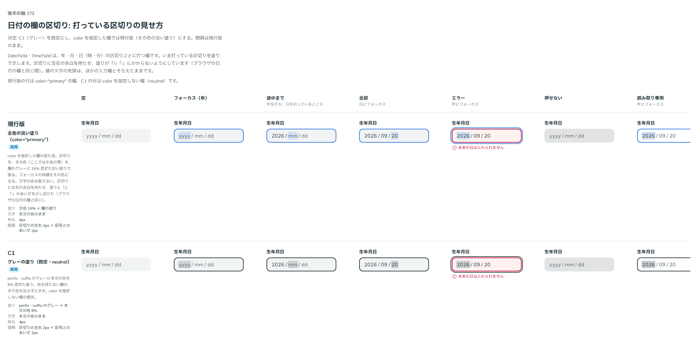

# 0191. 日付の欄の区切り

- ステータス: Accepted
- 日付: 2026-09-20
- ラウンド: 後半 軸172（第 2 ラウンド）

## 背景

DateField・TimeField は、年・月・日（時・分）の区切りごとに打つ欄です（[ADR-0187](./0187-typed-field-series.md)）。いま打っている区切りをどう示すか（塗りの色と間隔）を決める必要がありました。

はじめのラウンドで色を比べたところ、次の返事がありました。

> 172: 現行版デフォルト、C はもう少し濃くできますか？あと、フォーカス領域が文字にかぶらないように間隔を調整してもう一度見たいです。(input date のイメージ)

間隔（区切りの左右と、区切り記号「/」「:」とのあいだ）を直し、第 2 ラウンドで比べ直しました。

## 候補

比較は Storybook の `Design Review/172 日付の欄の区切り` です。空・フォーカス（年）・途中まで・全部・エラー・押せない・読み取り専用・TimeField の 8 列で比べました。

| 案     | 内容                                                                                                  |
| ------ | ----------------------------------------------------------------------------------------------------- |
| 現行版 | `color` を指定した欄の見た目。区切りを、その色（主色の青など）を欄のグレーに 16% 混ぜた淡い塗りで塗る |
| C1     | `color` を指定しない欄（`neutral`）の既定。prefix・suffix のグレーに本文の色を 8% 混ぜた塗り          |

どちらも、区切りの左右に余白（2px）を持たせ、塗りの外に記号とのあいだをさらに 2px 空けます（塗りが「/」「:」にかからない、`<input type="date">` と同じ間です）。値の文字の先頭は、ほかの入力欄とそろえたままです。

## 決定

**C1（グレーの塗り）を既定にし、`color` を指定した欄では現行版と同じ考え方（その色の淡い塗り）にします。** 間隔は、上に書いた「区切りの左右 2px ＋ 記号とのあいだ 2px」のまま決定します。

- `color`（`DateSegmentColor`）: `neutral`（既定。グレーの塗り）・`primary`・`secondary`（その色を欄の塗りに 16% 混ぜた淡い塗り）
- フォーカスの枠線（欄全体の枠線）も `color` に従います。色を持つ部品の既定の仕組み（[ADR-0071](./0071-focus-color.md) の M。Select と同じ）です
- 塗りは、キーボードだけでなくマウスで押しても出します（`:focus`）
- 空の区切りの見本は「yyyy/mm/dd」（`segmentPlaceholder="letters"`、既定）です

## 理由

ユーザーの返事の原文です。

> 172: 現行版デフォルト、C はもう少し濃くできますか？あと、フォーカス領域が文字にかぶらないように間隔を調整してもう一度見たいです。(input date のイメージ)

間隔を直したあとの返事です。

> 172: 間隔はこれで良さそう。デフォルトC1、入力欄の色によって現行に変化、にします

- **C1 を既定に**: `color` を指定しない欄はグレーの塗りにそろえます。ほかの入力欄が色を持たないとき濃紺・グレーになるのと同じ考え方です
- **`color` を指定した欄は現行版と同じ考え方**: Select の色の扱いとそろい、その色の淡い塗りで示します
- **間隔を空ける**: `<input type="date">` のように、塗りが区切り記号にかからないようにすることで、値がひと続きの日付として読めます

## 却下した案と理由

却下した案はありません。2 案を、`color` の有無で使い分ける形で採用しました。

## 影響

- `src/components/date-field/DateField.tsx`・`src/components/time-field/TimeField.tsx`: `color`（`DateSegmentColor`。`neutral`（既定）・`primary`・`secondary`）を足しました
- `design/tokens.css`: `--date-segment-pad-x`（区切りの左右の余白）・`--date-segment-gap`（区切りと記号のあいだ）・`--date-segment-radius`・`--date-segment-focus-bg`（`neutral` の塗り）・`--date-segment-focus-bg-primary`・`-secondary`（`color` を指定した欄の塗り）・`--date-segment-focus-fg`・`--date-segment-focus-placeholder` を持ちます
- `src/internal/date-segments/`: 区切りの塗りは `focus:` 疑似クラスで出すため、マウスで押したときも出ます
- fields-overview の基準画像は、間隔の変更にあわせて撮り直しが要ります
- backlog に、`color` を指定した欄のフォーカスの枠線を色に従わせるかの確認（Select にそろえた仕組みが実際に効いているかの確かめ）、DateField の min・max はエラーの見た目だけであること、読めない貼り付けは `onParseFail` だけであること、ja の 12 時間制の見本が詰まること、区切りごとに Tab が止まらないことを足しました

## 原則への反映

原則 2（フォーカスとエラーは枠線で表す）に、区切りごとに打つ欄の例外を足しました。フォーカスそのものが項目（区切り）へ移っても、線ではなく塗りで示します。1 つの値を線で区切ると、区切りのあいだで値が分かれて見えるためです。塗りの色は、部品の色に従います。

## 比較画像

比較のストーリーは、間隔を直したあとの決めた時点のコミット `（コミット後に記入）` にあります。`git checkout （コミット後に記入） && pnpm storybook` で開けます。

