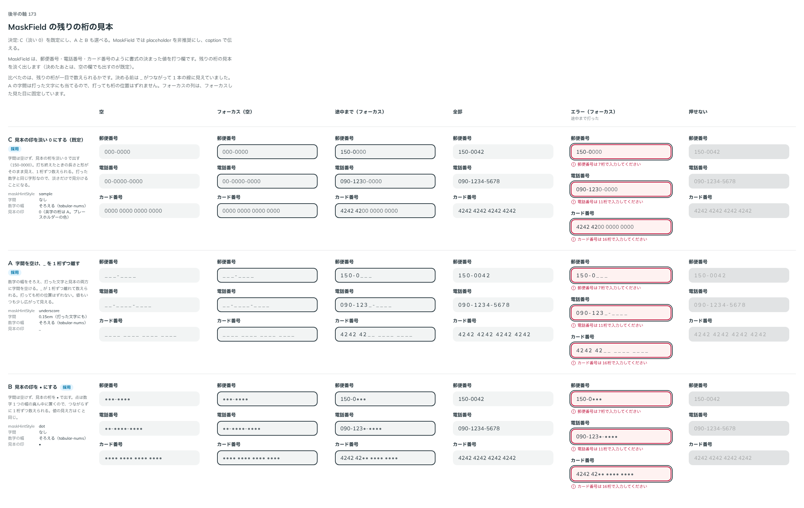

# 0192. MaskField の残りの桁の見本

- ステータス: Accepted
- 日付: 2026-09-20
- ラウンド: 後半 軸173

## 背景

MaskField（郵便番号・電話番号・カード番号のように書式の決まった値を打つ欄）は、残りの桁の見本（「000-0000」のような）を淡く出します。もとの見本は `_` がつながって 1 本の線に見え、残りが何桁かを数えられませんでした。

## 候補

比較は Storybook の `Design Review/173 MaskField の残りの桁の見本` です。空・フォーカス（空）・途中まで（フォーカス）・全部・エラー（フォーカス）・押せないの 6 列を、郵便番号・電話番号・カード番号の 3 つの書式で比べました。

| 案  | 内容                                                                                          |
| --- | --------------------------------------------------------------------------------------------- |
| C   | 字間は空けず、見本の桁を淡い 0 で出す（`maskHintStyle="sample"`）。数字の桁は 0、英字の桁は A |
| A   | 数字の幅をそろえ、打った文字と見本の両方に字間（0.15em）を空ける。見本は `_`（`underscore`）  |
| B   | 字間は空けず、見本の桁を `•` で出す（`dot`）                                                  |

どの案も、打った文字と見本の数字の幅をそろえます（`tabular-nums`）。

## 決定

**C（淡い 0）を既定にし、A（字間を空けた `_`）・B（`•`）も `maskHintStyle` で選べるようにします。** 見本は空の欄でも出します（`maskHint` の既定を `always` にしました）。

**MaskField では `placeholder` を非推奨にします。** MaskField はすでに残りの桁の見本で打つべき形を出しているため、`placeholder` は使いません。書式や例（「ハイフンは自動で入ります」「例: 150-0042」）は `caption`（入力欄の説明のテキスト）で伝えます。

## 理由

ユーザーの返事の原文です。

> 173: Mask で入力する文字数が見えるように間隔を調整したい気持ちがありますね

字間を空けた案（A）を作ったあとの返事です。

> 173: デフォルトC、AとBも選択可で、MaskField においては既に入力すべき形が出ているため、プレイスホルダは非推奨としてください。代わりに入力欄の説明テキストを利用する想定です。

- **C を既定に**: 字間を空けずに済み、打ち終えたときの長さと形がそのまま見えます。数字の幅をそろえたことで、A ほど字間を空けなくても 1 桁ずつ数えられるようになりました
- **A・B も選べるように**: `_` や `•` のほうが見本だとはっきり分かる場面に使えます
- **`placeholder` を非推奨に**: MaskField は残りの桁の見本がプレースホルダーと同じ役目（見本を示す）を果たすため、両方を出す理由がありません。書式や例は `caption` に一本化します

## 却下した案と理由

- **もとの見本（字間を空けない `_`）**: `_` がつながって 1 本の線に見え、残りの桁を数えられませんでした。数字の幅をそろえた C・字間を空けた A・`•` にした B に作り直しました

## 影響

- `src/components/mask-field/MaskField.tsx`: `maskHintStyle`（`MaskFieldHintStyle`。`sample`（既定）・`underscore`・`dot`）を足しました。`maskHint`（見本を出すか）の既定を `focus` から `always` に変えました。`placeholder` を `@deprecated` にし、JSDoc に `caption` を使う旨を書きました。`halfWidthNotice` の既定は `false` です
- `design/tokens.css`: `--mask-field-tracking`（0.15em。`underscore` の字間。打った文字にも当てます）を MaskField の区画に持ちます
- 英字の桁の見本は `A` です（数字は `0`）
- backlog に、英字の桁の見本を `A` にするか `a` にするか、`underscore` の字間で値が TextField と違って見えること、見本の層が長い値でずれる可能性、書式付きの値をそのまま送る手段がないことを足しました

## 原則への反映

原則 8（入力欄の様式）に、プレースホルダーの例外を足しました。書式の決まった欄（MaskField）は、プレースホルダーではなく残りの桁の見本を淡く出す形を使い、プレースホルダーは使いません。書式や例はキャプションで伝えます。

## 比較画像

比較のストーリーは決めた時点のコミット `3571614` にあります。`git checkout 3571614 && pnpm storybook` で開けます。

