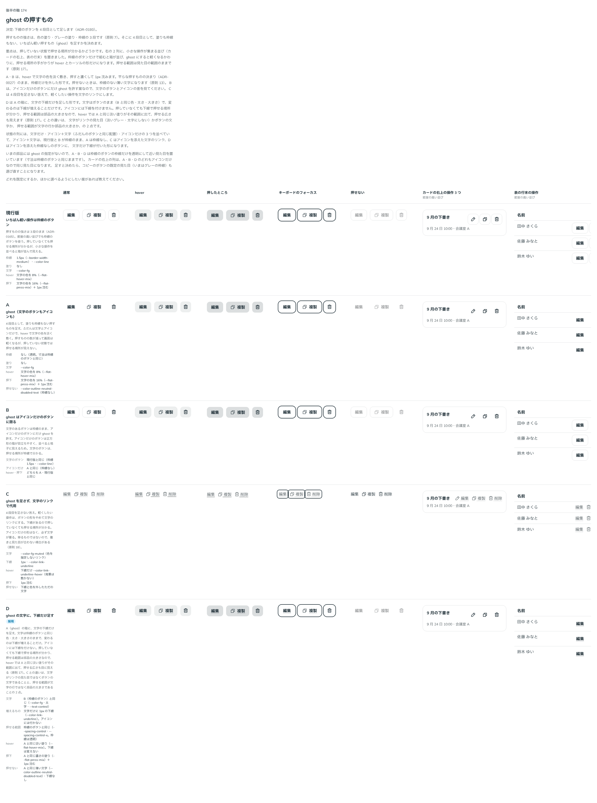

# 0193. いちばん軽い押すものは、文字に下線だけの形（4 段目）

- ステータス: Accepted
- 日付: 2026-09-20
- ラウンド: 後半 軸174

## 背景

押すものの強さは、色の塗り・グレーの塗り・枠線の 3 段でした（[ADR-0165](./0165-button-emphasis-levels.md)）。しかし、小さな操作が集まる場所（カードの右上、表の行末）では、いちばん軽い枠線のボタンでも箱が並んで見えます。塗りも枠線もない、もう一段軽い押すもの（ghost）を足すかどうかを決める必要がありました。

要点は、押していない状態で押せる場所が分かるかどうかです。塗りも枠線も外すと、手がかりは hover とカーソルの形だけになります。押せる範囲は見た目の範囲のままにする決まり（[原則 17](../principles.md#17-押せる範囲は見た目の範囲)）とも、正面からぶつかります。

## 候補

比較は Storybook の `Design Review/174 ghost の押すもの` です。通常・hover・押したところ・キーボードのフォーカス・押せない・カードの右上の操作 3 つ・表の行末の操作の 7 列で比べました。状態の列には、文字だけ・アイコン＋文字・アイコンだけの 3 つを並べています。

| 案     | 内容                                                                                                                                                                     |
| ------ | ------------------------------------------------------------------------------------------------------------------------------------------------------------------------ |
| 現行版 | 4 段目を足さず、いちばん軽い操作も枠線のボタンにする。枠線は `--border-width-medium`・`--color-line`                                                                     |
| A      | 塗りも枠線もない ghost。文字は `--color-fg`、hover は文字の色を `--flat-hover-mix`、押下は `--flat-press-mix` ＋ 1px 沈む。押していない状態では押せる場所が見えない      |
| B      | ghost はアイコンだけのボタンに限る。文字のあるボタンは枠線のまま                                                                                                         |
| C      | 4 段目を足さず、軽くしたい操作は文字のリンクにする。文字は `--color-fg-muted`、下線は `--color-link-underline`                                                           |
| D      | A の箱に、文字の下線だけを足す。文字は枠線のボタンとまったく同じ（`--color-fg`・太字・`--text-control`）で、増えるのは文字にだけ引く下線（`--color-link-underline`）のみ |

## 決定

**D を採り、押すものの強さを 4 段にします。** 4 段目は、塗りも枠線もなく、文字に淡い下線だけが付く形です。Button と Link の `appearance="underline"` として足しました。

- 文字も、寸法も、左右の余白も、角丸も、フォーカスの線も、枠線のボタン（`appearance="outline"`）とまったく同じです。変わるのは、枠線がなくなり、文字に下線が付くことだけです
- 下線は文字にだけ引きます。アイコンには付かないので、アイコンだけのボタンは下線も枠線もない形になります
- **押せる範囲は部品の大きさのままです。**下線は文字の幅にしか出ませんが、押せるのは枠線のボタンと同じ広さで、hover で敷く淡い色がその広さをそのまま見せます。これが[原則 17](../principles.md#17-押せる範囲は見た目の範囲)との折り合いです。見えない広がりを足しているのではなく、ふだん見えていない範囲を hover で見せています
- hover と押下は、平らな押すものの決まり（[ADR-0027](./0027-flat-press.md)）のままです。下線は hover で変えません。塗りで手応えが伝わるので、二重に動かしません（文字のリンクとはここが違います）
- 押せないとき・送信中は、押せない枠線のボタンと同じ文字の色にし、下線を外します（[原則 13](../principles.md#13-押せないものは浮かせず薄くする)）

## 理由

押していない状態でも押せる場所が分かる、という条件を満たしたうえで、いちばん軽くできるのが D でした。A・B は箱が消えるかわりに、押せる場所の手がかりが hover とカーソルの形だけになります。C は下線で場所が分かりますが、移るものではないのに文字のリンクの見た目になり、働きと見た目が合いません（[原則 18](../principles.md#18-働きで部品を選び見た目は別に選ぶ)）。

ユーザーの一言メモは、候補を足していく途中のものです。「C のバリエーションで、文字には下線、記号には何もない前提で、A のように少し大きめの判定がある、というバリエーションを追加してみてほしいです」「B の文字色・ウェイトなどは維持したまま、下線だけ増える、のイメージでした」。アイコン＋文字の見本を足したあと、「174 はいまの D でよさそうです」で決まりました。基準の言葉では「軽い」に寄せた決定で、密度の高い並びから箱を減らしつつ、押せることの手がかりは残しています。

## 却下した案と理由

- **現行版**: 小さな操作が集まる場所で、枠線の箱が並んで格子に見えます
- **A（ghost）**: 押していない状態で押せる場所が見えません。下線 1 本を足すだけでこれが解けるので、足さない理由がありません
- **B（アイコンだけに限る）**: 文字のボタンとアイコンだけのボタンで強さが変わってしまい、4 段目として使い分けられません
- **C（文字のリンクで代用）**: 移るものではないので、リンクの見た目にすると働きと見た目が合いません（[原則 18](../principles.md#18-働きで部品を選び見た目は別に選ぶ)）。押せる範囲も文字の行だけになります

## 影響

- `src/components/button/Button.tsx`: `appearance` に `underline` を足しました（`filled`・`outline`・`underline`。既定は `filled` のまま）。色（`--button-line`）は枠線のボタンと共有し、`primary`・`secondary`・`danger`・`neutral`・`white` のどれでも枠線のボタンと同じ文字の色になります。下線の色・太さ・位置は文字のリンクと同じ（`--color-link-underline`・1px・`underline-offset-4`）です
- `src/components/link/Link.tsx`: `appearance` に `underline` を足しました（`text`・`outline`・`button`・`underline`。既定は `text` のまま）。見た目は Button の `underline` に任せ、要素は `<a>` のままです。別のタブで開くときの ↗ が付き、ボタンと見分けられます。`shape` の既定は `square`（`button` と同じ）、キャプションも付けられます
- `src/stories/disabled-overview.stories.tsx`: 押せない状態の一覧に、Button・Link の `underline` を足しました
- 新しいトークンはありません。既存の `--color-link-underline`・`--flat-hover-mix`・`--flat-press-mix` を使います
- backlog に、CopyButton の既定の見た目を下線に替えるかどうか、アイコンだけの下線のボタン（線がまったく出ない形）を許す範囲、既存の部品で枠線から下線に落とす場所の監査を足しました

## 原則への反映

[原則 7](../principles.md#7-塗りか枠線か)の文を書き換えました。押すものの強さを 3 段から 4 段にし、いちばん軽い形（塗りも枠線もなく、文字に淡い下線だけ）を足しました。あわせて、密度の高い並びのうち、押すものが埋もれてよいところは下線だけにすること、下線は文字にだけ引くのでアイコンだけを置くと線のない形になること、下線だけの形でも押せるのは部品の大きさの範囲で、hover で敷く色がその広さを見せることを足しました。

3 段と書いていた [ADR-0165](./0165-button-emphasis-levels.md) は、この ADR で置き換えました（ステータスを `Superseded by 0193` にしています）。3 段それぞれの使い分けは、そのまま生きています。

## 比較画像

比較のストーリーは決めた時点のコミット `6bb1311` にあります。`git checkout 6bb1311 && pnpm storybook` で開けます。

