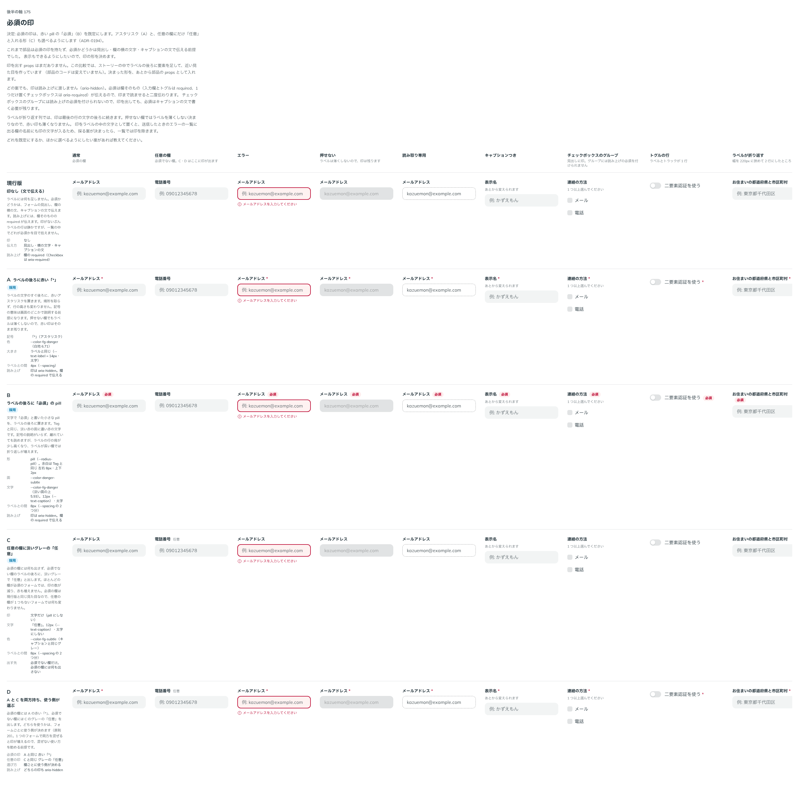

# 0194. 必須の印は「必須」の pill（アスタリスクと「任意」も選べる）

- ステータス: Accepted
- 日付: 2026-09-20
- ラウンド: 後半 軸175

## 背景

部品は必須の印を持たず、必須かどうかは見出し・欄の横の文字・キャプションの文で伝える前提でした。表示でも伝えられるようにしたいので、ラベルに添える印の形を決める必要がありました。[原則 4](../principles.md#4-部品はラベル--本体--キャプションの-3-層)（ラベル / 本体 / キャプションの 3 層）に関わります。

読み上げは、どの案でも印を渡しません。必須は欄そのもの（`required`、1 つだけ置くチェックボックスは `aria-required`）が伝えるので、印まで読ませると二度伝わります（[原則 15](../principles.md#15-読み上げは見た目の順フォーカスは次に触るものへ)）。

## 候補

比較は Storybook の `Design Review/175 必須の印` です。通常（必須の欄）・任意の欄・エラー・押せない・読み取り専用・キャプションつき・チェックボックスのグループ・トグルの行・ラベルが折り返すの 9 列で比べました。

| 案     | 内容                                                                                                                                                           |
| ------ | -------------------------------------------------------------------------------------------------------------------------------------------------------------- |
| 現行版 | 印なし。必須かどうかは、見出し・欄の横の文・キャプションの文で伝える                                                                                           |
| A      | ラベルの後ろに赤い「\*」。ラベルと同じ大きさ（`--text-label`・太字）、色は `--color-fg-danger`、ラベルとの間は `--spacing`                                     |
| B      | ラベルの後ろに「必須」の pill。Tag と同じ形（`--radius-pill`・左右 8px・上下 2px）、面は `--color-danger-subtle`、文字は `--color-fg-danger`・`--text-caption` |
| C      | 必須の欄には何も出さず、必須でない欄に淡いグレーの「任意」。`--text-caption`・`--color-fg-subtle`、太字にしない                                                |
| D      | A（赤い「\*」）と C（グレーの「任意」）の両方を持ち、フォームごとに使う側が選ぶ                                                                                |

## 決定

**B（「必須」の pill）を既定にします。A（赤い「\*」）と C（任意の欄の「任意」）も選べるようにします。**

- 必須の印の形は `requiredMark`（`tag`（既定）・`asterisk`・`none`）です
- 任意の印の形は `optionalMark`（`text`・`none`（既定））です。必須の印と組み合わせられます
- どちらも Form と ThemeProvider で既定を変えられます。欄の props を書いたときは、そちらが勝ちます（[原則 20](../principles.md#20-部品は知らないことを決めない)）
- `asterisk` を選ぶときは、フォームの先頭などに「\* は必須の項目です」の一文を置きます。文は使う側が書くので、Docs にそう書きました
- 印は読み上げから外します（`aria-hidden`）。送信したときのエラーの一覧に並ぶ欄の名前からも、印の文字を除きます
- 押せない欄でもラベルは薄くしないので、印も薄くしません（[原則 13](../principles.md#13-押せないものは浮かせず薄くする)）

## 理由

ユーザーの返事の原文です。

> 必須はBデフォルト、Aの表記も可（Docs に \* の意味を伝える一文を差し込むように書く）、Cの表記も可

以下は、メモから読み取れることです。

- **B を既定に**: 文字で「必須」と書くので、記号の意味をどこかで説明する必要がありません。離れていても読めます。Tag と同じ淡い面に濃い文字なので、赤も強く出ません（[原則 6](../principles.md#6-色は役割で持つ)・[原則 12](../principles.md#12-色は面用と前景用の-2-段で持つ)）
- **A も選べる**: 場所を取らず、ラベルの行の高さも変わりません。かわりに記号の説明が要るので、Docs にその一文を置くよう書きました
- **C も選べる**: ほとんどの欄が必須のフォームでは、印の数が減り、赤も増えません

## 却下した案と理由

- **現行版**: 一覧の中でどれが必須かを目で拾えません。文で伝える形は、印を `none` にすれば今までどおり使えます
- **D**: A と C を両方持つ案ですが、B も含めて 3 つとも選べる形にしたので、D という組み合わせを別に置く必要がなくなりました

## 影響

- `src/internal/field/FieldMark.tsx`（新規）: ラベルの後ろに置く印と、`required`・`requiredMark`・`optionalMark` の props（`FieldMarkProps`）です。印はラベルの中に置くので、ラベルが折り返すと一緒に折り返します
- `src/internal/field/Field.tsx`・`src/internal/field/input-field-props.ts`: Field を通る部品が `FieldMarkProps` を共通で持ちます。Checkbox・CheckboxGroup・Radio・Select・Switch・Textarea と、文字を打つ欄の系列（[ADR-0187](./0187-typed-field-series.md)）がこれを受け取ります
- `src/internal/ui-config.ts`・`src/components/theme-provider/ThemeProvider.tsx`・`src/components/form/Form.tsx`: `requiredMark`・`optionalMark` の既定を配れるようにしました。欄の props が優先されます
- `src/components/form/form-dom.ts`: エラーの一覧を作るとき、欄の名前から `[data-slot="field-mark"]` を取り除きます
- `src/index.ts`: `RequiredMark`・`OptionalMark` の型を公開しました
- `src/stories/required-mark.stories.tsx`（新規）: 部品をまたぐ印の一覧です
- 新しいトークンはありません。Tag と同じ `--color-danger-subtle`・`--color-fg-danger`・`--radius-pill`・`--text-caption` を使います
- backlog に、チェックボックスのグループには読み上げの必須を付けられず、必須をキャプションの文で書く必要が残ること、1 つのフォームで必須の印と任意の印を混ぜたときの勧め方、「\* は必須の項目です」の一文を見本のページにどう置くかを足しました

## 原則への反映

[原則 4](../principles.md#4-部品はラベル--本体--キャプションの-3-層)の文を書き換えました。ラベルの後ろに、入れることが要る欄（または入れなくてよい欄）の小さな印を添えることを足しました。印はラベルの行の一部なので、ラベルが折り返すと一緒に折り返すこと、印は見る人に見せるもので読み上げには出さないこと、エラーをまとめた一覧の欄の名前からも印を外すことを書いています。

## 比較画像

比較のストーリーは決めた時点のコミット `6bb1311` にあります。`git checkout 6bb1311 && pnpm storybook` で開けます。

