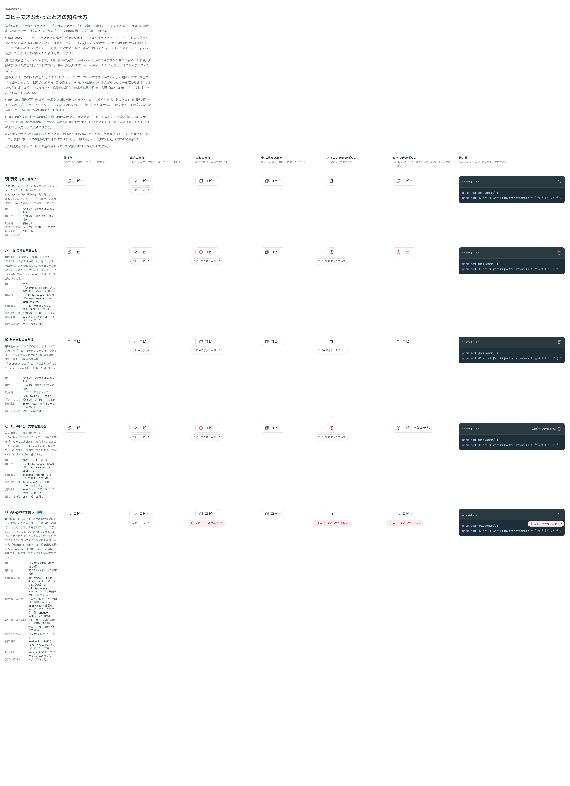

# 0195. コピーできなかったときは、淡い赤の吹き出しで知らせる

- ステータス: Accepted
- 日付: 2026-09-20
- ラウンド: 後半 軸176

## 背景

CopyButton と CodeBlock のコピーのボタンは、写せたときだけ見た目が変わりました。写せなかったとき（クリップボードの権限がない、安全でない接続で開いている）は何も出さず、`onCopyError` を受け取った使う側が知らせる前提です。`onCopyError` を渡していないときに、部品が既定でどう知らせるかを決める必要がありました。

`onCopyError` を渡したときは、どの案でも部品は何も出しません。押したときの知らせ方なので、[原則 6](../principles.md#6-色は役割で持つ)（色と形の組み合わせ）・[原則 14](../principles.md#14-動きは手応えと待ちを伝える)（手応え）・[原則 15](../principles.md#15-読み上げは見た目の順フォーカスは次に触るものへ)（割り込まない知らせ）に関わります。

## 候補

比較は Storybook の `Design Review/176 コピーできなかったときの知らせ方` です。押す前・成功の直後・失敗の直後・少し経ったあと・アイコンだけのボタン・文字つきのボタン（`feedback="label"`）・暗い面（CodeBlock）の 7 列で比べました。

| 案     | 内容                                                                                                                                                    |
| ------ | ------------------------------------------------------------------------------------------------------------------------------------------------------- |
| 現行版 | 何も出さない。知らせるかどうかは `onCopyError` を受け取る使う側に任せる                                                                                 |
| A      | 印を丸の「!」に変え、成功と同じ吹き出しで「コピーできませんでした」を出す。印の色は `--color-fg-danger`                                                 |
| B      | 印は変えず、吹き出しの文だけを変える。吹き出しを持たない場所（`feedback="label"`・CodeBlock の帯）では何も伝わらない                                    |
| C      | A に加えて、`feedback="label"` ではボタンの中の文字も「コピーできません」に変える                                                                       |
| D      | 印は変えず、吹き出しの面だけを淡い赤（`--color-danger-subtle`）にし、文字と丸の「!」を同じ色相の濃い赤（`--color-fg-danger`）にする。大きさは成功と同じ |

どの案も、失敗の知らせは成功と同じ 2 秒で消えます。読み上げは成功と同じ箱（`role="status"`）で「コピーできませんでした」と伝えます。

## 決定

**D を採ります。** 写せなかったときは、淡い赤の吹き出しで知らせます。

- 吹き出しの面は `--color-danger-subtle`、文字は `--color-fg-danger` です。淡い面に同じ色相の濃い文字という、タグやお知らせの soft と同じ組み合わせです（[原則 6](../principles.md#6-色は役割で持つ)・[原則 12](../principles.md#12-色は面用と前景用の-2-段で持つ)）
- 大きさ・余白・角・影・輪郭・文字の大きさは、「コピーしました」の吹き出しとまったく同じです。差し替えるのは面と文字の色だけです
- 文の前に丸の「!」を置きます。色だけに頼らず、形でも失敗だと分かるようにするためです。文と並ぶ印なので線は Regular です（[原則 21](../principles.md#21-アイコンは文字に合わせる)）
- ボタンの印（重なった 2 枚の紙）と文字（「コピー」）は変えません
- 吹き出しを持たない場所（`feedback="label"`、CodeBlock の帯の上）にも、この吹き出しだけを出します。出ていないあいだは吹き出しを止めておくので、マウスを載せたときや長押ししたときの振る舞いは変わりません
- 成功と同じ 2 秒で消え、`role="status"` で割り込まずに知らせます

## 理由

ユーザーの返事の原文です。はじめに出した赤い案について、

> ちょっと赤すぎます。淡い赤かつ、サイズは「コピーしました」と同じイメージです

と返ってきたので、面を淡い赤にして大きさを成功にそろえた D を作り直し、

> 176 淡い赤に変更した D でお願いします。

となりました。

以下は、メモから読み取れることです。

- **赤は淡く**: 写せなかったことは直せる失敗で、危険の知らせではありません。濃い赤は強すぎます。淡い面に濃い文字なら、赤いことは分かっても画面は騒ぎません
- **大きさは成功と同じ**: 成功と失敗で吹き出しの大きさが変わると、押したあとに形が動いて見えます。色だけが違えば、並べたときに差として読めます
- **ボタンの見た目は動かさない**: 印や文字を変えると、ボタンそのものが状態を持っているように見えます。知らせは吹き出しに寄せます

## 却下した案と理由

- **現行版**: `onCopyError` を渡していないと、押しても何も起きないように見えます
- **A**: ボタンの印まで変わるので、ボタンの見た目が動きます。吹き出しを持たない場所では、印だけが手がかりになります
- **B**: 吹き出しを持たない場所（`feedback="label"`・CodeBlock の帯）で何も伝わりません
- **C**: ボタンの中の文字が変わるので、文字の分だけボタンが横に伸びます

## 影響

- `src/internal/copy/use-copy.ts`: 結果を `'idle' | 'copied' | 'failed'` の 3 つで持つようにしました。写せなかったときも、写せたときと同じ長さ（2 秒）だけ `failed` を保ちます
- `src/internal/copy/copy-parts.tsx`: `copyErrorTooltipClass`（淡い赤の面と濃い赤の文字）、`CopyErrorContent`（丸の「!」＋文）、`CopyErrorTooltip`（吹き出しを持たない形のための、出ているあいだだけ開く吹き出し）を足しました。`CopiedStatus` は、失敗の文も同じ `role="status"` の箱で読み上げます
- `src/components/copy-button/CopyButton.tsx`: `errorLabel`（@default `'コピーできませんでした'`）を足しました。`onCopyError` を渡しているときは、使う側が知らせる前提なので部品は何も出しません（`showError = failed && !onCopyError`）
- `src/components/code-block/CodeBlock.tsx`: `copyErrorLabel`（@default `'コピーできませんでした'`）を足し、帯のコピーのボタンでも同じ吹き出しを出します
- 新しいトークンはありません。既存の `--color-danger-subtle`・`--color-fg-danger` と、吹き出しの形のトークン（`--tooltip-padding-x/y`・`--shadow-tooltip`）をそのまま使います
- backlog に、失敗の知らせを 2 秒より長く出すか、危険のお知らせのように割り込ませる（`role="alert"`）必要がないか、暗い面（CodeBlock）の上での淡い赤の見え方を実機で確かめること、貼り付けなど他の失敗の知らせ方をそろえるかを足しました

## 原則への反映

反映なし。[原則 6](../principles.md#6-色は役割で持つ)（淡い面に同じ色相の濃い文字、色だけに頼らず形も添える）、[原則 14](../principles.md#14-動きは手応えと待ちを伝える)（押したことの手応え）、[原則 15](../principles.md#15-読み上げは見た目の順フォーカスは次に触るものへ)（割り込まずに知らせる）の範囲内の決定です。知らせるかどうかの切り替え（`onCopyError`）は、部品の props です。

## 比較画像

比較のストーリーは決めた時点のコミット `6bb1311` にあります。`git checkout 6bb1311 && pnpm storybook` で開けます。

