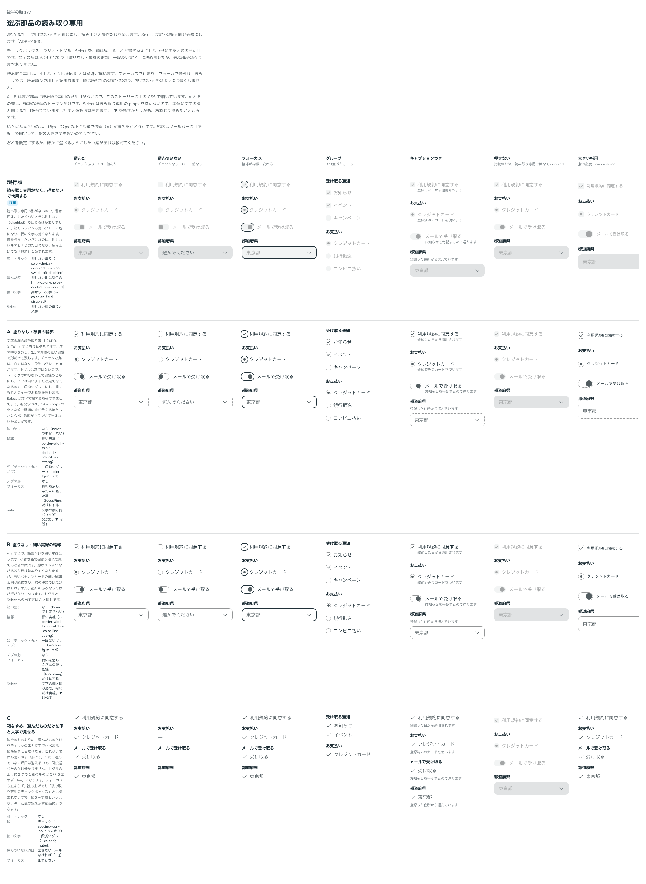

# 0196. 選ぶ部品の読み取り専用は、押せないときと同じ見た目にする

- ステータス: Accepted
- 日付: 2026-09-20
- ラウンド: 後半 軸177

## 背景

チェックボックス・ラジオ・トグル・Select には、読み取り専用の形がありませんでした。書き換えさせたくないときは押せない（`disabled`）で止めるほかなく、値を読ませたいだけなのに押せないものと同じ扱いになり、読み上げでも「無効」と読まれます。

文字を打つ欄の読み取り専用は、塗りなし・破線の輪郭・一段淡い値の文字に決めてあります（[ADR-0170](./0170-readonly-field.md)）。選ぶ部品にも同じ考えを当てるかどうかを決める必要がありました。[原則 8](../principles.md#8-入力欄の様式は編集できるかで決まる)（入力欄の様式）と [原則 13](../principles.md#13-押せないものは浮かせず薄くする)（押せないものの見せ方）に関わります。

## 候補

比較は Storybook の `Design Review/177 選ぶ部品の読み取り専用` です。選んだ・選んでいない・フォーカス・グループ・キャプションつき・押せない（比較のため）・大きい指用の 7 列で比べました。

| 案     | 内容                                                                                                                                                                                     |
| ------ | ---------------------------------------------------------------------------------------------------------------------------------------------------------------------------------------- |
| 現行版 | 読み取り専用の形を持たず、押せない（`disabled`）で代用する。箱もトラックも押せない塗り、横の文字も押せない文字（`--color-on-field-disabled`）                                            |
| A      | 塗りなし・細い破線の輪郭（`--border-width-thin`・dashed・`--color-line-strong`）。印は `--color-fg-muted`、ノブの影なし。Select は文字の欄と同じ（[ADR-0170](./0170-readonly-field.md)） |
| B      | A と同じで、輪郭だけ細い実線                                                                                                                                                             |
| C      | 箱をやめ、選んだものだけをチェックの印と文字で並べる。フォーカスも止まらない                                                                                                             |

## 決定

**見た目は押せないとき（`disabled`）と同じにし、読み上げと操作だけを変えます。** ただし 2 つ例外を置きます。

- **チェックボックス・ラジオ・トグルの横の文字は、本文と同じ色のまま**にします。値は読むための文字なので薄くしません（[原則 13](../principles.md#13-押せないものは浮かせず薄くする)）。カーソルも、押せないときの禁止の形にはしません
- **Select は、文字を打つ欄の読み取り専用と同じ**にします（A）。塗りなし・細い破線の輪郭・一段淡い値の文字で、フォーカスすると破線が枠線に変わります。▼ は残しますが、押せない Select と同じ色まで淡くします。塗りのないアイコンは押せない意味の印なので（[ADR-0190](./0190-field-addon-kinds.md)）、選ぶ欄だと分かる形を残しつつ、押せるようには見せません

読み取り専用と押せないは、次の点で違います。

- フォーカスで止まり、フォームで値が送られます（押せないものは送られません）
- 読み上げでは「読み取り専用」と伝わります（`aria-readonly`。`aria-disabled` は付けません）
- 押してもキーボードでも値は変わらず、hover や押したときの変化も出ません
- Select は選択肢を開きません。値を選び直せないので、開いても読める以上のことができないためです

## 理由

ユーザーの返事の原文です。

> 現行と同じ見た目で、読み上げの挙動だけが異なる、としたいです。

そのあと、見本を見ての追加です。

> チェックとラジオ、スイッチのラベルは元の黒さの時になっているのが正しい気がしました。Select は Input に揃えて

以下は、メモから読み取れることです。

- **箱は押せないときと同じ**: 18px・22px の小さな箱では、破線の点が数えるほどしか入らず、輪郭がざらついて見えません。塗りのあるなしで伝えるより、すでにある押せない箱の見た目をそのまま使うほうが読めます。見た目が同じでも、読み上げと操作で意味は分かれます
- **横の文字は本文の色**: 文字は読むためのものです。箱が薄いままでも、文字が本文の色なら「読む値」だと分かります
- **Select は文字の欄にそろえる**: Select は箱ではなく欄です。TextField と並んだときに、同じ読み取り専用なのに見た目が違うと読み取れません

## 却下した案と理由

- **A・B（塗りなし・破線／実線の輪郭）**: 小さな箱では輪郭が読めません。Select だけは、欄の大きさがあるので A をそのまま採りました
- **C（箱をやめる）**: 何が選べたのかが分からず、トグルの OFF も出せません。値を写す欄ではなく、キーと値の組を示す別の部品になります

## 影響

- `src/internal/form-context.ts`: `useChoiceLock(disabled, readOnly)` を足しました。読み取り専用と Form の送信中は、どちらも `readOnly` で止め、見た目は押せないときの規則が読む `data-disabled` を付けます。`disabled` は付けないので、フォーカスは外れず、値も送られます。送信中は `aria-disabled` を付けて横の文字も薄くし、読み取り専用は付けません（`readOnlyLook`）
- `src/internal/choice/choice-styles.ts`: `choiceReadOnly`（横の文字を `--color-fg` に戻し、カーソルを禁止の形にしない上書き）を足しました
- `src/components/checkbox/Checkbox.tsx`・`CheckboxGroup.tsx`・`src/components/radio/Radio.tsx`（Radio・RadioGroup）・`src/components/switch/Switch.tsx`: `readOnly`（@default `false`）を足しました。グループの `readOnly` は中の選択肢に配られ、選択肢ごとの `readOnly` で上書きできます
- `src/components/select/Select.tsx`: `readOnly`（@default `false`）を足しました。本体に `data-field-readonly` を置いて文字の欄と同じ見た目にし、値はなぞって写せます（`select-text`）。▼ は `--color-fg-subtle` まで淡くします
- 新しいトークンはありません。押せないときの色（`--color-choice-disabled`・`--color-switch-off-disabled`・`--color-choice-neutral-on-disabled`）と、読み取り専用の欄の規則（`data-field-readonly`）をそのまま使います
- backlog に、読み取り専用と押せないが見た目で区別できないことを利用者にどう伝えるか（Docs の書き方）、読み取り専用の選ぶ部品を指で触って確かめていないこと、読み取り専用の Select が開かないことを利用者が予想できるかを足しました

## 原則への反映

[原則 8](../principles.md#8-入力欄の様式は編集できるかで決まる)と [原則 13](../principles.md#13-押せないものは浮かせず薄くする)の文を書き換えました。原則 8 には、選ぶ部品（チェックボックス・ラジオ・トグル）の読み取り専用は押せないときと同じ見た目で、違うのは読み上げと操作だけであること、Select は欄なので文字を打つ欄の読み取り専用にそろえることを足しました。原則 13 には、読み取り専用の横の文字は読むための文字なので薄くしないことを足しました。

## 比較画像

比較のストーリーは決めた時点のコミット `6bb1311` にあります。`git checkout 6bb1311 && pnpm storybook` で開けます。

