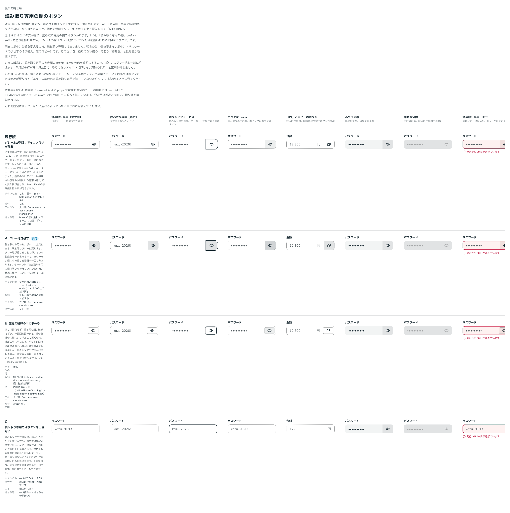

# 0197. 読み取り専用の欄でも、端に付くボタンはグレー地を残す

- ステータス: Accepted
- 日付: 2026-09-20
- ラウンド: 後半 軸178

## 背景

[原則 8](../principles.md#8-入力欄の様式は編集できるかで決まる)には 2 つの文があり、読み取り専用の欄ではぶつかります。1 つは「読み取り専用の欄は prefix・suffix も塗りを持たせない」（[ADR-0170](./0170-readonly-field.md)）、もう 1 つは「グレー地にアイコンだけを置いたものは押せるボタン」（[ADR-0190](./0190-field-addon-kinds.md)）です。

いまの部品は前者だけを守り、読み取り専用のとき欄の prefix・suffix の色を透明にしていました。ボタンのグレー地も一緒に消えるので、塗りのないアイコン（押せない意味の説明）と見分けが付きません。SearchField の虫眼鏡と同じ見た目になります。

読み取り専用でも残るボタンは、値を変えないもの（パスワードの伏せ字の切り替え、値のコピー）です。消去のボタンは値を変えるので、読み取り専用では出しません。

## 候補

比較は Storybook の `Design Review/178 読み取り専用の欄のボタン` です。読み取り専用（伏せ字）・読み取り専用（表示）・ボタンにフォーカス・ボタンに hover・「円」とコピーのボタン・ふつうの欄・押せない欄・読み取り専用＋エラーの 8 列で比べました。

| 案     | 内容                                                                                                                     |
| ------ | ------------------------------------------------------------------------------------------------------------------------ |
| 現行版 | グレー地が消え、アイコンだけが残る。押せることは hover の淡い重ね・フォーカスの線・ポインタの形でしか伝わらない          |
| A      | ボタンの上だけグレー地（`--color-field-addon`）を残す。輪郭はなく、欄の破線の内側に接する                                |
| B      | 塗りは持たせず、欄と同じ細い破線（`--border-width-thin`・`--color-line-strong`）でボタンの範囲を囲む（内側に浮かせる形） |
| C      | 読み取り専用の欄には、端に付くボタンを置かない。伏せ字は解いて出し、コピーは欄の外に置く                                 |

## 決定

**A を採ります。** 読み取り専用の欄でも、端に付くボタンの上だけグレー地を残します。

- 文字の塊（「円」「https://」）は、読み取り専用では地を持ちません。ここは今までどおりです
- ボタン（`FieldAddonButton`）は、読み取り専用でもグレー地（`--color-field-addon`）を持ちます。「グレー地＝押せる」という約束を優先します
- エラーのときは、ボタンの地が欄と同じ赤み（`--color-field-addon-invalid`）になります。ふつうの欄と同じ規則で、地の色だけが変わります。文字の塊は、エラーでも地を持ちません
- hover と押下は、ふつうの欄のボタンと同じです。その地の上に文字の色を `--flat-hover-mix`・`--flat-press-mix` で重ね、押下で中身が 1px 沈みます

## 理由

ユーザーの返事の原文です。

> A でお願いします。

以下は、メモから読み取れることです。

- **押せることの印を優先する**: 「読み取り専用の欄は塗りを持たない」は、書き換えられないことを伝えるための決まりです。一方「グレー地＝押せる」は、押せる場所を伝えるための決まりです。押せるボタンが実際にそこにある以上、後者を消すと押せることが伝わりません。塗りのない欄の中にグレーの塊が 1 つ残っても、それが押せる場所だと読めます
- **エラーの赤みもそろえる**: 比較のとき、読み取り専用＋エラーでボタンにだけ赤みが戻っていました。文字の塊は地を持たず、ボタンだけがグレー地を持つ、と決めたことで、この赤みも「グレー地がエラーで赤みを帯びる」というふつうの規則の一部になりました

## 却下した案と理由

- **現行版**: 塗りのないアイコンが「押せない意味の説明」という約束（[ADR-0190](./0190-field-addon-kinds.md)）と重なり、虫眼鏡と見分けが付きません
- **B（破線で囲む）**: 読み取り専用の様式は崩れませんが、押せることを「囲まれていること」だけで伝えるので、グレー地より弱い印です。欄の破線と線の種類が同じなので、欄の一部にも見えます
- **C（ボタンを出さない）**: 値を伏せたまま見せられず、欄の中でコピーもできません

## 影響

- `src/components/field-addon/FieldAddon.tsx`: `kind: 'text'`（文字の塊）は、読み取り専用の欄の中で地を透明にします（`[[data-field-readonly]_&]:[--addon-fill:transparent]`）。`kind: 'button'` は今までどおり `--addon-fill` を読むので、グレー地が残り、エラーでは `--color-field-addon-invalid` になります
- `src/internal/field/field-styles.ts`: 読み取り専用の欄が `--color-field-addon` を透明にするのをやめました。塗りを外すのは欄の本体（`--color-field`・`--color-field-hover`・`--color-field-focus`）だけです
- `src/internal/field/FieldClearButton.tsx`: 消去のボタンは、値を変えるので読み取り専用では出しません（今までどおり）。PasswordField の伏せ字の切り替えは、読み取り専用でも出します
- 新しいトークンはありません
- backlog に、読み取り専用＋エラーで欄の地とボタンの地の赤みの強さがそろっているかを実機で見ること、文字のボタン（「コピー」など、アイコンでないもの）の地の扱いを足しました

## 原則への反映

[原則 8](../principles.md#8-入力欄の様式は編集できるかで決まる)と [原則 13](../principles.md#13-押せないものは浮かせず薄くする)の文を書き換えました。原則 8 の「読み取り専用の欄は prefix・suffix も塗りを持たせない」を、文字の接頭辞・接尾辞は塗りを持たず、グレー地にアイコンだけのボタンは読み取り専用でも地を残す、と書き換えました。押せる場所をグレー地で示す約束を、読み取り専用の様式より優先します。

## 比較画像

比較のストーリーは決めた時点のコミット `6bb1311` にあります。`git checkout 6bb1311 && pnpm storybook` で開けます。

