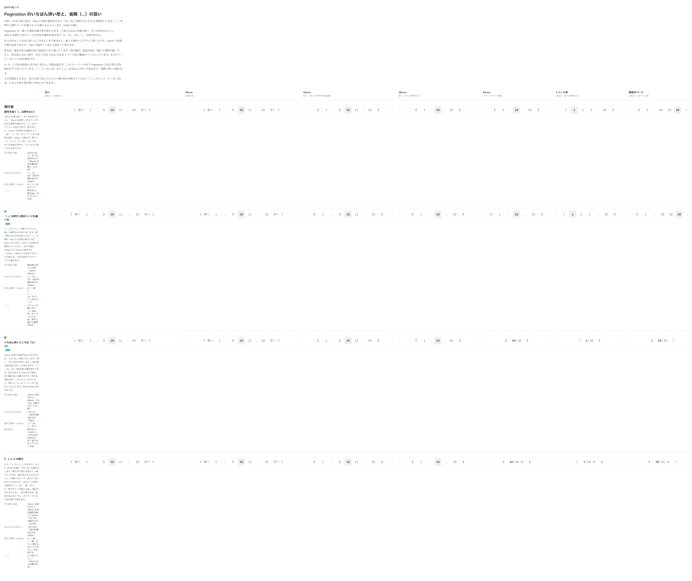

# 0198. Pagination のいちばん狭い形は「10 / 20」

- ステータス: Accepted
- 日付: 2026-09-20
- ラウンド: 後半 軸179

## 背景

Pagination は、置いた場所の幅で形が変わります（[原則 11](../principles.md#11-文字の大きさは入力方式で切り替える)・[原則 16](../principles.md#16-重なる面は指の動きで浮かべるかシートにする)）。32rem 未満で前へ・次へを矢印だけにし、28rem 未満でいまのページの左右の番号を省いていました（`1 … 10 … 20`）。「…」は押せない文字です。

スマートフォンの幅（24rem）でも現行版は収まりますが、部品の高さの箱が 7 つ並んで詰まって見えます。いちばん狭いところをどこまで削るか、そして省いた番号へどうやって届くかを決める必要がありました。

## 候補

比較は Storybook の `Design Review/179 Pagination の狭い形` です。広い（48rem）・40rem・32rem・28rem・24rem・1 ページ目・最後のページの 7 列で比べました。全 20 ページ・10 ページ目が既定です。

| 案     | 内容                                                                                                                                                   |
| ------ | ------------------------------------------------------------------------------------------------------------------------------------------------------ |
| 現行版 | 番号を省く。「…」は押せない文字（幅 `--pagination-ellipsis-width`）。24rem では押せる場所が 4 つ、並びの幅はおよそ 292px                               |
| A      | 「…」をメニューの開くボタンにし、省いた番号をその中に並べる。押せるので幅を部品の高さと同じにする。24rem では押せる場所が 6 つ、並びの幅はおよそ 332px |
| B      | 28rem 未満では番号をやめ、「10 / 20」の数だけにする（矢印は残す）。並びはおよそ 170px。押せる場所は前へ・次への 2 つ                                   |
| C      | A に加えて、さらに狭いところで「10 / 20」を出し、その数そのものをメニューの開くボタンにする（幅で切り替わる段が 3 か所）                               |

## 決定

**B（いちばん狭いところは「10 / 20」）を既定にします。A（「…」のメニュー）も選べるようにします。数を打って移る欄も選べるようにします。**

幅で切り替わる段は 3 か所です。

- 32rem 未満: 前へ・次へを矢印だけにします（文字は読み上げに残します）
- 28rem 未満: いまのページの左右の番号を省きます（`1 … 10 … 20`）
- 24rem 未満: 番号をやめ、「10 / 20」の数だけにします（`narrowDisplay="summary"`。既定）。前へ・次へは残ります

24rem 未満でも番号を並べたままにしたいときは、`narrowDisplay="pages"` にします（28rem 未満と同じ並びのままになります）。

### 押せる場所が減ることと、その補い方

「10 / 20」にすると、押せる場所は前へ・次への 2 つだけになります。間のページへは 1 ページずつ送ることになるので、補う道を 2 つ用意しました。

- **数を打って移る欄**（`pageInput`。既定は付けない）: 「10 / 20」の「10」を、数を打って移る欄にします。Enter か IME の確定で移ります。全角で打った数字は半角に直します。ページの数より大きい数や 0 以下では移らず、欄を離すと打った値はいまのページに戻ります
- **「…」のメニュー**（`ellipsisMenu`。既定は付けない）: 省略を押して、省いた番号をメニューから選べるようにします。押せるので、番号と同じ大きさ（指で押せる大きさ）になります（[原則 17](../principles.md#17-押せる範囲は見た目の範囲)）。`narrowDisplay="pages"` と組み合わせると、いちばん狭いところでも 2 回の操作でどのページにも届きます

どちらも付けないときは、いちばん狭いところで 1 ページずつ送る形になります。どこまで要るかは置く場所（ページの数、指かマウスか）で変わるので、使う側が選びます（[原則 20](../principles.md#20-部品は知らないことを決めない)）。

## 理由

ユーザーの返事の原文です。

> Bデフォルトで、... についてはA の挙動も追加できるようにする。24rem より小さい場合、B の挙動と A の挙動を選べるようにする。また、現在の数字は NumberField 的なのを差し込んで、数字を直接入力できるようにする（エンターなど、IMEの確定で遷移）挙動もオプションで選べるようにする。

以下は、メモから読み取れることです。

- **B を既定に**: いちばん狭いところでは、並びがおよそ 170px まで縮みます。箱が並んで詰まって見える状態を避けられ、狭い欄の中にも置けます。いまいる場所（10 / 20）だけは、どの幅でも読めます
- **A も選べる**: 番号を並べたまま間のページへ届かせたいときの道です。「…」を押せるようにすると幅は増えますが、24rem にも収まります
- **数を打つ欄も選べる**: ページの数が多いフォーラムや一覧では、メニューよりも数を打つほうが速く着きます

## 却下した案と理由

- **現行版**: 24rem で部品の高さの箱が 7 つ並び、詰まって見えます。押せない「…」も、間のページへ届く道になりません
- **C（A と B の両方を 1 つの形にする）**: 幅で切り替わる段が増え、「10 / 20」そのものが開くボタンになります。数を打つ欄と役目が重なるので、別々に選べる形（B ＋ `pageInput` ／ B ＋ `narrowDisplay="pages"` ＋ `ellipsisMenu`）にまとめました

## 影響

- `src/components/pagination/Pagination.tsx`: `narrowDisplay`（`summary`（既定）・`pages`）、`ellipsisMenu`（@default `false`）、`pageInput`（@default `false`）、`ellipsisLabel`（@default `'間のページ'`）、`summaryLabel`（読み上げの文。既定は「20 ページ中 10 ページ目」の形）を足しました。「10 / 20」は、いまのページだけ本文の色の太字、残りは番号と同じグレーで、数字は等幅の数字（`tabular-nums`）です。読み上げには、見えている「10 / 20」ではなく `summaryLabel` の文を渡します
- `src/components/pagination/PaginationEllipsisMenu.tsx`（新規）: 「…」を開くボタンにしたときのメニューです。押せるので、番号と同じ大きさになります
- `src/components/pagination/PaginationPageInput.tsx`（新規）: 数を打って移る欄です。IME で変換しているあいだの Enter は確定なので、確定し終えてから移ります
- `src/components/pagination/pagination-items.ts`: `ellipsisRange`（省略が隠しているページの範囲）を足しました
- `src/index.ts`: `PaginationNarrowDisplay` の型を公開しました
- `design/tokens.css`: `--pagination-count-gap`（「10 / 20」の数と「/ 20」のあいだ）を Pagination の区画に足しました。`--pagination-ellipsis-width` は、押せない「…」のときの幅として残ります（`ellipsisMenu` のときは番号と同じ大きさです）
- backlog に、「…」のメニューと数を打つ欄を指で確かめていないこと、`pageInput` と `ellipsisMenu` を同時に付けたときの並び、幅の切り替わる場所（32rem・28rem・24rem）を使う側が変えられるようにするかを足しました

## 原則への反映

反映なし。[原則 11](../principles.md#11-文字の大きさは入力方式で切り替える)（幅で構造を切り替える）、[原則 16](../principles.md#16-重なる面は指の動きで浮かべるかシートにする)（狭いところでの重なる面）、[原則 17](../principles.md#17-押せる範囲は見た目の範囲)（押せるものは押せる大きさを取る）の範囲内の決定です。どこまで削るか、間のページへどう届くかは、部品の props（`narrowDisplay`・`ellipsisMenu`・`pageInput`）です。

## 比較画像

比較のストーリーは決めた時点のコミット `6bb1311` にあります。`git checkout 6bb1311 && pnpm storybook` で開けます。なお、比較のストーリーは 28rem 未満で「10 / 20」に切り替える形（B）で描いていました。実装では、24rem 以上 28rem 未満で番号を並べた狭い並びを残し、24rem 未満で「10 / 20」にしています。

