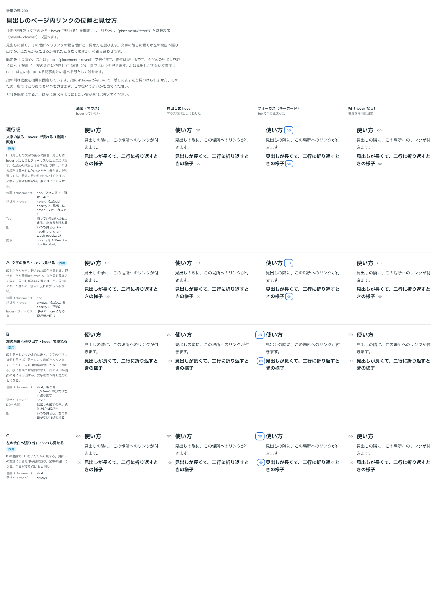

# 0200. 見出しのページ内リンクは、文字の後ろに置き、hover で現す

- ステータス: Accepted
- 日付: 2026-09-20
- ラウンド: 後半

## 背景

記事や文書の見出しには、その場所へのリンク（ページ内リンク）を付けたくなります。見出しの id を指す小さな印を、見出しのどこに置き、いつ見せるかを決める必要がありました。

- 置き場所: 文字の後ろか、左の余白へ張り出すか
- 見せ方: 見出しに触れたときだけ現すか、ふだんから見せるか

働きはリンクなので、部品は `HeadingAnchor` として見出しの中に置きます（[原則 18](../principles.md#18-働きで部品を選び見た目は別に選ぶ)）。押せる範囲は印とその周りだけです（[原則 17](../principles.md#17-押せる範囲は見た目の範囲)）。印の形・色・大きさは [0201](./0201-heading-anchor-mark.md) で決めました。

## 候補

比較は、決めた時点のコミット `afa3d83` の比較のストーリー（`design/stories/axis-200-heading-anchor-placement.stories.tsx`）です。通常（マウス）・見出しに hover・フォーカス（キーボード）・指（hover なし。密度を指用に固定）の 4 列で比べました。

| 案     | 内容                                                                                                                                                                |
| ------ | ------------------------------------------------------------------------------------------------------------------------------------------------------------------- |
| 現行版 | 文字の後ろに置き、見出しに hover したときとフォーカスしたときだけ現す。ふだんの見出しは文字だけで軽い。折り返しても、最後の行の終わりに付くだけ。指ではいつも見せる |
| A      | 文字の後ろに置き、ふだんから控えめな灰色で見せる。押せることが最初から分かる。見出しが多い文書では、印が並んで少しうるさい                                          |
| B      | 左の余白へ張り出し、hover で現す。見出しの左端がそろったまま。ただし、左に余白がないと切れる。DOM の順は見出しの最初の子で、読み上げも印が先になる                  |
| C      | B の位置で、ふだんから見せる。左端に印が縦に並び、記事の目印になる。余白が要る点は B と同じ                                                                         |

## 決定

**現行版（文字の後ろ・hover で現れる）を既定にします。A・B・C の見え方は、props で選べるようにします。**

- `placement`: `end`（既定。文字の後ろで、見出しの最後の子）／`start`（左の余白へ張り出す。見出しの最初の子）
- `reveal`: `hover`（既定。見出しに hover したときとフォーカスしたときだけ現れる）／`always`（ふだんから見せる）

A は `reveal="always"`、B は `placement="start"`、C は両方を指定した形です。

部品として先に決めたことは、次のとおりです。

- 押せる範囲は、印とその周りの余白（左右 4px・上下 2px）です。印は小さいので、hover と押下のあいだ、その範囲に Primary を淡く敷いて見せます（文字の色を淡く敷く、Link や Button と同じ塗り）。見えない広がりにはしません（[原則 17](../principles.md#17-押せる範囲は見た目の範囲)、[ADR-0193](./0193-underline-button.md)）。比較のあとで足しました
- 隠しているあいだ（`reveal="hover"`）も、Tab では止まります。止まると現れます
- 指の入力（`--density-coarse` が 1）では、hover がないので、`reveal` にかかわらずいつも見せます。隠したままでは見つけられないためです
- 現れる・消えるは opacity だけで、速く切り替えます（`--heading-anchor-duration`）。位置は動かしません。動きを減らす設定では、すぐに切り替えます（[原則 14](../principles.md#14-動きは手応えと待ちを伝える)）。動きの候補は並べていません
- 見出しの名前は「見出しの文字 ＋ `label`」になります。`label` は短い文にします

## 理由

ユーザーの返事の原文です（14 軸まとめての返事）。

> デフォルト現行、張り出し・常時表示選択可

以下は、メモから読み取れることです。

- **現行版を既定に**: ふだんの見出しを文字だけの軽い姿に保てます。また、左の余白に頼らないので、余白のない置き場所や狭い画面でも切れません（[原則 20](../principles.md#20-部品は知らないことを決めない)）
- **張り出し（B・C）も選べる**: 左の余白がある記事では、見出しの左端をそろえたまま印を出せます。余白があるかどうかは使う側が知っていることなので、props で選びます
- **常時表示（A・C）も選べる**: 押せることを最初から見せたい文書向けの道です

### 押せる範囲の見せ方（比較のあとで決めたこと）

比較のあとで実装を見直したところ、印の周りに余白（左右 4px・上下 2px）があるのに、hover で色を敷いていないので、押せる範囲が印の大きさより広いことが見えませんでした。文字のリンクの押せる範囲は文字の行だけで、部品のコメントに書いた「文字のリンクと同じ」も違っていました。次の 3 つから選んでもらいました。

1. 余白を外し、押せる範囲を印だけにする
2. 余白を残し、ADR-0193（下線の押すもの）と同じく、hover で淡い色を敷いて範囲を見せる
3. 余白を残し、原則 17 に例外を足す

「押せる範囲は見た目の範囲」の決まりとの関係を聞かれたとき、ghost の押すものの取り決め（[ADR-0193](./0193-underline-button.md)）を確かめてもらいました。

> ghost ボタンの取り決めってどうなっていましたっけ

> 2 でよいです。現在の実装では、ホバー色がないのが問題であると思っています。

ghost（塗りも枠線もない押すもの）は、押していない状態で押せる場所が見えないので採らず、押せる範囲は hover で敷く淡い色が見せる、というのが ADR-0193 の折り合いです。HeadingAnchor も同じ考えで、hover と押下で色を敷きます。余白を外す案（1）と、原則に例外を足す案（3）は採りませんでした。

## 却下した案と理由

既定にしなかっただけで、A・B・C はどれも props で選べます。却下した案はありません。既定にしなかった理由は次のとおりです。

- **A（いつも見せる）**: 見出しが多い文書では、どの見出しにも印が並び、読みの流れに少しうるさくなります
- **B・C（左の余白へ張り出す）**: 左に印の幅の余白がないと切れます。狭い画面や指では、印が画面の外にはみ出すか、文字を右へ押し込むことになります。余白に依存する形は、既定にしません

## 影響

- `src/components/heading-anchor/HeadingAnchor.tsx`（新規）: 見出しに付くページ内リンクです。props は `href`、`label`（@default `'このセクションへのリンク'`）、`reveal`（@default `'hover'`）、`placement`（@default `'end'`）、`mark`（[0201](./0201-heading-anchor-mark.md)）、`children`（印の差し替え）です。`start` の張り出す幅は、印の大きさ・左右の余白・間から計算します。Prose の中の `h2` などに置いても、a の色や下線にはなりません
- `HeadingAnchor.tsx`（比較のあとの修正）: hover と押下で、Primary を `--flat-hover-mix`・`--flat-press-mix` で混ぜた淡い色を、印と余白の範囲に敷きます（`--flat-bg`。トークンは足していません）。押下で 1px 沈む動きは、そのままです
- `src/components/heading-anchor/HeadingAnchor.stories.tsx`（新規）と、見た目の基準画像（`__screenshots__/`）
- `src/index.ts`: `HeadingAnchor` と props の型を公開しました
- `design/tokens.css`: HeadingAnchor の区画に、`--heading-anchor-gap`（文字と印のあいだ）、`--heading-anchor-rest-opacity`（ふだんの濃さ。`always` で 1 に差し替え）、`--heading-anchor-touch-opacity`（指のときのふだんの濃さ）、`--heading-anchor-duration`（現れる・消える速さ。役割は `--duration-fast`）を足しました
- 部品は状態を持たない `a` なので、`'use client'` は不要です

## 原則への反映

反映なし。[原則 17](../principles.md#17-押せる範囲は見た目の範囲)（押せる範囲は印と周りの余白で、hover と押下の色がその範囲を見せる）、[原則 14](../principles.md#14-動きは手応えと待ちを伝える)（状態の移り変わりは速く。動きを減らす設定でも伝えることは減らさない）、[原則 18](../principles.md#18-働きで部品を選び見た目は別に選ぶ)（働きはリンク）、[原則 20](../principles.md#20-部品は知らないことを決めない)（左の余白の有無は使う側が選ぶ）の範囲内の決定です。

## 比較画像

比較のストーリーは決めた時点のコミット `afa3d83` にあります。`git checkout afa3d83 && pnpm storybook` で、決めたときの部品のまま開けます。

画像は決めた時点（`afa3d83`）のものなので、印に hover したときの色は敷いていません。この色は、比較のあとに足しました（コミット `9f87665`）。

