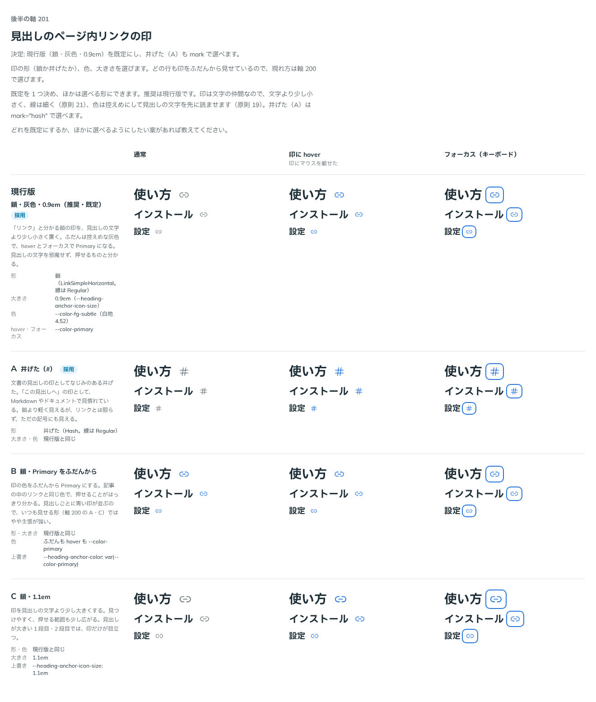

# 0201. 見出しのページ内リンクの印は、灰色の鎖にする

- ステータス: Accepted
- 日付: 2026-09-20
- ラウンド: 後半

## 背景

見出しに付くページ内リンク（[0200](./0200-heading-anchor-placement.md)）の印の形・色・大きさを決める必要がありました。印は文字の仲間なので、大きさは見出しの文字に比例させ、線は文字と並ぶ細さにします（[原則 21](../principles.md#21-アイコンは文字に合わせる)）。

## 候補

比較は、決めた時点のコミット `afa3d83` の比較のストーリー（`design/stories/axis-201-heading-anchor-mark.stories.tsx`）です。印を見比べるので、どの行も `reveal="always"` で、通常・印に hover・フォーカス（キーボード）の 3 列で並べました。形は `mark` で、色と大きさは `design/tokens.css` の上書きだけで作りました。

| 案     | 内容                                                                                                                               |
| ------ | ---------------------------------------------------------------------------------------------------------------------------------- |
| 現行版 | 鎖（線は細い）・見出しの文字の 0.9 倍・ふだんは控えめな灰色（`--color-fg-subtle`）で、hover とフォーカスで Primary。リンクと分かる |
| A      | 井げた（`#`）。Markdown やドキュメントで見慣れた見出しの印。鎖より軽いが、リンクとは限らず、ただの記号にも見える                   |
| B      | 鎖の色をふだんから Primary にする。押せることははっきり分かるが、見出しごとに青い印が並び、主張が強い                              |
| C      | 鎖を 1.1 倍にする。見つけやすく押せる範囲も広がるが、大きい見出しでは印だけが目立つ                                                |

## 決定

**現行版（鎖・灰色・0.9 倍）を既定にします。A（井げた）は `mark="hash"` で選べるようにします。B・C は形にしません。**

- `mark`: `link`（既定。鎖）／`hash`（井げた）。色と大きさは同じです
- 印は `children` で差し替えられます（`mark` より優先）。大きさは見出しの文字に合わせます
- 色は `--heading-anchor-color`（ふだん）と `--heading-anchor-color-hover`（hover・フォーカス）、大きさは `--heading-anchor-icon-size` の役割です。値は `design/tokens.css` にあります

## 理由

ユーザーの返事の原文です（14 軸まとめての返事）。

> デフォルト現行、A選択可

以下は、メモから読み取れることです。

- **現行版を既定に**: 鎖はリンクと分かる形です。灰色で少し小さいので、見出しの文字を邪魔しません
- **A も選べる**: 井げたは、見出しのページ内リンクの印として見慣れた使い手がいます。使う側の好みなので、`mark` で選べるようにします
- **B・C は選ばれなかった**: 返事に挙がらなかったので、形にしません

## 却下した案と理由

- **B（Primary をふだんから）**: 押せることははっきり分かりますが、見出しごとに青い印が並びます。ふだんは灰色にし、hover とフォーカスで Primary にする形のほうが、見出しの文字を邪魔しません。色を変えたい使う側は、トークン（`--heading-anchor-color`）を差し替えられます
- **C（1.1 倍）**: 印が文字より大きくなり、見出しが大きい 1 段目・2 段目では印だけが目立ちます。印は文字の仲間として、文字になじむ大きさに置きます

## 影響

- `src/components/heading-anchor/HeadingAnchor.tsx`: `mark`（@default `'link'`）と `children`（印の差し替え）を持ちます。鎖は `LinkSimpleHorizontalIcon`、井げたは `HashIcon` です（どちらも `src/internal/icons`。線は細い）
- `design/tokens.css`: HeadingAnchor の区画に、`--heading-anchor-icon-size`（0.9em。見出しの文字に比例）、`--heading-anchor-color`（`--color-fg-subtle`）、`--heading-anchor-color-hover`（`--color-primary`）を足しました
- 比較のために足した切り替えのトークンはありません（B・C は上書きだけで作ったため）

## 原則への反映

反映なし。[原則 21](../principles.md#21-アイコンは文字に合わせる)（アイコンは文字の仲間。大きさは周りの文字に比例し、文字と並ぶときは細い線）の範囲内の決定です。印の色は、押せることを hover とフォーカスで伝える働きで、[原則 6](../principles.md#6-色は役割で持つ)の役割の色（Primary）を使っています。

## 比較画像

比較のストーリーは決めた時点のコミット `afa3d83` にあります。`git checkout afa3d83 && pnpm storybook` で、決めたときの部品のまま開けます。

画像は決めた時点（`afa3d83`）のものなので、印に hover したときの色は敷いていません。この色は、比較のあとに足しました（コミット `9f87665`）。

