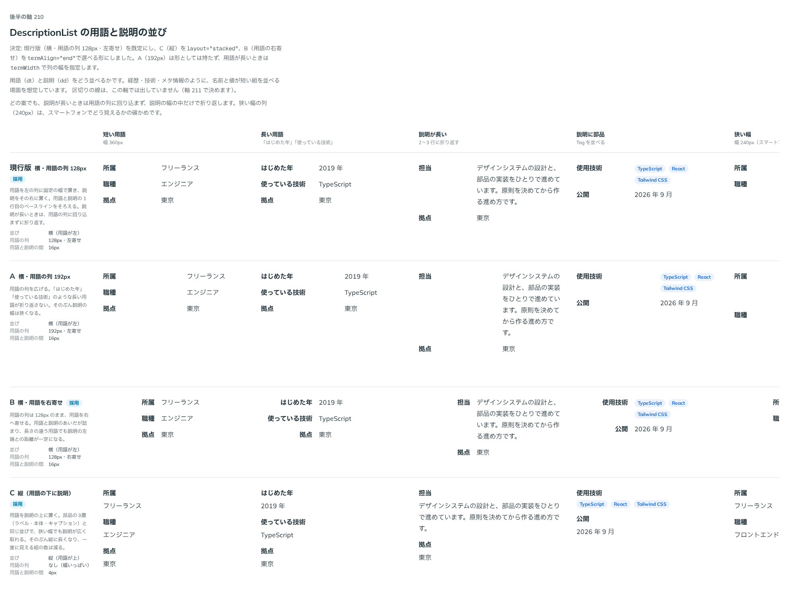

# 0202. DescriptionList の用語と説明は、横に並べるのを既定にする

- ステータス: Accepted
- 日付: 2026-09-20
- ラウンド: 後半

## 背景

DescriptionList は、経歴・技術・メタ情報のような、名前と値が短い組を並べる部品です。用語（dt）と説明（dd）をどう並べるかを決める必要がありました。関わる原則は、部品を単独で置かず名前と説明を伴わせる [原則 4](../principles.md#4-部品はラベル--本体--キャプションの-3-層)、読み上げの順を見た目に合わせる [原則 15](../principles.md#15-読み上げは見た目の順フォーカスは次に触るものへ)、置き場所を知らない部品は既定を 1 つ決めてほかを選べるようにする [原則 20](../principles.md#20-部品は知らないことを決めない) です。

この部品は押さないので、hover も影も持ちません。ページと同じレイヤーに置きます（[原則 1](../principles.md#1-影はレイヤーの離れを表す)）。

## 候補

比較は、決めた時点のコミット `afa3d83` の比較のストーリー（`design/stories/axis-210-description-list-layout.stories.tsx`）です。短い用語・長い用語・説明が長い組・説明に部品（Tag）を置いた組・狭い幅（240px）の 5 列で比べました。区切りの線は、この比較では出していません（[0203](./0203-description-list-divider.md)）。

| 案     | 内容                                                                                                                                            |
| ------ | ----------------------------------------------------------------------------------------------------------------------------------------------- |
| 現行版 | 横並び。用語の列は 128px で左寄せ、用語と説明のあいだは 16px。用語と説明の 1 行目のベースラインをそろえ、説明が長いときは用語の列に回り込まない |
| A      | 横並び。用語の列を 192px にする。「はじめた年」「使っている技術」のような長い用語が折り返さないが、説明の幅は狭くなる                           |
| B      | 横並び。用語の列は 128px のまま、用語を右へ寄せる。用語と説明のあいだが詰まり、説明の左端との距離が一定になる                                   |
| C      | 縦並び。用語の上に説明を置く（あいだは 4px）。狭い幅でも説明が広く取れるが、縦に長くなり、一度に見える組の数は減る                              |

## 決定

**現行版（横並び・用語の列 128px・左寄せ）を既定にします。縦並び（C）と、横並びで用語を右寄せにする形（B）も選べるようにします。A（192px）は形にせず、列の幅を指定できるようにします。**

- `layout`: `horizontal`（既定）・`stacked`（C。用語の上に説明）
- `termAlign`: `start`（既定）・`end`（B。用語の列の中で右へ寄せる）
- `termWidth`: 用語の列の幅（`'8rem'`・`'160px'` など）。A のように長い用語を折り返したくないときは、列の幅をこれで指定します

### 部品の構造

要素は `dl` の中に `div`（1 組）を置き、その中に `dt` と `dd` を並べます。`<DescriptionItem term={...}>説明</DescriptionItem>` が 1 組で、`term` が dt、`children` が dd になります。用語と説明は読み上げで組になり、見た目の順と読み上げの順が同じです（原則 15）。並びは、`layout` が根の要素でトークンを差し替えて切り替えます。dt と dd の並びが HTML の上では変わらないので、縦横を切り替えても読み上げは同じです。

用語は値の名前なので太字です（原則 4）。説明は本文の大きさです（[原則 11](../principles.md#11-文字の大きさは入力方式で切り替える)）。

## 理由

ユーザーの返事の原文です。

> デフォルト現行、縦並びにも変更可、横並び右寄せも選択可

以下は、メモから読み取れることです。

- **現行版を既定に**: 用語を左に固定の幅で置き、説明をその右に置く形を、そのまま既定にすることを選んでいます
- **縦並びも選べる**: C を `layout="stacked"` にしました。狭い幅で説明を広く取りたいときの道です
- **横並びの右寄せも選べる**: B を `termAlign="end"` にしました
- **A は何も言われていない**: 返事に A はありません。列の幅を変えるだけで表せるので、形にせず `termWidth` で指定できる形にしました

## 却下した案と理由

- **A（192px）を既定や選べる形にすること**: 返事に含まれておらず、列の幅の違いだけなので、`termWidth` に任せました。用語の長さは置く場所で変わるので、部品は決めません（原則 20）

## 影響

- `src/components/description-list/DescriptionList.tsx`（新規）: `DescriptionList` と `DescriptionItem`。props は `layout`（@default `'horizontal'`）・`termAlign`（@default `'start'`）・`termWidth`（書かないと 128px）。ほかの props は [0203](./0203-description-list-divider.md)・[0204](./0204-description-list-term.md) にあります
- `src/components/description-list/DescriptionList.stories.tsx`（新規）: `Components/DescriptionList` のストーリー
- `design/tokens.css`: DescriptionList の区画（`--description-direction`・`--description-item-align`・`--description-term-width`・`--description-term-align`・`--description-column-gap`・`--description-row-gap`・`--description-item-gap`）を足しました
- `src/index.ts`: `DescriptionList`・`DescriptionItem`・`DescriptionListLayout`・`DescriptionListTermAlign` などを公開しました
- `'use client'` は要りません（ブラウザの API を使いません）
- backlog に足す候補: 1 つの用語に複数の説明（dd を複数）を持たせる書き方は用意していません。狭い画面で横から縦へ自動で切り替える形は入れていません（使う側が `layout` を切り替えます）

## 原則への反映

反映なし。[原則 4](../principles.md#4-部品はラベル--本体--キャプションの-3-層)（用語は太字）、[原則 11](../principles.md#11-文字の大きさは入力方式で切り替える)（説明は本文の大きさ）、[原則 15](../principles.md#15-読み上げは見た目の順フォーカスは次に触るものへ)（読み上げの順）、[原則 20](../principles.md#20-部品は知らないことを決めない)（既定を 1 つ決め、ほかは選べる）の範囲内の決定です。

## 比較画像

決めた時点のコミット `afa3d83` で、`git checkout afa3d83 && pnpm storybook` で開けます。

