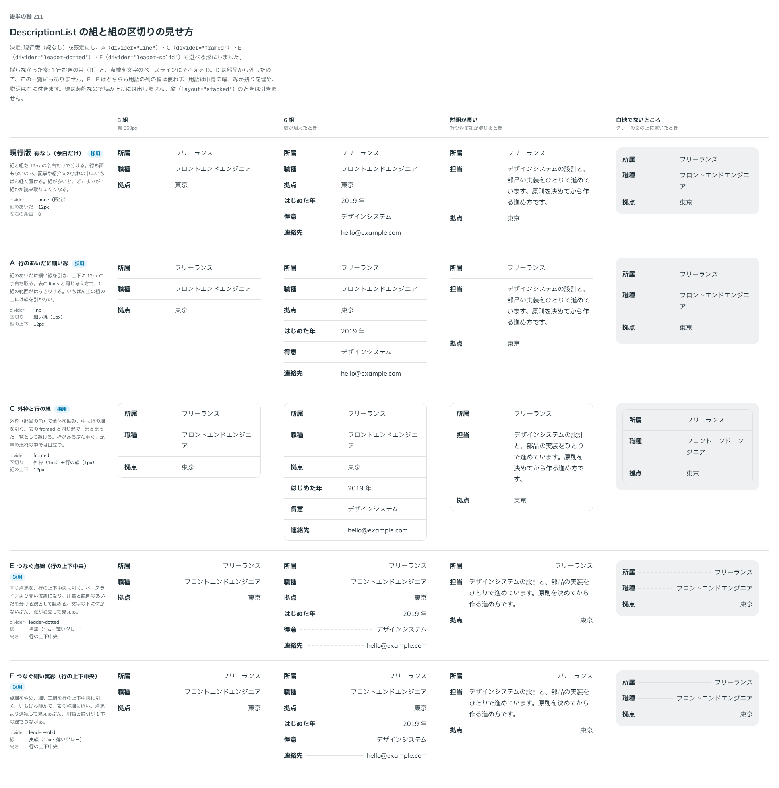

# 0203. DescriptionList の区切りは、線なしを既定に、線・枠・つなぐ線を選べる

- ステータス: Accepted
- 日付: 2026-09-20
- ラウンド: 後半

## 背景

DescriptionList は、組を何本も並べると、どこまでが 1 組かが読み取りにくくなります。組と組の区切りをどう見せるかを決める必要がありました。関わる原則は、押さない部品に影も面も足さない [原則 1](../principles.md#1-影はレイヤーの離れを表す)、部品の角を使う [原則 5](../principles.md#5-角丸は部品と包むもので分ける)、既定を 1 つ決めてほかを選べるようにする [原則 20](../principles.md#20-部品は知らないことを決めない) です。

## 候補

比較は、決めた時点のコミット `afa3d83` の比較のストーリー（`design/stories/axis-211-description-list-divider.stories.tsx`）です。3 組・6 組・説明が長い組・グレーの面の上、の 4 列で比べました。

比較のストーリーは、決めたあとに、採らなかった案（B・D）を部品から外したので、そのコミットでは B・D の列が残っていません。B・D の内容は、決めたときの説明で書きます。

| 案     | 内容                                                                                                                                                |
| ------ | --------------------------------------------------------------------------------------------------------------------------------------------------- |
| 現行版 | 線なし。組と組を余白だけで分ける。記事の流れの中にいちばん軽く置ける。組が多いと、どこまでが 1 組かが読み取りにくくなる                             |
| A      | 行のあいだに細い線（`divider="line"`）。上下に 12px の余白を取る。表の `lines` と同じ考え方で、いちばん上の組の上には線を引かない                   |
| B      | 1 行おきの帯（面）。行の範囲が面で分かる                                                                                                            |
| C      | 外枠と行の線（`divider="framed"`）。部品の角の外枠で囲み、中に行の線を引く。表の `framed` と同じ形。まとまった一覧として置けるが、枠があるぶん重い  |
| D      | 用語の右から説明までを、点線でつなぐ。点線を文字のベースラインにそろえる（実装するときの推奨だった）                                                |
| E      | D と同じ点線を、行の上下中央に引く（`divider="leader-dotted"`）。文字の下に付かないので、点が独立して見え、用語と説明のあいだを分ける線として読める |
| F      | 点線をやめ、細い実線を行の上下中央に引く（`divider="leader-solid"`）。いちばん静かで、表の罫線に近い。用語と説明が 1 本の線でつながる               |

## 決定

**現行版（線なし）を既定にします。A（行の線）・C（外枠）・E（点線でつなぐ）・F（実線でつなぐ）を選べるようにします。B（1 行おきの帯）と D（ベースライン揃えの点線）は採りません。**

- `divider`: `none`（既定）・`line`（A）・`framed`（C）・`leader-dotted`（E）・`leader-solid`（F）
- E・F は、横並びのとき、用語の右から説明の左までを、行の上下中央で薄い線でつなぎます。用語の列の幅（`termWidth`）は使わず、用語は中身の幅、線が残りを埋め、説明は右に付きます
- 縦並び（`layout="stacked"`）のときは線を引きません（用語と説明が上下なので、つなげません）
- 説明が長い組では、線が 0 まで縮んで消えます（線より折り返しを先にします）
- 線は装飾なので読み上げには出しません。実装は dt の `::after` を伸ばす形で、要素を足さないので、HTML も読み上げの並びも変わりません

### 返事の読み替え

返事は「A/B/E/F 選択可」でした。しかし比べたときのラベルは、現行版・A・C・D・E・F で、B は「1 行おきの帯」ですが、その前の返事（「A/C選択可」）で選んだのは C（外枠）です。B は選ばれていないはずなので、返事の B は C の言い間違いと読み、A・C・E・F を選べる形にしました。D は返事に含まれていないので、採りませんでした。

## 理由

ユーザーの返事の原文です。

最初の返事:

> デフォルト現行、A/C選択可、横並びの場合にラベル右から値まで薄い中央線のパターンも追加してみてほしいです

つなぐ線（E・F）を見たあとの返事:

> 現行版デフォ、A/B/E/F 選択可

以下は、メモから読み取れることです。

- **現行版を既定に**: 2 回とも現行版（線なし）を既定にしています。記事の流れの中に、いちばん軽く置けます
- **A・C を選べる**: 1 回目の返事のとおりです。行の線と外枠は、組が多いときに範囲をはっきりさせます
- **つなぐ線を足した**: 「ラベル右から値まで薄い中央線」は、用語の右から説明までを、行の上下中央の薄い線でつなぐ形です。これを E（点線）・F（実線）で出しました。行の上下中央に引く点は、原文の「中央線」からです
- **B は C の読み替え**: 上の「返事の読み替え」のとおりです
- **D は採らない**: 返事に D はありません。実装するときの推奨は D でしたが、返事は行の上下中央の線（E・F）を選んでいます

## 却下した案と理由

- **B（1 行おきの帯）**: 返事の「B」は C の言い間違いと読んだので、帯の案そのものは選ばれていません。部品から外しました
- **D（点線・ベースライン揃え）**: 返事に含まれません。E・F（行の上下中央）を選んだので、部品から外しました

## 影響

- `src/components/description-list/DescriptionList.tsx`: `divider`（`none`（既定）・`line`・`framed`・`leader-dotted`・`leader-solid`。@default `'none'`）を足しました。区切りは根の要素でトークンを差し替えて切り替え、縦並びのときの leader は `compoundVariants` で消します。`termAlign`・`termWidth` は leader のときは効きません
- `design/tokens.css`: `--description-divider-width`・`--description-frame-width`・`--description-pad-x`・`--description-pad-y`・`--color-description-line`・`--description-leader-display`・`--description-leader-gap`・`--description-leader-style`・`--description-leader-width`・`--color-description-leader` を DescriptionList の区画に足しました
- `src/index.ts`: `DescriptionListDivider` の型を公開しました

## 原則への反映

反映なし。[原則 1](../principles.md#1-影はレイヤーの離れを表す)（押さない部品に影も面も足さない。区切りは線だけで、帯の面は採らなかった）、[原則 5](../principles.md#5-角丸は部品と包むもので分ける)（外枠の角は部品の角）、[原則 20](../principles.md#20-部品は知らないことを決めない)（既定を 1 つ決め、ほかは選べる）の範囲内の決定です。

## 比較画像

決めた時点のコミット `afa3d83` で、`git checkout afa3d83 && pnpm storybook` で開けます。

