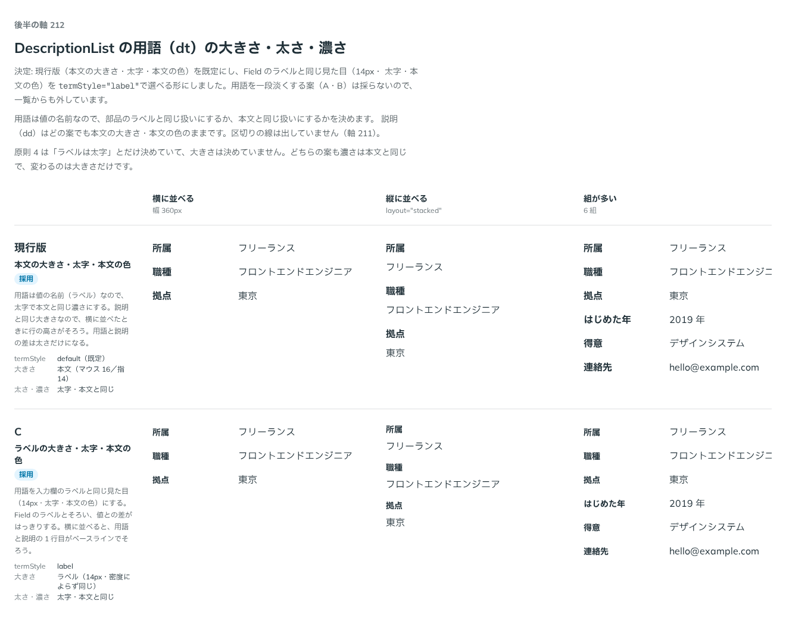

# 0204. DescriptionList の用語は、本文の大きさの太字を既定に、Field のラベルと同じ見た目も選べる

- ステータス: Accepted
- 日付: 2026-09-20
- ラウンド: 後半

## 背景

DescriptionList の用語（dt）は、値の名前です。説明（dd）との差をどこに付けるか、入力欄のラベルとどうそろえるかを決める必要がありました。関わる原則は、ラベルは太字 [原則 4](../principles.md#4-部品はラベル--本体--キャプションの-3-層)、ラベルとキャプションは入力方式によらず同じ大きさ、部品の文字と本文は同じ大きさ [原則 11](../principles.md#11-文字の大きさは入力方式で切り替える)、既定を 1 つ決めてほかを選べるようにする [原則 20](../principles.md#20-部品は知らないことを決めない) です。

## 候補

比較は、決めた時点のコミット `afa3d83` の比較のストーリー（`design/stories/axis-212-description-list-term.stories.tsx`）です。横に並べる・縦に並べる・組が多い・指の密度の 4 列で比べました。そのコミットのストーリーには、現行版と C だけが残っています（A・B は、決めたあとに、淡さのトークンといっしょに部品から外しました）。A・B の内容は、濃さや太さを変える案としか記録が残っていません。

| 案     | 内容                                                                                                                                                          |
| ------ | ------------------------------------------------------------------------------------------------------------------------------------------------------------- |
| 現行版 | 本文の大きさ・太字・本文の色。説明と同じ大きさなので、横に並べたときに行の高さがそろう。用語と説明の差は太さだけ                                              |
| A      | 濃さや太さを変える案                                                                                                                                          |
| B      | 濃さや太さを変える案                                                                                                                                          |
| C      | 大きさ 14px・太字・一段淡い色。入力欄のラベルと同じ大きさ・太さで、値との差がはっきりする。密度によらず同じ大きさ。横に並べると、1 行目がベースラインでそろう |

## 決定

**現行版（本文の大きさ・太字・本文の色）を既定にします。Field のラベルと同じ見た目（14px・太字・通常の文字色）を `termStyle="label"` で選べるようにします。**

C は、大きさと太さは Field のラベル（`text-label font-bold text-fg`）と同じでしたが、色が一段淡く、Field のラベルと違いました。そのままは採らず、選べる形は Field のラベルと完全に同じ見た目（色も通常の文字色）にしました。トークンも Field と同じ `--text-label`・`--leading-label` です。A・B（濃さや太さを変える案）と、一段淡い色は採りません。

- `termStyle`: `default`（既定）・`label`（Field のラベルと同じ見た目。密度によらず 14px）

### ユーザーの質問への答え

ユーザーの質問は「C は TextField のラベルと同じ見た目ですか？同じなら選択可としたいです。」でした。答えは、大きさ（14px）と太さ（太字）は同じで、色は C が一段淡く違いました。同じ見た目にしてから選べる形にしました。

## 理由

ユーザーの返事の原文です。

> デフォルト現行、C は TextField のラベルと同じ見た目ですか？同じなら選択可としたいです。

以下は、メモから読み取れることです。

- **現行版を既定に**: 用語を本文の大きさの太字にする形を、そのまま既定にしています
- **C は、Field のラベルと同じなら選べる**: 条件付きの返事です。ラベルと同じ見た目なら、入力欄のラベルと DescriptionList の用語がそろうことを求めています。違いがあった色は、Field に合わせました
- **A・B は何も言われていない**: 選ばれていないので、採りません

## 却下した案と理由

- **A・B（濃さや太さを変える案）**: 返事に含まれません。部品から外しました
- **C を、色が一段淡いまま採ること**: 返事は「同じ見た目なら」という条件でした。色が違うので、そのままは採らず、Field と同じ見た目にした形を選べるようにしました

## 影響

- `src/components/description-list/DescriptionList.tsx`: `termStyle`（`default`（既定）・`label`。@default `'default'`）を足しました。`label` は根の要素で `--description-term-text`・`--description-term-leading` を `--text-label`・`--leading-label` に差し替えます
- `design/tokens.css`: `--description-term-text`・`--description-term-leading`（既定は `--text-body`・`--leading-body`）を DescriptionList の区画に足しました。淡さのトークンは部品から外しました
- `src/index.ts`: `DescriptionListTermStyle` の型を公開しました

## 原則への反映

反映なし。[原則 4](../principles.md#4-部品はラベル--本体--キャプションの-3-層)（用語はラベルと同じ太字）、[原則 11](../principles.md#11-文字の大きさは入力方式で切り替える)（`label` は入力方式によらず同じ大きさ。既定は本文と同じ大きさ）、[原則 20](../principles.md#20-部品は知らないことを決めない)（既定を 1 つ決め、ほかは選べる）の範囲内の決定です。

## 比較画像

決めた時点のコミット `afa3d83` で、`git checkout afa3d83 && pnpm storybook` で開けます。

