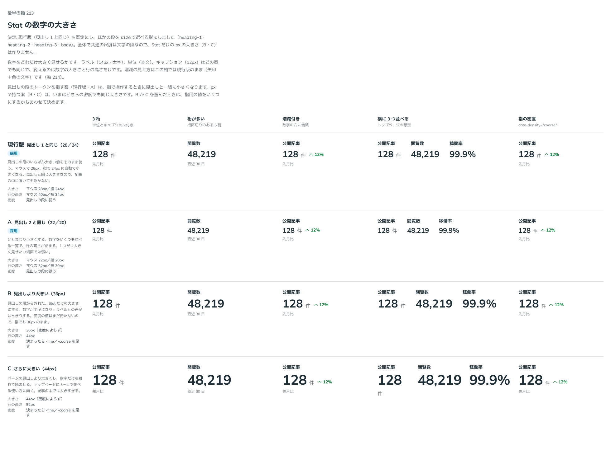

# 0205. Stat の数字の大きさは、見出しの段を既定に、文字の尺度の段で選べる

- ステータス: Accepted
- 日付: 2026-09-20
- ラウンド: 後半

## 背景

Stat は、実績・指標（公開記事の数、稼働率）を 1 つ大きく見せる部品です。数字をどの大きさにするかを決める必要がありました。関わる原則は、指で操作するとき見出しは本文に合わせて一緒に小さくなる [原則 11](../principles.md#11-文字の大きさは入力方式で切り替える)、既定を 1 つ決めてほかを選べるようにする [原則 20](../principles.md#20-部品は知らないことを決めない) です。

## 候補

比較は、決めた時点のコミット `afa3d83` の比較のストーリー（`design/stories/axis-213-stat-value-size.stories.tsx`）です。3 桁・桁が多い・増減付き・横に 3 つ並べる・指の密度の 5 列で比べました。

| 案     | 内容                                                                                                             |
| ------ | ---------------------------------------------------------------------------------------------------------------- |
| 現行版 | 見出し 1 の段（マウス 28px／指 24px）。見出しと同じ大きさなので、記事の中に置いても浮かない                      |
| A      | 見出し 2 の段（22px／20px）。ひとまわり小さく、数字をいくつも並べる一覧で行の高さが詰まる                        |
| B      | 36px（密度によらず）。見出しの段から外れた、Stat だけの大きさ。数字が主役になり、ラベルとの差がはっきりする      |
| C      | 44px（密度によらず）。ページの見出しより大きく、トップページに 3〜4 つ並べる使い方に向く。記事の中では大きすぎる |

## 決定

**現行版（見出し 1 の段）を既定にします。ほかの段を `size` で選べるようにします。Stat だけの px の大きさ（B・C）は作りません。**

- `size`: `heading-1`（既定）・`heading-2`（A）・`heading-3`・`body`
- 段は文字の尺度の段で、密度（マウス・指）で一緒に変わります。数字をいくつも並べるときは小さい段にします

### ユーザーの質問への答え

ユーザーの質問は「全体で統一のサイズトークンってありましたっけ」でした。答えは、あります。文字の尺度のトークン（`--text-heading-1`〜`--text-heading-4`・`--text-body` など）で、密度で自動に変わります。`size` はこの段に対応させ、px の専用サイズ（36px・44px）は作りません。

## 理由

ユーザーの返事の原文です。

> 現行版デフォ、他のサイズも選択可としたいです。全体で統一のサイズトークンってありましたっけ

以下は、メモから読み取れることです。

- **現行版を既定に**: 見出し 1 の段を既定にしています
- **他のサイズも選べる**: 大きさを 1 つに決めず、選べることを求めています
- **統一の尺度を気にしている**: Stat だけの大きさを増やさず、全体で決まっているサイズトークンに乗せたい、という問いです。文字の尺度の段に乗せたので、A は `heading-2` で選べ、B・C の px の専用サイズは作りません

## 却下した案と理由

- **B（36px）・C（44px）**: 見出しの段から外れた、Stat だけの px の大きさです。密度による切り替えの値を別に持つことになります。全体で統一の尺度（文字の尺度）に乗せるため、作りません

## 影響

- `src/components/stat/Stat.tsx`: `size`（`heading-1`（既定）・`heading-2`・`heading-3`・`body`。@default `'heading-1'`）を足しました。根の要素で `--stat-value-text`・`--stat-value-leading` を、選んだ段の文字の大きさと行の高さに差し替えます。`StatSize` の型を足しました
- `design/tokens.css`: `--stat-value-text`・`--stat-value-leading`（既定は `--text-heading-1`・`--leading-heading-1`）、`--stat-value-weight`・`--stat-value-gap` を Stat の区画に足しました
- `src/index.ts`: `StatSize` の型を公開しました
- Stat の要素と 3 層は [0206](./0206-stat-delta.md) に書きました

## 原則への反映

反映なし。[原則 11](../principles.md#11-文字の大きさは入力方式で切り替える)（見出しは本文に合わせて段を付け、指では一緒に小さくなる。数字は見出しの段に乗る）、[原則 20](../principles.md#20-部品は知らないことを決めない)（既定を 1 つ決め、ほかは選べる）の範囲内の決定です。

## 比較画像

決めた時点のコミット `afa3d83` で、`git checkout afa3d83 && pnpm storybook` で開けます。

