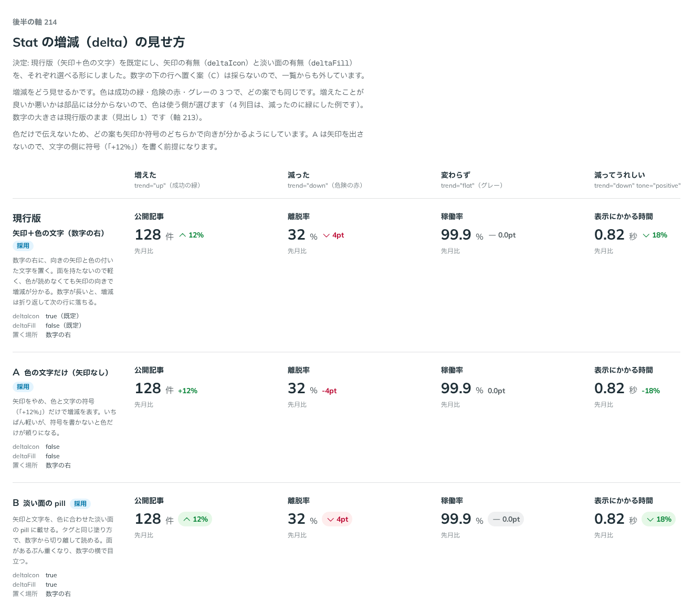

# 0206. Stat の増減は、矢印＋色の文字を既定に、矢印の有無と pill を選べる

- ステータス: Accepted
- 日付: 2026-09-20
- ラウンド: 後半

## 背景

Stat には、数字のほかに増減（「先月比 +12%」のような変化）を添えられます。増減をどう見せるか、どこに置くかを決める必要がありました。関わる原則は、色だけで伝えず形でも見分ける [原則 6](../principles.md#6-色は役割で持つ)、知らないこと（増えたことが良いか悪いか）を決めず使う側に渡す [原則 20](../principles.md#20-部品は知らないことを決めない)、ラベル・本体・キャプションの 3 層 [原則 4](../principles.md#4-部品はラベル--本体--キャプションの-3-層) です。

## 候補

比較は、決めた時点のコミット `afa3d83` の比較のストーリー（`design/stories/axis-214-stat-delta.stories.tsx`）です。増えた・減った・変わらず・減ってうれしい・横に 3 つ並べる、の 5 列で比べました。C は、決めたあとにストーリーから外れたので、決めたときの説明で書きます。

| 案     | 内容                                                                                                                                                       |
| ------ | ---------------------------------------------------------------------------------------------------------------------------------------------------------- |
| 現行版 | 数字の右に、向きの矢印と色の付いた文字を置く。面を持たないので軽く、色が読めなくても矢印の向きで増減が分かる。数字が長いと、増減は折り返して次の行に落ちる |
| A      | 矢印をやめ、色と文字の符号（「+12%」）だけで増減を表す。いちばん軽いが、符号を書かないと色だけが頼りになる                                                 |
| B      | 矢印と文字を、色に合わせた淡い面の pill に載せる。タグと同じ塗り方で、数字から切り離して読める。面があるぶん重く、数字の横で目立つ                         |
| C      | 増減を、数字の下の行に置く                                                                                                                                 |

## 決定

**現行版（矢印＋色の文字を数字の右に置く。pill なし）を既定にします。矢印の有無と、淡い面の pill の有無を、それぞれ選べるようにします。C（数字の下の行）は採りません。**

- `deltaIcon`: 矢印を出すか（`true` が既定。`false` が A）
- `deltaFill`: 増減を、`tone` に合わせた淡い面の pill に載せるか（`false` が既定。`true` が B）
- 2 つは独立で、組み合わせられます
- `deltaIcon={false}` のときは、`delta` に符号（「+12%」「-4pt」）を書きます。色だけで増減を伝えないためです（JSDoc に明記しました）

### 部品として先に決めたこと

- 要素は、1 組の `dl` の中に `dt`（ラベル）と `dd`（数字・単位・増減・キャプション）です。ラベルと数字は読み上げで組になります（[原則 15](../principles.md#15-読み上げは見た目の順フォーカスは次に触るものへ)）
- 3 層は、Field・バーと同じ、上にラベル（太字・14px）、真ん中に数字、下にキャプション（12px・薄いグレー）です（原則 4）。`dd` は本文の大きさです（[原則 11](../principles.md#11-文字の大きさは入力方式で切り替える)）
- 増減は、色だけで伝えず、矢印の形でも見分けます。上向き・下向き・横棒の 3 つ（`trend`: `up`・`down`・`flat`）で、新しいアイコンを足さず既存の Caret と Minus を使います（原則 6）
- 増減の良し悪しは部品には分からないので、色は `tone`（`positive`・`negative`・`neutral`）で使う側が選びます。書かないときは `trend` から決めます（`up` は成功の緑、`down` は危険の赤、`flat` はグレー）。「減ってうれしい」ときは `trend="down"` に `tone="positive"` を渡します（原則 20）
- 読み上げの文が要るときは、`deltaLabel`（「先月比 12% 増」など）を渡します。書くと、見えている増減の代わりに読まれます
- どちらも影・hover なしで、ページと同じレイヤーに置きます（[原則 1](../principles.md#1-影はレイヤーの離れを表す)）。Stat をカードに載せるのは、使う側の組み合わせです（Card と組み合わせます）

## 理由

ユーザーの返事の原文です。

> 現行版デフォ、アイコン有り無し・pill ありなし選択可

以下は、メモから読み取れることです。

- **現行版を既定に**: 矢印＋色の文字を、数字の右に置く形を既定にしています
- **アイコンの有り無しを選べる**: A（矢印なし）を `deltaIcon={false}` にしました
- **pill の有り無しを選べる**: B を `deltaFill` にしました
- **C は何も言われていない**: 数字の下の行に置く案は、返事にありません

## 却下した案と理由

- **C（数字の下の行）**: 返事に含まれません。置く場所は数字の右のままにしました

## 影響

- `src/components/stat/Stat.tsx`（新規）: `Stat`。props は `label`・`value`・`unit`・`caption`・`delta`・`trend`（@default `'flat'`）・`tone`（書かないと `trend` から決める）・`deltaLabel`・`align`（@default `'start'`）・`size`（[0205](./0205-stat-value-size.md)）・`deltaIcon`（@default `true`）・`deltaFill`（@default `false`）。`StatTrend`・`StatDeltaTone`・`StatAlign` の型を足しました
- `src/components/stat/Stat.stories.tsx`（新規）: `Components/Stat` のストーリー
- `design/tokens.css`: `--stat-gap`・`--stat-caption-gap`・`--stat-delta-text`・`--stat-delta-leading`・`--stat-delta-weight`・`--stat-delta-gap` を Stat の区画に足しました。増減の色は、部品の中の `--color-stat-delta`・`--stat-delta-tint` を `tone` で差し替えます。比べるためだけに足した `--stat-delta-fill`・`--stat-delta-basis` は、部品に畳んで消しました
- `src/index.ts`: `Stat`・`StatProps`・`StatTrend`・`StatDeltaTone`・`StatAlign`・`StatSize` を公開しました
- `'use client'` は要りません
- backlog に足す候補: Stat を横に並べるときの並べ方（レシピ）は未着手です

## 原則への反映

反映なし。[原則 6](../principles.md#6-色は役割で持つ)（色だけで伝えず、矢印の形でも見分ける）、[原則 20](../principles.md#20-部品は知らないことを決めない)（増減の良し悪しは使う側が選ぶ。既定を 1 つ決め、ほかは選べる）、[原則 4](../principles.md#4-部品はラベル--本体--キャプションの-3-層)（3 層）、[原則 1](../principles.md#1-影はレイヤーの離れを表す)（影・hover なし）の範囲内の決定です。

## 比較画像

決めた時点のコミット `afa3d83` で、`git checkout afa3d83 && pnpm storybook` で開けます。

