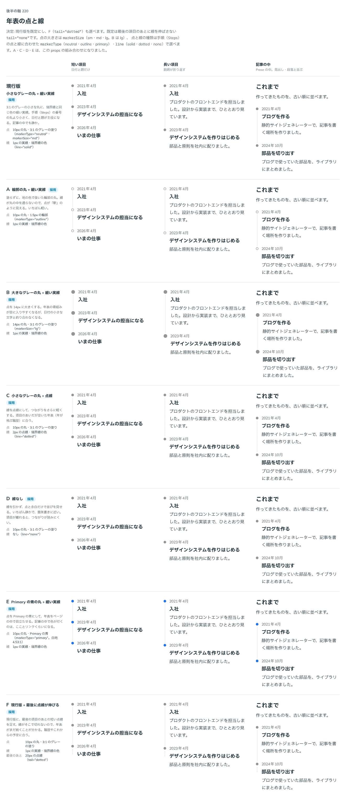

# 0207. 年表の点と線は、小さなグレーの丸と細い実線

- ステータス: Accepted
- 日付: 2026-09-20
- ラウンド: 後半

## 背景

Timeline は、職歴や活動を日付で並べる年表です。ポートフォリオの職歴と、記事の中の経緯で使います。点と線が年表の骨組みになるので、その見た目と、props の名前を決める必要がありました。

- Timeline は、読みものの部品です。ページと同じレイヤーで、影を付けず、押せません（[原則 1](../principles.md#1-影はレイヤーの離れを表す)・[原則 19](../principles.md#19-読みものは読みやすさを先にする)）
- 色を指定しないときは、色を持つ部品もグレーです（[原則 6](../principles.md#6-色は役割で持つ)）
- 手順の Steps とは、役目が違います。Steps は「これからやること」を番号で数える部品、Timeline は「起きたこと」を日付で並べる記録です。Docs に一言で書きます

## 候補

比較は、決めた時点のコミット `afa3d83` の比較のストーリー（`design/stories/axis-220-timeline-marker-line.stories.tsx`）です。短い項目・長い項目（説明が折り返す）・記事の中（Prose の中）の 3 列で比べました。

| 案     | 内容                                                                                                |
| ------ | --------------------------------------------------------------------------------------------------- |
| 現行版 | 小さなグレーの丸（10px・3:1 のグレーの塗り）＋細い実線（1px・境界線の色）                           |
| A      | 輪郭の丸（10px・1.5px の輪郭。地の色で抜く）＋細い実線。塗らないので、点が「駅」のように見える      |
| B      | 大きなグレーの丸（14px）＋細い実線。骨組みは目に入りやすいが、日付の小さな文字と釣り合わない        |
| C      | 現行版の点＋点線（2px）。項目のあいだが空いた年表に合う                                             |
| D      | 現行版の点＋線なし。点と余白だけで並べる。いちばん静かだが、項目が離れるとつながりが読みにくい      |
| E      | Primary の青の丸（10px。白地で 4.53:1）＋細い実線。記事の中で色が付くのは、こことリンクくらいになる |
| F      | 現行版＋最後の項目のあとに、20px の点線が伸びる。年表がまだ続くことが分かる                         |

F は、最初の返事のあとで足した候補です。年表の項目の強調（[0210](./0210-timeline-emphasis.md)）への返事の中で、「あと、220 の補足ですが、最後の項目ならちょっとだけ点線が伸びる、というのも選べると分かりやすそうですね」と言われたためです。

## 決定

**現行版（小さなグレーの丸と細い実線）を既定にします。点の種類・大きさ・線・最後の点線は、props で選べます。**

| 候補 | props                                             |
| ---- | ------------------------------------------------- |
| A    | `markerType="outline"`                            |
| B    | `markerSize="lg"`（14px）                         |
| C    | `line="dotted"`                                   |
| D    | `line="none"`                                     |
| E    | `markerType="primary"`                            |
| F    | `tail="dotted"`（`line="none"` のときは出ません） |

点の種類は、Steps の `neutral`・`outline`・`primary` と同じ種類、同じ色です。点の大きさは `sm`・`md`（既定）・`lg` の 8・10・14px で、どれも `--spacing` の尺度を指します。既定の 10px は現行版と同じです。

点の名前は、`size` と `marker` ではなく **`markerSize` と `markerType`** にします（次節）。

### 部品として先に決めたこと

- **要素**は `<ol role="list">` の中に `TimelineItem` を並べる形です。並びに意味がある（古い順・新しい順）ので `ol` にしますが、番号は描きません。Safari は `list-style: none` の `ol` を一覧として読まないので、`role="list"` を付けます。項目の題は見出しで（既定は `h3`。Steps と同じ `headingLevel`）、日付は `Time` を渡せる `ReactNode` です。部品は日付の文を組み立てません（[原則 20](../principles.md#20-部品は知らないことを決めない)）
- **点と線**は、`li` ではなく、中の包みの `::before`・`::after` に描きます（Steps と同じ作りです）。Prose が `li` に当てる印と重ならないためです。線は点の下から次の点の上まで引き、最後の項目には引きません
- **neutral の塗り**だけは、Steps と違い、`--color-line-strong`（3:1）のままです。Steps の neutral は、丸の中の数字が濃さを持つので淡い面にできます。Timeline の点には中身がないので、点そのものが 3:1 に届く必要があります
- **番号を数える部品ではない**ので、Steps の `number`（丸を置かない数字）は持ちません
- 点は Steps の番号の丸より小さくします。日付と題が主役だからです
- `Timeline.tsx` は context を使うので、`'use client'` が付きます（Steps と同じ）

## 理由

ユーザーの返事の原文です。

最初の返事（14 軸をまとめて選んだ中の、この軸への返事）:

> デフォルトは現行版で、サイズ変更可、色などは Step に準拠します

props の名前について（Timeline の props を作ったあと）:

> Timeline.size は文字サイズと誤認する気がします。marker prop と合わせて、markerSize, markerType などに寄せるのがいい気がします。steps も同時に変更する旨、backlog においてもらっていいですか。

最後の点線（F）を足して見せたあと:

> F も選べるで良さそうです

以下は、メモから読み取れることです。

- **現行版を既定に**: 現行版が既定で、ほかの形は選べる形です。大きさは変えられるようにし、色（点の種類）は Steps に準拠します。Steps と同じ種類・同じ色にしたのは、この返事に合わせたためです
- **`markerSize`・`markerType`**: `size` だけでは、文字の大きさに読めます。点に関わる props は `marker` を頭に付けて、そろえます。Steps の `marker`・`size` も同じ名前にそろえる必要があるので、同時に変える予定を backlog に置きました
- **F を選べる形に**: 最後に点線が伸びる形は、年表がまだ続くことが分かる、という見方です。既定にはせず、選べる形にしました

## 却下した案と理由

- **B（大きなグレーの丸）を既定にすること**: 点が大きいと年表の骨組みは目に入りますが、日付と題が主役の読みもので、点が前に出ます。選べる形（`markerSize="lg"`）にとどめました
- **D（線なし）を既定にすること**: いちばん静かですが、項目が離れるとつながりが読みにくくなります。選べる形にしました
- **E（Primary の青の丸）を既定にすること**: 記事の中で色が付くのが、この年表とリンクくらいになります。色を指定しないときはグレー、という考え（[原則 6](../principles.md#6-色は役割で持つ)）でも、グレーが既定です。選べる形にしました

## 影響

- `src/components/timeline/Timeline.tsx`（新規）: `Timeline`・`TimelineItem` を足しました。Timeline の props は次のとおりです
  - `markerType`（`neutral`・`outline`・`primary`。@default `'neutral'`）。`TimelineItem` の `markerType` で、項目ごとに上書きできます
  - `markerSize`（`sm`・`md`・`lg`。@default `'md'`）
  - `line`（`solid`・`dotted`・`none`。@default `'solid'`）
  - `tail`（`none`・`dotted`。@default `'none'`）
  - `datePlacement`・`align`・`collapse`・`headingLevel`（[0208](./0208-timeline-date-placement.md)・[0209](./0209-timeline-alternate.md)・[0211](./0211-timeline-narrow-date.md)。`headingLevel` の @default は `3`）
- `design/tokens.css`: Timeline の区画（`timeline`）を足しました
  - 点: `--timeline-marker-size-sm`（8px）・`--timeline-marker-size-md`（10px）・`--timeline-marker-size-lg`（14px）・`--timeline-marker-gap`（点と文のあいだ 12px）・`--timeline-marker-ring`（輪郭の丸の線。`--border-width-medium`）・`--color-timeline-marker`（`--color-line-strong`）
  - 線: `--timeline-line-width`（`--border-width-thin`）・`--timeline-line-gap`（点と線の端のあいだ 4px）・`--timeline-line-dotted-width`（`--border-width-thick`）・`--timeline-line-dotted-gap`（6px）・`--color-timeline-line`（`--color-line`）
  - 最後の点線: `--timeline-tail-length`（20px）
  - 項目のあいだ: `--timeline-gap`（24px）・`--timeline-date-gap`・`--timeline-inline-gap`・`--timeline-title-gap`
- `src/components/timeline/Timeline.stories.tsx`（新規）: 点・線・最後の点線の一覧
- `src/index.ts`: `Timeline`・`TimelineItem` と、`TimelineMarkerType`・`TimelineMarkerSize`・`TimelineLine`・`TimelineTail` などの型を公開しました
- backlog に、Steps の `marker` を `markerType` に、必要なら `line` も合わせて変え、`size`（見出しの段に従う）と点の大きさの関係を決めること、Timeline と同時に変えることを足しました（2026-09-20）

## 原則への反映

反映なし。読みものは影なし・押せない（[原則 1](../principles.md#1-影はレイヤーの離れを表す)・[原則 19](../principles.md#19-読みものは読みやすさを先にする)）、色を指定しないときはグレー（[原則 6](../principles.md#6-色は役割で持つ)）、日付の文を部品が組み立てない（[原則 20](../principles.md#20-部品は知らないことを決めない)）の範囲内の決定です。

## 比較画像

決めた時点のコミット `afa3d83` の比較のストーリーで描きました。`git checkout afa3d83 && pnpm storybook` で、決めたときの部品のまま開けます。

