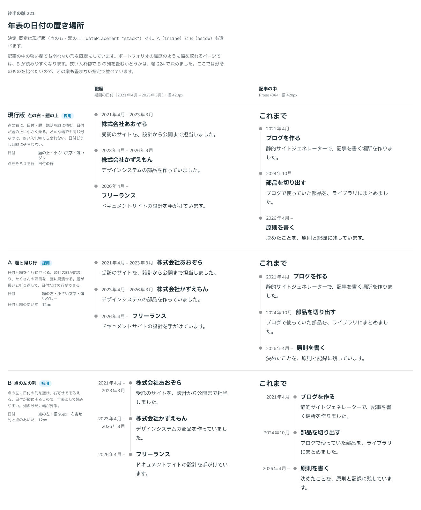

# 0208. 年表の日付は点の右・題の上、題と同じ行・点の左の列も選べる

- ステータス: Accepted
- 日付: 2026-09-20
- ラウンド: 後半

## 背景

年表の 1 項目は、点・日付・題・説明でできています。日付をどこに置くかで、年表の読み方が変わります。日付が縦にそろうと年表として読みやすくなりますが、列の分だけ幅が要ります。

日付は `Time` を渡せる `ReactNode` で、部品は「2021年4月 – 2023年3月」のような文を組み立てません（[原則 20](../principles.md#20-部品は知らないことを決めない)）。置き場所だけを決めます。

## 候補

比較は、決めた時点のコミット `afa3d83` の比較のストーリー（`design/stories/axis-221-timeline-date-placement.stories.tsx`）です。職歴（期間の日付・幅 420px）と記事の中（Prose の中・幅 420px）の 2 列で比べました。

| 案     | 内容                                                                                                                                               |
| ------ | -------------------------------------------------------------------------------------------------------------------------------------------------- |
| 現行版 | 点の右に、日付・題・説明を縦に積む。日付は題の上の小さい薄いグレーの文字。どんな幅でも同じ形で、狭い入れ物でも崩れない。日付どうしは縦にそろわない |
| A      | 日付と題を 1 行に並べる（間 12px）。項目の縦が詰まり、たくさんの項目を見渡せる。題が長いと折り返し、日付だけの行ができる                           |
| B      | 点の左に日付の列（幅 96px・右寄せ・点との間 12px）を空ける。日付が縦にそろうので読みやすい。列の分だけ幅が要る                                     |

## 決定

**現行版（`datePlacement="stack"`：点の右・題の上）を既定にします。A（`inline`：題と同じ行）と B（`aside`：点の左の列）も選べます。**

幅を取れるページ（ポートフォリオの職歴）では、B が読みやすくなります。B は入れ物が狭いと列を置けないので、狭いときの日付の置き場所は `collapse` で選びます（[0211](./0211-timeline-narrow-date.md)）。

## 理由

ユーザーの返事の原文です。

> 現行版デフォ、A/B選択可

以下は、メモから読み取れることです。

- **現行版を既定に**: どんな幅でも同じ形なので、置く場所を選ばず、既定にしやすい形です（[原則 20](../principles.md#20-部品は知らないことを決めない)）
- **A・B も選べる**: 項目を詰めたいとき（A）と、日付を縦にそろえて読ませたいとき（B）で、使う側が選べます

## 却下した案と理由

3 案とも選べる形なので、却下した案はありません。既定にしなかった理由は次のとおりです。

- **A を既定にしない**: 題が長いと折り返して、日付だけの行ができます
- **B を既定にしない**: 列の分だけ幅が要ります。狭い入れ物では畳む先を決める必要があり、どこでも同じ形にはなりません

## 影響

- `src/components/timeline/Timeline.tsx`: Timeline に `datePlacement`（`stack`・`inline`・`aside`。@default `'stack'`）を足しました。B の狭いときの畳み方は `collapse`（[0211](./0211-timeline-narrow-date.md)）です
- `design/tokens.css`: Timeline の区画に `--timeline-date-width`（96px）・`--timeline-date-aside-gap`（12px）を足しました。既存の `--timeline-date-gap`（日付と題のあいだ。点の右に積むとき）・`--timeline-inline-gap`（題と同じ行に並べるときの間 12px）も、この軸で使います
- `src/components/timeline/Timeline.stories.tsx`: 日付の置き場所の一覧
- `src/index.ts`: `TimelineDatePlacement` の型を公開しました

## 原則への反映

反映なし。日付の文を部品が組み立てず、置き場所を選べる形にするのは、[原則 20](../principles.md#20-部品は知らないことを決めない)（知らないことは決めない。既定を 1 つ決め、ほかは選べる）の範囲内の決定です。

## 比較画像

決めた時点のコミット `afa3d83` の比較のストーリーで描きました。`git checkout afa3d83 && pnpm storybook` で、決めたときの部品のまま開けます。

