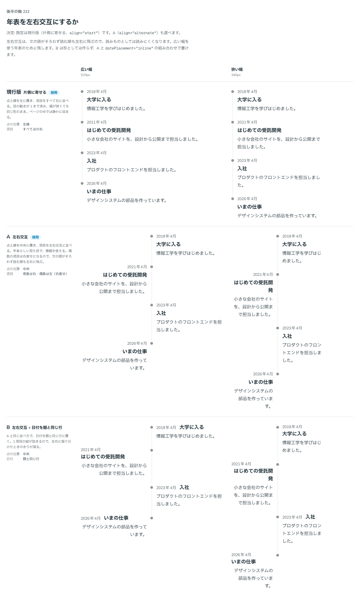

# 0209. 年表は片側に寄せる、左右交互も選べる

- ステータス: Accepted
- 日付: 2026-09-20
- ラウンド: 後半

## 背景

年表には、点と線を左に置いて項目を右に並べる形と、点と線を中央に置いて項目を左右に振り分ける形があります。左右交互は年表らしい見た目になり、横幅を使えます。一方で、文の頭がそろわず、読む順も左右に飛びます。

## 候補

比較は、決めた時点のコミット `afa3d83` の比較のストーリー（`design/stories/axis-222-timeline-alternate.stories.tsx`）です。広い幅（520px）と狭い幅（340px）の 2 列で比べました。

| 案     | 内容                                                                                                                        |
| ------ | --------------------------------------------------------------------------------------------------------------------------- |
| 現行版 | 点と線を左端に置き、項目をすべて点の右に並べる。目の動きが 1 本で済み、幅が狭くても同じ形のまま。ページの中では静かに収まる |
| A      | 点と線を中央に置き、奇数は右・偶数は左（右寄せ）に並べる。年表らしい見た目で横幅を使えるが、偶数の項目は文の頭がそろわない  |
| B      | A と同じ並べ方で、日付を題と同じ行に置く。1 項目の縦が詰まるので、左右に振り分けたときの余りが減る                          |

## 決定

**現行版（`align="start"`：片側に寄せる）を既定にします。A（`align="alternate"`：左右交互）も選べます。**

B（左右交互＋日付を題と同じ行）は、`align="alternate"` と `datePlacement="inline"`（[0208](./0208-timeline-date-placement.md)）の組み合わせで書けるので、形としては選べます。ただし、採用の印は付けません。左右交互のときの日付は、`stack`・`inline` のときだけ使えます。

## 理由

ユーザーの返事の原文です。

> デフォ現行、A選択可

以下は、メモから読み取れることです。

- **現行版を既定に**: 片側に寄せる形は、幅が狭くても同じ形のままです。どこに置かれるか分からない部品の既定に向いています（[原則 20](../principles.md#20-部品は知らないことを決めない)）
- **A も選べる**: 横幅を使えるページでは、左右交互を選べます
- B には触れていないので、専用の形にはしていません（A と `datePlacement="inline"` の組み合わせで書けます）

## 却下した案と理由

- **A を既定にしない**: 偶数の項目は右寄せになり、文の頭がそろいません。読む順も左右に飛びます。選べる形にとどめました
- **B を専用の形にしない**: `align` と `datePlacement` の組み合わせで書けるので、別の値を足しません

## 影響

- `src/components/timeline/Timeline.tsx`: Timeline に `align`（`start`・`alternate`。@default `'start'`）を足しました。`alternate` は点を中央に置き、偶数の項目を左側に寄せます。`datePlacement` が `stack`・`inline` のときに使えます
- `src/components/timeline/Timeline.stories.tsx`: 左右交互の一覧
- `src/index.ts`: `TimelineAlign` の型を公開しました

## 原則への反映

反映なし。並べ方を選べる形にするのは、[原則 20](../principles.md#20-部品は知らないことを決めない)（既定を 1 つ決め、ほかは選べる）の範囲内の決定です。

## 比較画像

決めた時点のコミット `afa3d83` の比較のストーリーで描きました。`git checkout afa3d83 && pnpm storybook` で、決めたときの部品のまま開けます。

