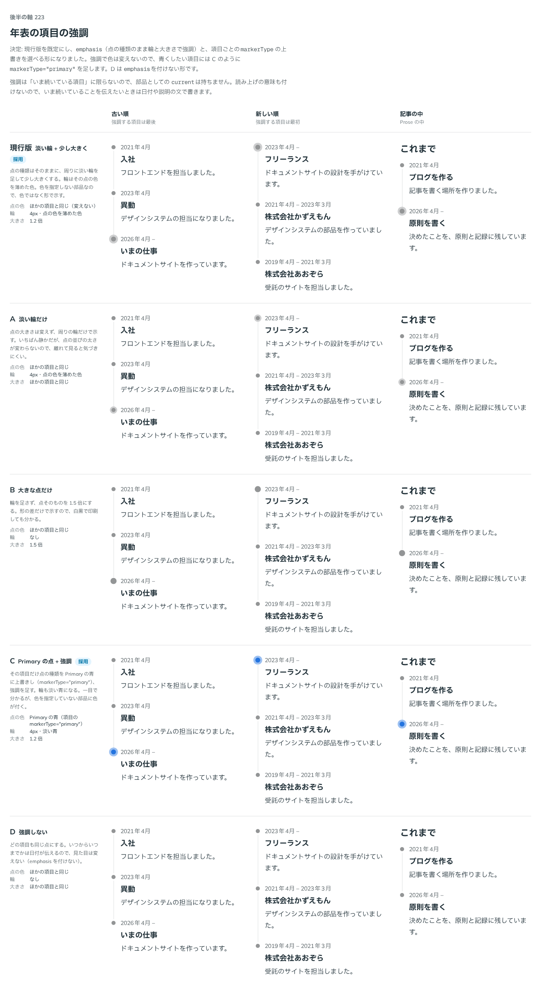

# 0210. 年表の項目の強調は、点の種類のまま輪と大きさで示す

- ステータス: Accepted
- 日付: 2026-09-20
- ラウンド: 後半

## 背景

年表のある項目だけを目立たせたい場面があります。在職中の職歴、いま進んでいる活動、節目になった出来事などです。Timeline は、色を指定しないとグレーの点を並べる部品です（[原則 6](../principles.md#6-色は役割で持つ)）。強調のときに、部品が勝手に色を付けてよいかが問題でした。

また、強調を項目の props でどう渡すか、点の種類（[0207](./0207-timeline-marker-line.md)）との関係をどうするかも決める必要がありました。

## 候補

比較は、決めた時点のコミット `afa3d83` の比較のストーリー（`design/stories/axis-223-timeline-current.stories.tsx`）です。古い順（強調する項目は最後）・新しい順（強調する項目は最初）・記事の中の 3 列で比べました。

| 案     | 内容                                                                                                                           |
| ------ | ------------------------------------------------------------------------------------------------------------------------------ |
| 現行版 | 点の種類はそのままに、周りに淡い輪（4px・点の色を薄めた色）を足し、1.2 倍に大きくする。色ではなく形で示す                      |
| A      | 大きさは変えず、淡い輪だけで示す。いちばん静かだが、離れて見ると気づきにくい                                                   |
| B      | 輪を足さず、点を 1.5 倍にする。形の差だけなので、白黒で印刷しても分かる                                                        |
| C      | その項目だけ `markerType="primary"` で青にして、強調を足す。輪も淡い青になる。一目で分かるが、色を指定していない部品に色が付く |
| D      | 強調しない。いつからいつまでかは日付が伝える                                                                                   |

ストーリーの最初の案は、今の項目を濃紺の点・淡い輪・1.2 倍で示す `current` でした。

## 決定

**強調は `TimelineItem` の `emphasis`（boolean）で渡します。その項目の点の種類・色のまま、淡い輪と 1.2 倍の大きさを足します。**

- 点の種類は、`Timeline` の `markerType` で親から一括して指定し、`TimelineItem` の `markerType` で項目ごとに上書きできます
- 青くしたい項目は、`markerType="primary"` と `emphasis` を組み合わせます（C の見た目）
- 輪の色は、その点の色を `color-mix` で薄めて作ります（`--timeline-emphasis-halo-mix`）。濃さは 32%・45%・60% を撮って比べ、32% は弱く、60% は点と輪が一体化するので、45% にしました
- `aria-current` は付けません。強調は「いまの項目」に限らないためです。いま続いていることは、日付や説明の文で伝えます
- neutral（グレー）の点でも、大きさと輪で普通の点と見分けがつくことを、基準画像で確かめました

`emphasisColor`（強調色を渡す props）と、「いまの項目」の `current` は、持ちません。

## 理由

ユーザーの返事の原文です。返事のやりとりを、決めた順に書きます。

最初の返事（14 軸をまとめて選んだ中の、この軸への返事）:

> デフォ現行。今の項目というよりも、項目の props から強調するか＋強調色を入れる形式が楽ですかね。あと、220 の補足ですが、最後の項目ならちょっとだけ点線が伸びる、というのも選べると分かりやすそうですね

この返事のとおり、`current` を、項目の props から強調するかどうかを渡す形（`emphasis`）にしました。強調色を渡す `emphasisColor` も足しました。最後の点線は、[0207](./0207-timeline-marker-line.md) の F（`tail="dotted"`）です。

`emphasisColor` を足した形を見せたあと:

> TimelineItem の emphasis と競合する気がします。

続けて、構造の提案がありました。

> そもそもマーカーの種類を親からの一括適用・個別変更可として、emphasisColor は廃止、emphasis bool で そこだけ色を青くするというのを Item から変更できる、というのは構造的に難しいですか？（どういうふうに実装が分かれているかは把握していない状態での質問です）

この提案のとおり、`markerType` を親からの一括適用・項目ごとの上書きにして、`emphasisColor` をやめました。そのうえで、`emphasis` の見た目について、次の返事がありました。

> emphasis は青にするとは限らないと思います。その markerType のまま、強調が入る、というイメージでした。

以下は、メモから読み取れることです。

- **`emphasis` は boolean に**: 強調するかどうかは、項目ごとに決めます。「今の項目」に限りません
- **`emphasisColor` は廃止**: 点の見た目を決める手段が `markerType` と `emphasisColor` の 2 つになり、競合します。強調の色は、`markerType` の項目ごとの上書きで決めます
- **強調は色を変えない**: 強調は「青にする」ことではなく、その `markerType` のまま、強調が入ることです。色を指定しないときはグレー、という部品の考え（[原則 6](../principles.md#6-色は役割で持つ)）とも合います。青くしたい項目は、`markerType="primary"` と `emphasis` を組み合わせます

## 却下した案と理由

- **`current`（今の項目を濃紺で示す）**: 強調したい項目は「いまの項目」に限りません。項目の props から強調するかどうかを渡す形にしました
- **`emphasisColor`（強調色を渡す）**: `markerType` と競合します。点の見た目を決める手段は `markerType` に 1 本化しました
- **C（強調で青くする）**: 強調は青にするとは限りません。青にしたいときは `markerType="primary"` を組み合わせて書けます
- **A（輪だけ）・B（大きな点だけ）**: 返事で選ばれませんでした。輪と大きさの両方を足す現行版のほうが、neutral の点でも普通の点と見分けがつきます
- **D（強調しない）**: `emphasis` を付けなければ、この見た目になります

## 影響

- `src/components/timeline/Timeline.tsx`: `TimelineItem` に `emphasis`（boolean。@default `false`）と `markerType`（項目ごとの上書き。書かなければ Timeline の指定に従う）を足しました。強調した項目には `data-emphasis` が付きます
- `design/tokens.css`: Timeline の区画に `--timeline-emphasis-scale`（1.2）・`--timeline-emphasis-halo`（4px。`--spacing` の尺度）・`--timeline-emphasis-halo-mix`（45%）を足しました
- `src/components/timeline/Timeline.stories.tsx`: 強調の一覧（`Emphases`）と、項目ごとの点の種類の一覧（`ItemMarkers`）を足しました。どちらも `tags: ['visual']` の基準画像で確かめています
- 最初の案（`current`・`emphasisColor`）は、部品を直したときに比較のストーリーから外しています。決めた時点のコミット `afa3d83` の比較のストーリーは、最終形の 5 案です。最初の案は、そのストーリーの履歴（`git log -p -- design/stories/axis-223-timeline-current.stories.tsx`）にあります

## 原則への反映

反映なし。色を指定しないときはグレー、強調は色でなく形（輪と大きさ）で示す、という点で、[原則 6](../principles.md#6-色は役割で持つ) と [原則 12](../principles.md#12-色は面用と前景用の-2-段で持つ) の範囲内の決定です。

## 比較画像

決めた時点のコミット `afa3d83` の比較のストーリーで描きました。`git checkout afa3d83 && pnpm storybook` で、決めたときの部品のまま開けます。

