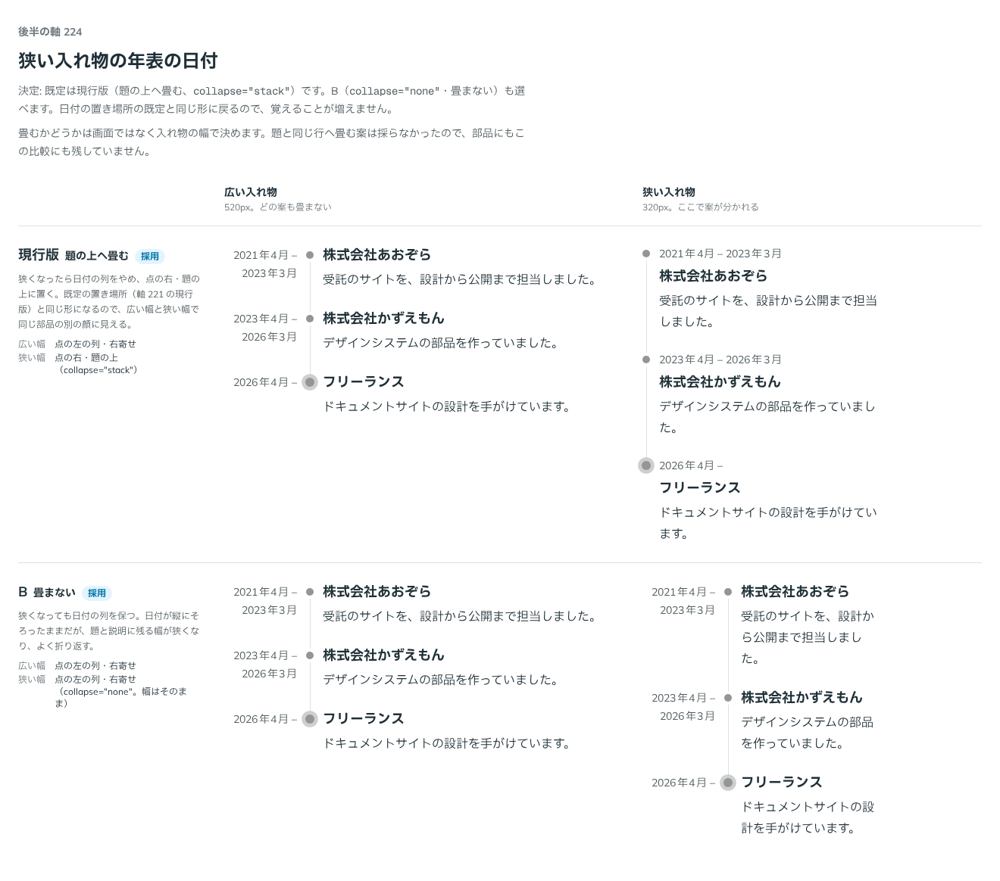

# 0211. 狭い入れ物の年表は、日付を題の上へ畳む

- ステータス: Accepted
- 日付: 2026-09-20
- ラウンド: 後半

## 背景

日付を点の左の列に置く形（`datePlacement="aside"`。[0208](./0208-timeline-date-placement.md)）は、幅が狭くなると列を置けません。狭いときに、日付をどうするかを決める必要がありました。

判定は、画面の幅ではなく、年表を置いた入れ物の幅で決めます。年表は、記事の本文の中にも、狭いサイドバーの中にも置かれるので、画面の幅では分からないためです（[原則 11](../principles.md#11-文字の大きさは入力方式で切り替える)。判定は、使う側が固定できます）。

## 候補

比較は、決めた時点のコミット `afa3d83` の比較のストーリー（`design/stories/axis-224-timeline-narrow-date.stories.tsx`）です。広い入れ物（520px。どの案も畳まない）と狭い入れ物（320px。ここで案が分かれる）の 2 列で比べました。

| 案     | 内容                                                                                                                                 |
| ------ | ------------------------------------------------------------------------------------------------------------------------------------ |
| 現行版 | 狭くなったら日付の列をやめ、点の右・題の上に置く。既定の置き場所（[0208](./0208-timeline-date-placement.md) の現行版）と同じ形になる |
| A      | 狭くなったら、日付を題と同じ行に置く。1 項目の縦が詰まるので、狭い画面で一度に見える項目が増える。題が長いと折り返す                 |
| B      | 狭くなっても日付の列を保つ。日付が縦にそろったままだが、題と説明に残る幅が狭くなり、よく折り返す                                     |

A は、採らないと決めたあとに部品（`collapse` の値）からも比較のストーリーからも外したので、決めた時点のコミット `afa3d83` の比較のストーリーには残っていません。案の内容は、その前のコミット `01f1146` のストーリーの履歴にあります。

## 決定

**現行版（`collapse="stack"`：日付を題の上へ畳む）を既定にします。B（`collapse="none"`：畳まない）も選べます。**

- 畳むしきい値は、入れ物の幅が 448px 未満（Tailwind の `@max-md`）です。しきい値そのものは、軸にしていません
- 入れ物の幅は、Timeline を container として測ります（`@container/timeline`）。画面の幅では畳みません
- `collapse` は、`datePlacement="aside"` のときだけ効きます

## 理由

ユーザーの返事の原文です。

> デフォ現行、Bも選択可

以下は、メモから読み取れることです。

- **現行版を既定に**: 狭いときに日付の列をやめると、既定の置き場所と同じ形になり、狭い入れ物でも崩れません
- **B も選べる**: 日付を縦にそろえたまま保ちたいときは、畳まない形を選べます

## 却下した案と理由

- **A（題と同じ行へ畳む）**: 返事で選ばれませんでした。畳む先は、既定の置き場所と同じ形（題の上）だけにしました。覚えることが増えません
- **畳むしきい値を軸にすること**: しきい値（448px）は比較していません。この軸で決めたのは、畳む先だけです

## 影響

- `src/components/timeline/Timeline.tsx`: Timeline に `collapse`（`stack`・`none`。@default `'stack'`）を足しました。`stack` のとき、入れ物の幅が 448px 未満（`@max-md/timeline`）で、日付の列と余白を取りやめ、日付を題の上に置きます
- `src/components/timeline/Timeline.stories.tsx`: 広い入れ物と狭い入れ物で、日付の畳み方を確かめます
- `src/index.ts`: `TimelineCollapse` の型を公開しました

## 原則への反映

反映なし。[原則 11](../principles.md#11-文字の大きさは入力方式で切り替える)（入れ物の幅で決まるものは、画面の幅と別に扱い、判定は使う側が固定できる）の範囲内の決定です。

## 比較画像

決めた時点のコミット `afa3d83` の比較のストーリーで描きました。`git checkout afa3d83 && pnpm storybook` で、決めたときの部品のまま開けます。

