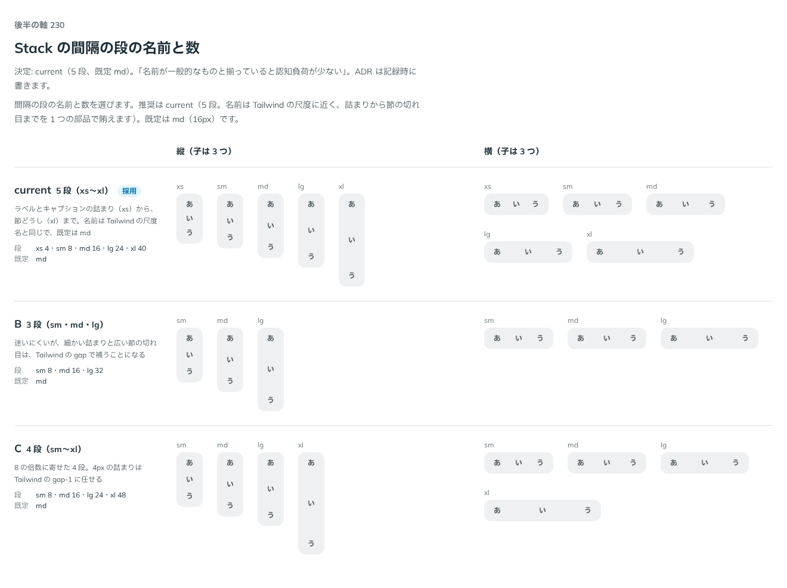

# 0212. Stack の間隔は 5 段（xs〜xl）、既定は md

- ステータス: Accepted
- 日付: 2026-09-20
- ラウンド: 後半

## 背景

Stack は、子を縦・横に一定の間隔で並べる部品です。画面のあちこちで間隔をそろえるために、間隔を段で持ちます。段の名前と数を決める必要がありました。

Stack を部品にするか、レシピ（既存の部品を組み合わせた見本）に回すかは、backlog に未決事項として残っていました。このとき、Stack を部品にすることも決めています（下の「決定」）。

間隔は押すものではなく、置き方の余白です。そのため入力方式では変えません（[原則 11](../principles.md#11-文字の大きさは入力方式で切り替える)の、ページを囲む左右の余白と同じ考えです）。値は尺度 `--spacing` の倍数にします。

## 候補

比較は、決めた時点のコミット `afa3d83` の比較のストーリー（`design/stories/axis-230-stack-gap.stories.tsx`）です。縦・横それぞれに、子（Tag）を 3 つ並べて比べました。既定はどの案でも `md`（16px）です。

| 案     | 内容                                                                                                                                  |
| ------ | ------------------------------------------------------------------------------------------------------------------------------------- |
| 現行版 | 5 段（xs 4・sm 8・md 16・lg 24・xl 40px）。ラベルとキャプションの詰まり（xs）から、節どうし（xl）まで。名前は Tailwind の尺度名と同じ |
| B      | 3 段（sm 8・md 16・lg 32px）。迷いにくいが、細かい詰まりと広い節の切れ目は、Tailwind の gap で補うことになる                          |
| C      | 4 段（sm 8・md 16・lg 24・xl 48px）。8 の倍数に寄せた 4 段。4px の詰まりは Tailwind の `gap-1` に任せる                               |

## 決定

**現行版（5 段。既定は `md`）を採用します。**

- 段は `none`・`xs`・`sm`・`md`・`lg`・`xl` です。`none` は 0 で、`xs` 4px・`sm` 8px・`md` 16px・`lg` 24px・`xl` 40px はどれも `--spacing` の倍数です
- 既定は `md`（16px）です
- 間隔は、入力方式や密度では変えません

部品として先に決めていたことも、ここに記録します。

- Stack は、間隔と並べ方だけを持ちます。色と影は持ちません（[原則 1](../principles.md#1-影はレイヤーの離れを表す)・[原則 9](../principles.md#9-遊びはレイアウト層に置く)）。子のあいだに線を足す `divider` だけが、細い線を足します
- 1 か所だけの間隔なら Tailwind の `flex gap-4` で足りると、Docs に書きます。段の名前を使うのは、間隔を画面のあちこちでそろえたいときです
- backlog の「Sidebar・Stack をレシピに回すか」のうち、Stack は部品にすることで決着です。Sidebar は未決のままです

## 理由

ユーザーの返事の原文です。

> 現行。名前が一般的なものと揃っていると認知負荷が少なくてよいですね。

以下は、メモから読み取れることです。

- **名前が一般的なものと揃っている**: 現行版の段の名前は Tailwind の尺度名と同じなので、使う側が新しく覚えることが少なくなります
- **B・C が選ばれなかった**: 段を減らすと、詰まり（4px）や広い節の切れ目を Tailwind の gap で補うことになります。メモは、段の数よりも名前が一般的であることを基準にしています

## 却下した案と理由

- **B（3 段）**: 迷いにくくなりますが、細かい詰まりと広い節の切れ目を Tailwind の gap で補うことになります。`lg` が 32px で、現行版・C の `lg`（24px）と値が変わります
- **C（4 段）**: `xs` をなくして 4px の詰まりを Tailwind の `gap-1` に任せ、`xl` を 48px にします。段の名前と値の組が、現行版から変わります

## 影響

- `src/components/stack/Stack.tsx`（新規）: `direction`（@default `'vertical'`）・`gap`（@default `'md'`）・`align`・`justify`・`wrap`・`divider`（@default `false`）・`render` を持つ部品です。間隔は `--stack-gap` に段の値を入れて渡します
- `src/components/stack/Stack.stories.tsx`（新規）と、`__screenshots__/` の基準画像
- `design/tokens.css`: Stack の区画に `--stack-gap-xs`・`--stack-gap-sm`・`--stack-gap-md`・`--stack-gap-lg`・`--stack-gap-xl` を足しました。どれも `--spacing` の倍数です。`none` の 0 は部品の中に書いています
- `src/index.ts`: `Stack` と、`StackProps`・`StackDirection`・`StackGap`・`StackAlign`・`StackJustify` の型を公開しました
- 横に並べるときの揃えと折り返しの既定は、[0213](./0213-stack-horizontal.md) で決めています

## 原則への反映

反映なし。[原則 1](../principles.md#1-影はレイヤーの離れを表す)（ページと同じレイヤーなので影なし）、[原則 9](../principles.md#9-遊びはレイアウト層に置く)（部品は真面目なまま、装飾は持たない）、[原則 11](../principles.md#11-文字の大きさは入力方式で切り替える)（押すものではない余白は入力方式で変えない）の範囲内の決定です。

## 比較画像

比較のストーリーは決めた時点のコミット `afa3d83` にあります。`git checkout afa3d83 && pnpm storybook` で開けます。

