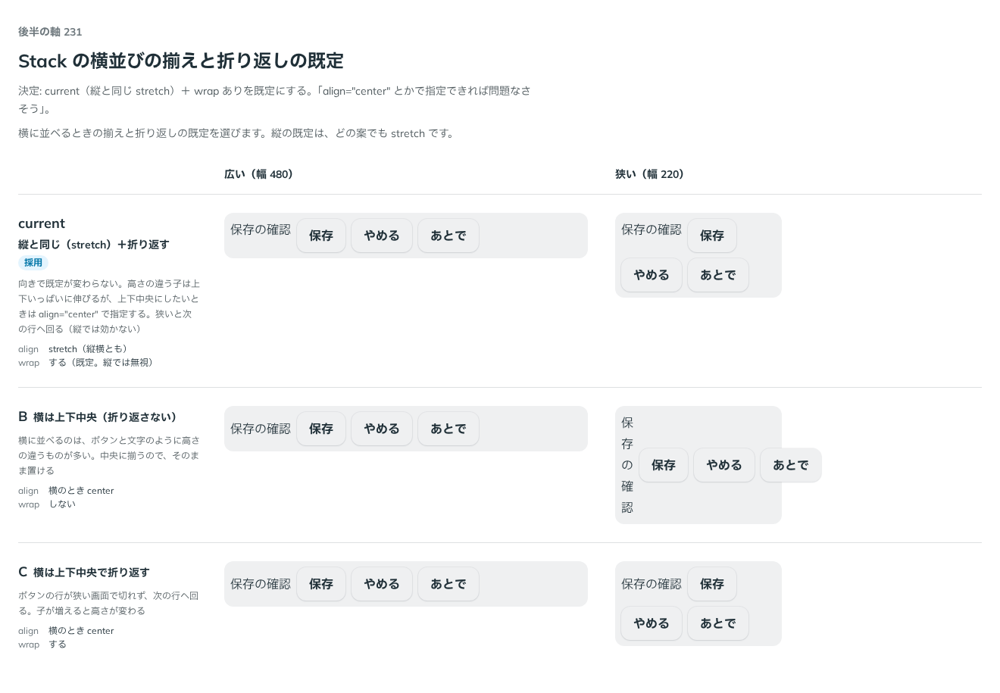

# 0213. Stack を横に並べるときの既定は、縦と同じ揃えで折り返す

- ステータス: Accepted
- 日付: 2026-09-20
- ラウンド: 後半

## 背景

Stack を横に並べるとき、子の高さがそろわないときの揃え（`align`）と、幅に入りきらないときの折り返し（`wrap`）の既定を決める必要がありました。横に並べるのは、文字とボタンのように高さの違うものが多いためです。

縦の揃えの既定は、どの案でも `stretch` です。決めるのは、横のときに向きで既定を変えるかどうかです。間隔の段は [0212](./0212-stack-gap.md) で決めています。

## 候補

比較は、決めた時点のコミット `afa3d83` の比較のストーリー（`design/stories/axis-231-stack-horizontal.stories.tsx`）です。幅 480 と幅 220 の入れ物に、文字（Text）とボタン 3 つを、間隔 `sm` で横に並べて比べました。比べた行は、Stack の props を行ごとに明示しています。

| 案     | 内容                                                                                                                                                                                      |
| ------ | ----------------------------------------------------------------------------------------------------------------------------------------------------------------------------------------- |
| 現行版 | 縦と同じ。`align` は `stretch`（縦横とも）で、`wrap` は折り返す（縦では無視）。向きで既定が変わらない。高さの違う子は上下いっぱいに伸びる。上下中央にしたいときは `align="center"` を渡す |
| B      | 横は上下中央（`align="center"`）で、折り返さない（`wrap={false}`）。高さの違うものがそのまま中央に揃う                                                                                    |
| C      | 横は上下中央（`align="center"`）で、折り返す。ボタンの行が狭い画面で切れず、次の行へ回る。子が増えると高さが変わる                                                                        |

実装のときの現行版は「縦と同じ・折り返さない」で、推奨は B でした。ユーザーの返事のあと、比較の現行版の行を「縦と同じ・折り返す」に書き換えています。上の表の現行版は、この書き換えのあとの内容です。

## 決定

**現行版（縦と同じ `stretch`）に、折り返し（`wrap`）ありを加えた形を既定にします。上下中央にしたいときは、`align="center"` で指定します。**

- `align` の既定は、縦横とも `stretch` です
- `wrap` の既定は `true` です。横に並べるときだけ効かせ、縦では無視します。縦で高さに制限があるときに、flex-wrap で列が分かれてしまうためです
- 折り返さないときは `wrap={false}` を渡します

## 理由

ユーザーの返事の原文です。

> current + wrap ありがデフォルトでいいかなと。align="center" とかで指定できれば問題なさそう。

以下は、メモから読み取れることです。

- **現行版（`stretch`）を既定に**: 向きで既定が変わらないので、縦と横で同じ props の意味のまま使えます
- **折り返しあり**: 幅に入りきらないときに次の行へ回ります。折り返しあり（現行版・C）が選ばれ、折り返さない B は選ばれませんでした
- **上下中央は指定で**: 上下中央は、既定にせず `align="center"` で選べれば足りる、という考えです

## 却下した案と理由

- **B（横は上下中央・折り返さない）**: 折り返しありを既定にする選択と合いません。上下中央を既定にすると、向きで既定が変わります
- **C（横は上下中央で折り返す）**: 折り返しは採用しましたが、上下中央は既定にせず、指定で選ぶ形にしました。既定が向きで変わらないほうを選んでいます

## 影響

- `src/components/stack/Stack.tsx`: `align`（@default `'stretch'`）と `wrap`（@default `true`）の既定です。`wrap` は内部で、横のときだけ `flex-wrap` を足します（`direction === 'horizontal' && wrap`）。`align` と `wrap` の JSDoc に、上下中央にするときは `align="center"`、折り返さないときは `wrap={false}` と書きました
- `src/components/stack/Stack.stories.tsx`: 横に並べる例では、上下中央にしたいときに `align="center"` を渡す形にします
- トークンの追加はありません

## 原則への反映

反映なし。[原則 20](../principles.md#20-部品は知らないことを決めない)（部品は置かれる場所を知らないので、既定を 1 つ決め、ほかの形は選べるようにする）の範囲内の決定です。既定は縦と同じ `stretch` ＋ 折り返しありで、上下中央と折り返さない形は props で選べます。

## 比較画像

比較のストーリーは決めた時点のコミット `afa3d83` にあります。`git checkout afa3d83 && pnpm storybook` で開けます。なお、比較の現行版の行は、ユーザーの返事のあとに「縦と同じ・折り返す」へ書き換えているので、実装時の既定（折り返さない）とは違います。

