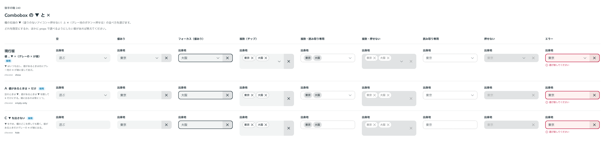

# 0216. Combobox の ▼ と消去の × は、両方出して ▼ が左へずれるのが既定

- ステータス: Accepted
- 日付: 2026-09-21
- ラウンド: 後半 軸240

## 背景

Combobox は、開くための ▼ と、選んだ値を消す × の両方を欄の右端に持ちます。値を選ぶと × が増えるので、2 つをどう並べるか、欄の幅が変わらないかを決める必要がありました。× は値に作用するので、欄の端に付く押せるボタン（グレー地のアイコン。[0190](./0190-field-addon-kinds.md)）にします（[0168](./0168-field-suffix-acts-on-value.md)）。

## 候補

比較は、決めた時点のコミット `b807ad3` の比較のストーリー（`design/stories/axis-240-combobox-chevron-clear.stories.tsx`）です。未選択と選択後を並べて比べました。

| 案     | 内容                                                                                    |
| ------ | --------------------------------------------------------------------------------------- |
| 現行版 | ▼ はいつも出す。値があるとグレー地の × が右端に入り、▼ が左へずれる。欄の幅は変わらない |
| A      | 値があるときは ▼ を隠し、× だけを出す（`chevron="empty-only"`）                         |
| B      | × を塗りなしのアイコンにして、▼ を端に残す                                              |
| C      | ▼ を出さない（`chevron="hide"`）                                                        |
| D      | × の場所を、値がないときも空けておく                                                    |

## 決定

**現行版（▼ はいつも出し、値があると × が右端に入って ▼ が左へずれる）を既定にします。A（`empty-only`）と C（`hide`）も、`chevron` で選べます。**

- 欄の幅は、× が出入りしても変わりません
- 複数選択でチップが複数行になったときは、× を全高の帯（欄の高さいっぱいのグレー地）に置きます

## 理由

ユーザーの返事の原文です。

> 240 ですが、未選択は V のみ、選択後、幅が変わらずに 一番右にグレー地ありの X が増えてくる、はどうでしょうか。

これに対し、「V がずれる、が正しい」「X ボタンが増えても、幅は固定になるべき」と確かめたうえで、決まりました。

> 240 はデフォルト現行、A/C も選択可でお願いします。複数行にまたがった場合は、全高の帯で大丈夫です。

以下は、決めたときの考えです。

- **現行版を既定に**: 値の有無で欄の幅が変わらず、開くための ▼ もいつも見えます
- **A・C も選べる**: 値があるときに ▼ を隠したい、または ▼ を出したくない画面のためです
- **比較で分かったこと**: 比較のストーリーの列が中身の最小幅まで縮み、× のない欄が × の分だけ狭く見えました。部品の欄の幅は固定で、ストーリー側の問題でした

## 却下した案と理由

- **B（× を塗りなしのアイコンにして ▼ を端に残す）**: 塗りのないアイコンは、押せない意味の説明を表します（[原則 8](../principles.md#8-入力欄の様式は編集できるかで決まる)）。押せる × を塗りなしにすると、これに反します
- **D（× の場所を空けておく）**: ユーザーの意図と違いました。幅を固定するというのは、場所を空けることではなく、▼ がずれることで幅を保つ、という意味でした

## 影響

- `src/components/combobox/Combobox.tsx`: `chevron`（`show`（既定）・`empty-only`・`hide`）を足しました
- `src/components/combobox/Combobox.stories.tsx`: ▼ と × の並べ方の見本を足します
- トークンの追加はありません
- backlog に、複数選択の欄で行が増えたときの × の縦位置は、全高の帯に決めた、と記録します

## 原則への反映

原則 8 の文を書き換えました。押せない意味の説明と、値があるときだけ出るボタンが同じ端に並ぶときの順番と、端のものが増えても欄の幅が変わらないことを、端に付くもののまとまりに足しました。

## 比較画像

決めた時点のコミット `b807ad3` の比較のストーリーで描きました。`git checkout b807ad3 && pnpm storybook` で、決めたときの部品のまま開けます。

