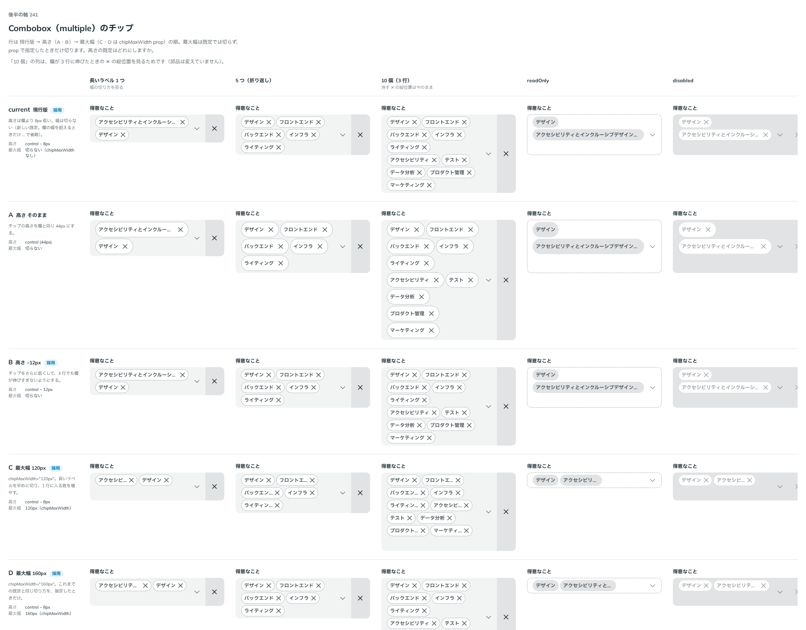

# 0217. 欄の中のチップは、部品の高さより 12px 低く、最大幅は決めない

- ステータス: Accepted
- 日付: 2026-09-21
- ラウンド: 後半 軸241

## 背景

複数選択の Combobox は、選んだ値を欄の中にチップで並べます。単独の Chip の高さは 44px（[0074](./0074-a11y-review-deferred.md) の T1。ボタンと同じ部品の高さ）ですが、欄の中では上下の余白が要るので、縮めることになります。欄の中のチップの高さと最大幅を決める必要がありました。

## 候補

比較は、決めた時点のコミット `b807ad3` の比較のストーリー（`design/stories/axis-241-combobox-chips.stories.tsx`）です。

| 案     | 内容                                                         |
| ------ | ------------------------------------------------------------ |
| 現行版 | 高さは部品の高さ − 8px。最大幅は 160px で、越えたら … で切る |
| A      | 高さは 44px（Chip の高さのまま）                             |
| B      | 高さは部品の高さ − 12px                                      |
| C      | 最大幅を 120px にする                                        |
| D      | 最大幅を 160px にする                                        |

## 決定

**高さは B（部品の高さ − 12px。`chipSize="compact"`）を既定にします。現行版（− 8px。`regular`）も選べます。最大幅は既定で決めず、`chipMaxWidth` で指定できます。**

- 最大幅の既定なしは、欄の幅までです。チップが欄からはみ出して、× や ▼ を押し出すことはありません
- `chipMaxWidth` で長さを指定すると、越えた文字を … で省略します

## 理由

ユーザーの返事の原文です。

> Chip の見た目によって変わってくると思いました。現行orBで迷っています（ほかは消さなくて良い）。最大幅はデフォルトなし、props で指定可能、ですかね。

> チップの高さはデフォルトB、現行版も選択可。幅はデフォルト制限なし、CやDのように指定可能としたいです。

以下は、決めたときの考えです。

- **B を既定に**: 高さを詰めると、複数行に増えたときも欄が高くなりすぎません。現行版の高さは `chipSize="regular"` で選べます
- **最大幅は使う側が決める**: 部品は、選択肢のラベルの長さを知りません。既定を決めず、C・D のように長さを指定できる形にしました（[原則 20](../principles.md#20-部品は知らないことを決めない)）

## 却下した案と理由

- **A（44px）**: 欄の中では大きすぎ、上下の余白が取れないので、選ばれませんでした
- **既定の最大幅（現行版の 160px）**: 使う側がラベルの長さを決めるので、既定では決めません。C・D は `chipMaxWidth` の値として選べます
- **折り返して見せる案**: 部品の直しが要るので、backlog に置きます

## 影響

- `src/components/combobox/Combobox.tsx`: `chipSize`（`compact`・`regular`。@default `'compact'`）と `chipMaxWidth` を足しました
- `design/tokens.css`: 欄の中のチップの高さ（`--combobox-chip-height`）と左右の余白を、部品のトークンに持ちます
- backlog に、長いラベルの折り返し表示と、欄の中のチップ一式（Chips・Chip・ChipRemove・大きさのトークン）を共有できる形にする課題を足します

## 原則への反映

原則 8 の文を書き換えました。選んだ値を小物にして並べる欄では、小物の高さを欄の中に収め、端の説明やボタンを押し出さず、欄の幅も超えないことを足しました。

## 比較画像

決めた時点のコミット `b807ad3` の比較のストーリーで描きました。`git checkout b807ad3 && pnpm storybook` で、決めたときの部品のまま開けます。

