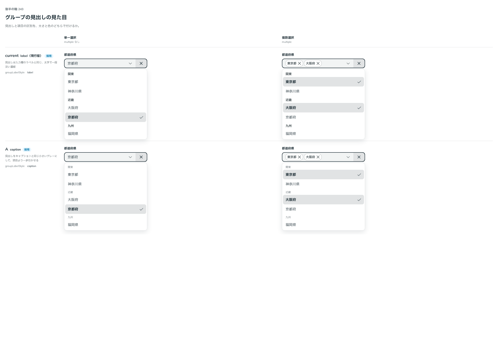
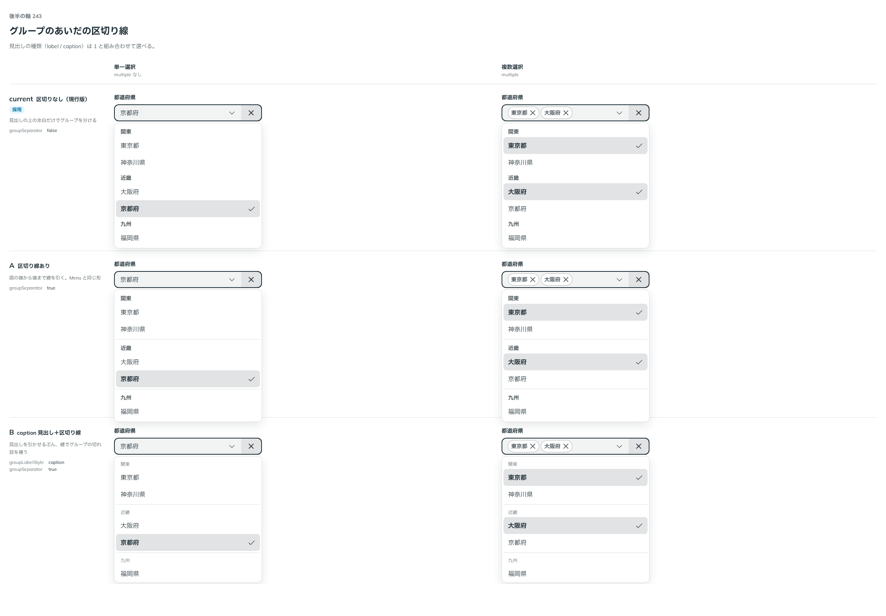
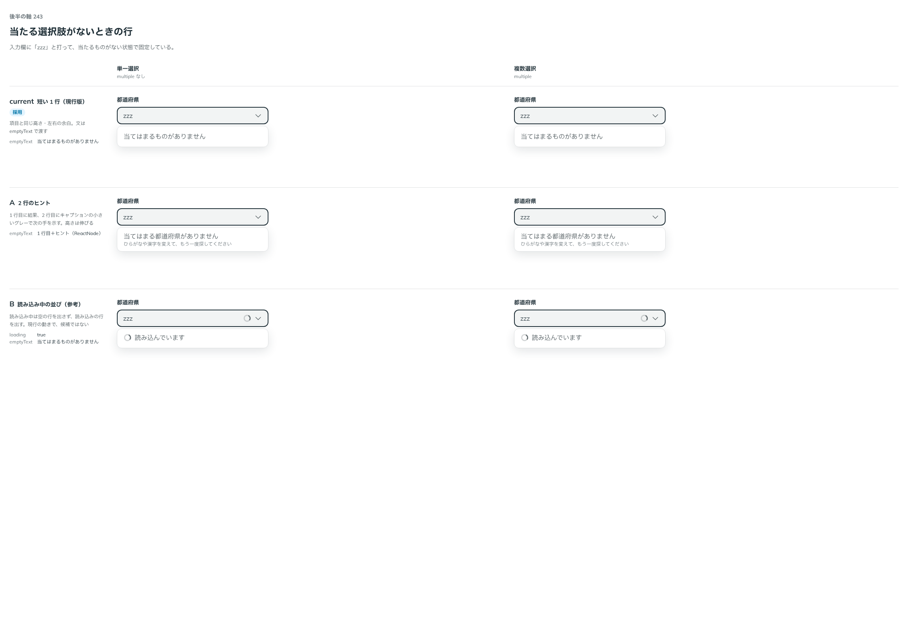

# 0218. Combobox のグループの見出しと空の行は、Menu とそろえる

- ステータス: Accepted
- 日付: 2026-09-21
- ラウンド: 後半 軸243

## 背景

Combobox は、グループの見出しと、絞った結果が空のときの行を持ちます。見出しの見た目と区切り線、空の行の高さと文の置き方を決める必要がありました。見出しは Menu にも同じ軸があります（[0150](./0150-menu-group-label.md)）。

## 候補

比較は、決めた時点のコミット `b807ad3` の比較のストーリー（`design/stories/axis-243-combobox-empty-groups.stories.tsx`）です。

| 案     | 内容                                                                                                                      |
| ------ | ------------------------------------------------------------------------------------------------------------------------- |
| 現行版 | 見出しはラベル（太字・一段淡い濃紺）。区切り線なし。空の行は短い 1 行（項目と同じ高さ・左余白、キャプションと同じグレー） |
| A      | 見出しをキャプションと同じ見た目にする（`groupLabelStyle="caption"`）。区切り線は `groupSeparator` で足せる               |

## 決定

**現行版を既定にします。A（`groupLabelStyle="caption"`）と、区切り線（`groupSeparator`）も選べます。**

- 空の行は文を持ちません。`emptyText` は ReactNode で、2 行のヒントも使う側が渡せます
- 読み込み中の行があるときは、空の行を出しません

## 理由

ユーザーの返事の原文です。

> 243 は current デフォルト、A も選択可、が Menu とそろうと思います。

以下は、決めたときの考えです。

- **Menu とそろえる**: Menu のグループの見出しも、ラベルが既定で、キャプションは選べる形です（[0150](./0150-menu-group-label.md)）。Combobox も同じ軸・同じ選び方にします
- **文を持たない**: 空の文は、使う側の言葉で渡します（[0214](./0214-combobox-scope.md)）

## 却下した案と理由

- **A を既定にする**: 返事で選ばれませんでした。選べる形として残します

## 影響

- `src/components/combobox/Combobox.tsx`: `groupLabelStyle`（`label`・`caption`。@default `'label'`）、`groupSeparator`、`emptyText` を足しました
- トークンの追加はありません

## 原則への反映

原則 14 の文を書き換えました。待っているあいだは、結果がないことを知らせないことを足しました。グループの見出しと区切り線は、Menu の決定（0150）に合わせただけなので、原則には反映していません。

## 比較画像

決めた時点のコミット `b807ad3` の比較のストーリーで描きました。`git checkout b807ad3 && pnpm storybook` で、決めたときの部品のまま開けます。

