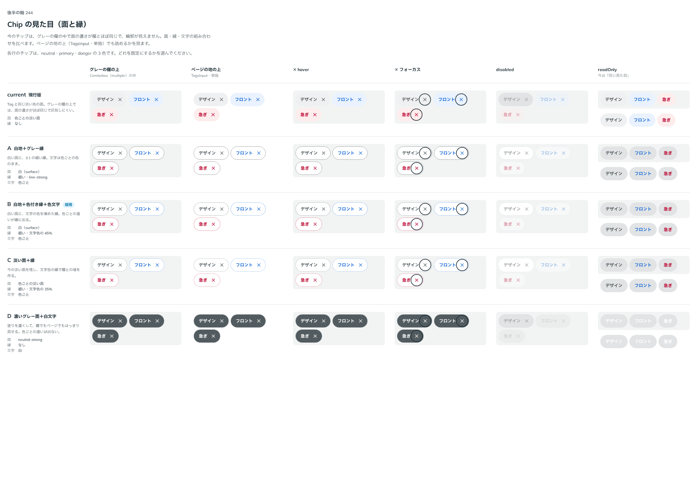
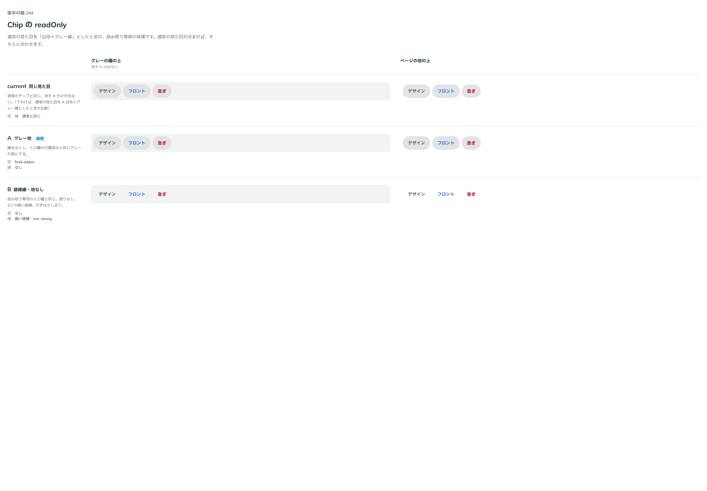

# 0219. Chip は、白い面に文字色を薄めた細い縁が既定（読み取り専用はグレー地）

- ステータス: Accepted（読み取り専用の見た目は「一旦」）
- 日付: 2026-09-21
- ラウンド: 後半 軸244

## 背景

Chip は、Combobox の欄の中と単独で使う、押せる・消せる小物です。はじめの見た目は、グレーの欄の上で面と欄の差が 1.03:1 しかなく、輪郭が見えませんでした。面と縁の見た目を決める必要がありました。読み取り専用のときの見た目も、あわせて決めます。

## 候補

比較は、決めた時点のコミット `b807ad3` の比較のストーリー（`design/stories/axis-244-chip-look.stories.tsx`）です。グレーの欄の上とページの上に置いて比べました。

| 案     | 内容                                                                     |
| ------ | ------------------------------------------------------------------------ |
| 現行版 | 淡い面だけ。グレーの欄の上で面と欄の差が 1.03:1 しかなく、輪郭が見えない |
| A      | 白地にグレーの縁（欄の上で縁と下の色の比が 2.73:1）                      |
| B      | 白地に、文字の色を薄めた細い縁                                           |
| C      | 淡い面に縁                                                               |
| D      | 濃いグレーの面に白文字（色ごとの違いが消える）                           |

## 決定

**B（白い面に、文字の色を薄めた細い縁）を既定にします。読み取り専用のときは、縁のないグレー地（入力欄の端に付くグレーと同じ地）にします。**

- 縁と下の色の比は、グレーの欄の上で 3.3:1、ページの上で 3.35:1 です。文字と面の比は 5.1〜6.9 です
- 読み取り専用は、一旦の決定です。primary の文字とグレー地の比が 3.96:1 で 4.5:1 を切るので、見た目を確定するときに文字色を調整します
- Chip の高さは 44px（[0074](./0074-a11y-review-deferred.md) の T1）です。欄の中では、[0217](./0217-combobox-chips.md) で決めた大きさに縮めます
- 見た目は `--chip-*`（`design/tokens.css`）で差し替えられます

## 理由

ユーザーの返事の原文です。

> ぱっと思ったのは、白地にグレー縁かなと。それ以外のバリエーションも考えたいです。今のままだとコントラストが全くありません。readOnly のときも同じ見た目か、グレー地にするかはちょっと迷っています。

> 244: B がよいです。readOnly のときは一旦 A にしましょう。入力欄は白＋破線のはずなので、それとは見た目が合うはずです

ここでの読み取り専用の「A」は、読み取り専用の見た目の案 A（縁なしのグレー地）で、白地にグレー縁の案 A とは別です。

以下は、決めたときの考えです。

- **縁で輪郭を出す**: グレーの欄の上でも、ページの上でも、面の明度差に頼らず縁で見分けられます
- **縁の色は文字の色から作る**: 色の役割で持つので（[原則 6](../principles.md#6-色は役割で持つ)）、色ごとの違いが縁にも残ります
- **読み取り専用は縁なしのグレー地**: 読み取り専用の欄は、塗りがなく破線の輪郭です（[0170](./0170-readonly-field.md)）。その中に置く Chip は、欄と別の面として見えるグレー地にします

## 却下した案と理由

- **A（白地＋グレーの縁）**: 欄の上で 2.73:1 と、B より縁が弱くなりました
- **C（淡い面＋縁）**: 選ばれませんでした
- **D（濃いグレーの面＋白文字）**: 色ごとの違いが消えます

## 影響

- `src/components/chip/Chip.tsx`: Chip の見た目を `--chip-*` のトークンで持ちます
- `design/tokens.css`: `--chip-bg`・`--chip-border-*`・`--chip-readonly-*` などを、決まった形にします
- backlog に、読み取り専用のグレー地の上の primary の文字（3.96:1）を、4.5:1 以上に調整することと、押せる・選べる形（`pressable`・`selected`）を作っていないことを足します

## 原則への反映

原則 6 の文を書き換えました。色を面に敷くか、縁と文字だけに持たせるかは、置かれる地で決めることと、ページの上にも入力欄の中にも並ぶ小物は、白い面と細い縁にすることを足しました。原則 5（小物は pill）は、そのとおりなので変えていません。

## 比較画像

決めた時点のコミット `b807ad3` の比較のストーリーで描きました。`git checkout b807ad3 && pnpm storybook` で、決めたときの部品のまま開けます。

