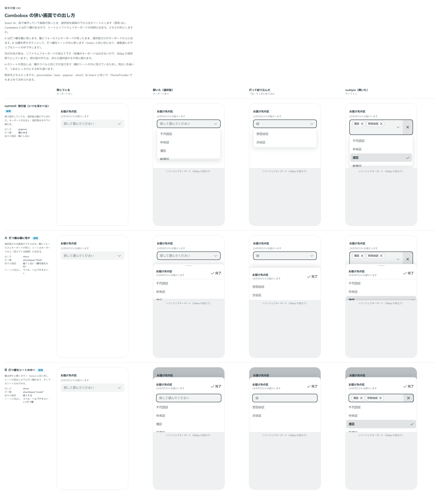

# 0220. 指のときの Combobox は、打つ欄をシートの中に置き、開いた瞬間に打てる

- ステータス: Accepted
- 日付: 2026-09-21
- ラウンド: 後半 軸242

## 背景

Combobox は、指で操作していて画面が狭いとき、Select と同じく選択肢をシートにします（[0037](./0037-select-sheet.md)・[原則 16](../principles.md#16-重なる面は指の動きで浮かべるかシートにする)）。ただし Combobox は文字を打つ欄なので、シートの中でどこに打つ欄を置くか、開いたときにすぐ打てるか、シートの高さをどうするかを決める必要がありました。ソフトウェアキーボードが出ると、シートの後ろの欄が隠れるためです。

## 候補

比較は、決めた時点のコミット `b807ad3` の比較のストーリー（`design/stories/axis-242-combobox-sheet.stories.tsx`）です。スマホで実際に触れるよう、各案を独立したストーリーにし、フレームは付けていません。

| 案     | 内容                                                                                                                                                                                 |
| ------ | ------------------------------------------------------------------------------------------------------------------------------------------------------------------------------------ |
| 現行版 | 指で操作していても、選択肢は欄の下に浮かぶ（\`presentation="popover"\`）。キーボードが出ると、選択肢はその下に隠れる                                                                 |
| A      | 選択肢だけを画面の下から出す。打つ欄は欄に残す（\`sheetInput="field"\`）。欄にフォーカスとキーボードが残り、後ろを読みながら選べる。欄がスクロールで隠れる・キーボードで面がつぶれる |
| B      | 欄は押すと開くボタン（Select と同じ形）。シートの見出しの下に打つ欄を置く（\`sheetInput="inside"\`）。チップもシートの中で外す。後ろの画面は暗くする                                 |

## 決定

**B（打つ欄をシートの中に置き、開いた瞬間にフォーカスを当てる）を既定にします。シートを使わない形（現行版）と、A も選べます。**

- シートにする基準は、従来どおりです。指で操作していて、画面が狭いときだけです
- 既定は `sheetInput="inside"` です。開いた瞬間に打つ欄へフォーカスが当たり、ソフトウェアキーボードが出ます（`sheetAutoFocus`。@default `true`）
- シートの高さは、打つ欄をシートの中に置くとき（既定）は、開いた時点で全高です（`sheetDetent="full"`）。打つ欄を欄に残すとき（`sheetInput="field"`）の既定は半分の高さ（`half`）です。全高で開くと、シートが打っている欄を覆ってしまうためです
- 選べる形は、`presentation="popover"`（シートを使わない）、`sheetInput="field"`（A）、`sheetAutoFocus={false}`（すぐフォーカスしない）、`sheetDetent="half"`（半分の高さ）です

## 理由

ユーザーの返事の原文です。

> 242 B フォーカスは当たってそうですが、ソフトウェアキーボードが出ないですね. あとは、シートを開いた時点で画面目いっぱい開くようにしてほしいですね

> 242 のBで開いた瞬間にフォーカスが当たるようにするとどうでしょうか？

> 242 はデフォルトすぐ打てるBとしたいです。シートを使わない/Aも選択可能としたいです。すぐフォーカスしない、も選択可能としたいです。高さは full、シートを使うかの基準は従来通りです。

スマホで実際に見られるよう、「各パターンを独立した Story に」する依頼もありました（フレームなし）。

実機（Android の Chrome）で分かったことは、次のとおりです。

- **キーボードは、ユーザーの操作の中で同期的に当たったフォーカスにだけ出ます。** そこで、押した瞬間に、押した欄の位置に合わせた見えない入力欄（fixed・透明）へフォーカスを当て、シートが開いたら本物の打つ欄へ移します。欄を包む `position` の箱は作りません。作ると、container に出した面より手前に描かれ、重なりの順がおかしくなりました
- **Android の Chrome は、キーボードで layout viewport を縮めず、見えている範囲（visualViewport）だけを下へずらします。** シートの高さは、画面の高さから、見えている範囲の縮み（`innerHeight − visualViewport.height`）を引いて数えます（`offsetTop` を引くと、上へ突き抜けました）。持ち上げる高さは別に持ちます
- **縮みが 120px 未満は、キーボードではなく、アドレスバーやナビゲーションバーの出入りとみなして 0 にします。** 閉じたあとに、下端に帯が残ったためです
- **全高のときは、外枠（Positioner）だけでなく、面（Popup）も高さいっぱいにします**
- **フォーカスで、ブラウザはキーボードに隠れない位置までページをスクロールします。** 開いているあいだは、開く前のスクロール位置へ戻し続け（0・0.1・0.3・0.6・1 秒後）、閉じたあとも戻します。閉じたときに欄へ戻すフォーカスは、スクロールさせません
- ストーリーの `play` が、開いた瞬間に自動でクリックしてしまい、ユーザーの操作にならないので、キーボードが出ませんでした。確認の `play` は、開発時に出さないテスト専用のストーリー（`!dev`）に分けました

iOS（iPad）は、まだ確かめていません（ユーザーが「iPad などでも試してみますね」と返しています）。backlog に足します。

## 却下した案と理由

- **A を既定にする**: 欄にフォーカスとキーボードが残るので、後ろを読みながら選べます。しかし、欄がスクロールで隠れることと、キーボードで面がつぶれることが起きます。選べる形（`sheetInput="field"`）として残しました
- **現行版（いつも浮かべる）を既定にする**: 指で操作するときに、キーボードで選択肢が隠れます。選べる形（`presentation="popover"`）として残しました

## 影響

- `src/components/combobox/Combobox.tsx`: `sheetInput`（`inside`・`field`。@default `'inside'`）、`sheetAutoFocus`（@default `true`）、`sheetDetent`（@default: `sheetInput="inside"` は `'full'`、`"field"` は `'half'`）を足しました。`presentation` は Select と同じで、ThemeProvider でまとめて決められます
- `src/internal/sheet/use-keyboard-inset.ts`: キーボードで見えている範囲が縮んだ分を数えます
- `src/components/combobox/Combobox.stories.tsx`: 各パターンを独立したストーリーにし、確かめの `play` は `!dev` のテスト専用ストーリーに分けました
- トークンの追加はありません
- backlog に、iOS（iPad）でのフォーカスとキーボード・visualViewport の計算・下端の帯の確認、見えない入力欄でキーボードを出す方法が Android の Chrome だけの確認であること、縮み 120px の閾値が画面の高さの小さい端末で足りるか、を足します

## 原則への反映

原則 16 と原則 15 の文を書き換えました。打って絞り込む面をシートにするときは、打つ欄もシートの中に置いて開いた時点から打てるようにし、キーボードが出ているあいだはシートを見えている範囲に収めること（原則 16）と、画面に出さず端末の動きを引き出すためだけに置いたものは、読み上げにも出さないこと（原則 15）です。実機で分かった計算や閾値は、実装の決め事なので、原則には書いていません。

## 比較画像

決めた時点のコミット `b807ad3` の比較のストーリーで描きました。`git checkout b807ad3 && pnpm storybook` で、決めたときの部品のまま開けます。

