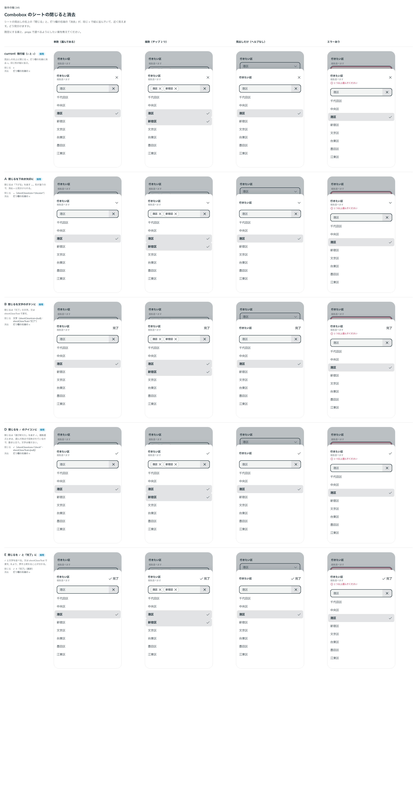

# 0221. Combobox のシートの閉じるは、✓ と「完了」が既定

- ステータス: Accepted
- 日付: 2026-09-21
- ラウンド: 後半 軸245

## 背景

Combobox のシートの見出しの右上には閉じる ×（[0037](./0037-select-sheet.md)）があり、シートの中の打つ欄の右端には消去の × があります（[0220](./0220-combobox-sheet.md)）。2 つが同じ形で近く、見分けにくいことが分かりました。閉じるボタンの見た目と、見出しまわりの高さを決める必要がありました。

## 候補

比較は、決めた時点のコミット `b807ad3` の比較のストーリー（`design/stories/axis-245-combobox-sheet-close.stories.tsx`）です。

| 案     | 内容                                                                                            |
| ------ | ----------------------------------------------------------------------------------------------- |
| 現行版 | 見出しの右上に閉じる ×、打つ欄の右端に消去 ×。同じ形が縦に並ぶ                                  |
| A      | 閉じるを ⌄（下向きの矢印）にする。「下げる」を表し、形が違うので消去 × と見分けられる           |
| B      | 閉じるを文字（「完了」）だけのボタンにする                                                      |
| D      | 閉じるを ✓ だけにする。「選び終えた」を表す。一覧の選んだ印と同じ形・同じ縦の並びで、紛らわしい |
| E      | 閉じるを ✓ と「完了」にする                                                                     |

検討の途中で、シートの中では消去の × を出さない形（C）も挙げましたが、比較のストーリーには並べていません。

## 決定

**閉じるは ✓ と「完了」を既定にします。アイコンと文字は、`sheetCloseIcon` と `sheetCloseText` で差し替えられます。**

- `sheetCloseIcon` は `'check'`（既定）・`'x'`・`'chevron'`・`null` です。`sheetCloseText` は文字列（既定 `'完了'`）か `null` です
- 文字が `null`（アイコンだけ）のときも、読み上げの名前は「閉じる」です。アイコンと文字がどちらも `null` のときは ×（閉じる）を出します
- 選んだ内容は、選んだ時点で反映されています。✓「完了」は、この動きと合います
- 閉じるは、見出しとヘルプテキストのまとまりの上下中央に置きます。ヘルプテキストがなくても、その 1 行の高さを空けます（`SheetFieldTitle` の `reserveCaption`）。打つ欄の位置は、ヘルプテキストのあるなしで変わりません。ヘルプテキストがないとき、見出しは、空けた行を含めたまとまりの中央に置きます
- 見出しと打つ欄のあいだは 8px です
- エラー・警告の行は数えません。出入りで打つ欄が 1 行分動くのは、そのままにします

## 理由

ユーザーの返事の原文です。

> 選択を消すバツボタンと閉じるバツボタンがかなり近い位置にあるなと思っています。うまい解決方法を考えたいです。

> チェックアイコン 完了 とかどうですか？

> 見出ししかない場合、ボタンの余白が小さく、バツと近接して見えます

> ヘルプテキストのあるなしに関わらず、常に同じ高さ同じ位置になるようにしたい

> 見出し ヘルプテキスト の上下中央に閉じるがあるのが自然ですね エラーテキストがある場合ってどうなるんでしたっけ

> 見出ししかない場合、見出しが上に寄ってませんか？

> closeIcon と closeText みたいな感じな props にして、デフォルトは チェックアイコン・テキスト完了で行きましょう エラーでズレる分にはよいです

以下は、決めたときの考えです。

- **✓ と文字で見分ける**: 消去の × と形も、文字の有無も違うので、近くに並んでも間違えません
- **既定の文を持つ**: 「完了」は、部品が文を決めない決まり（[原則 20](../principles.md#20-部品は知らないことを決めない)）の例外に近い既定の文です。Select の閉じるの既定「閉じる」と同じく、`sheetCloseText` で差し替えられます。多言語の対応は backlog に置きます

## 却下した案と理由

- **A（⌄ のみ）・B（文字のみ）**: 選ばれませんでした
- **C（シートの中では消去の × を出さない）**: ユーザーは選びませんでした。それに合わせて、`sheetClear` は外しました
- **D（✓ のみ）**: 一覧の選んだ印と同じ形・同じ縦の並びで、紛らわしくなります

## 影響

- `src/components/combobox/Combobox.tsx`: `sheetCloseIcon`（@default `'check'`）と `sheetCloseText`（@default `'完了'`）を足しました
- `src/internal/sheet/SheetFieldTitle.tsx`: `reserveCaption` を足しました。ヘルプテキストがなくても 1 行の高さを空けます
- トークンの追加はありません
- backlog に、「完了」の文言の多言語の対応を足します

## 原則への反映

原則 16 と原則 20 の文を書き換えました。シートを閉じる操作は、面の中の消去の操作と見分けられる形にし、閉じるは取り消しではなく済んだことを表す言い方にすること（原則 16）と、部品そのものの操作を指す短い文（閉じる、完了）だけは既定を持ち、使う側が差し替えられること（原則 20）です。見出しまわりの縦の位置は、原則 4 の「ヘルプテキストの有無で本体の位置が動かない」の適用で、書き換えは要りませんでした。

## 比較画像

決めた時点のコミット `b807ad3` の比較のストーリーで描きました。`git checkout b807ad3 && pnpm storybook` で、決めたときの部品のまま開けます。

