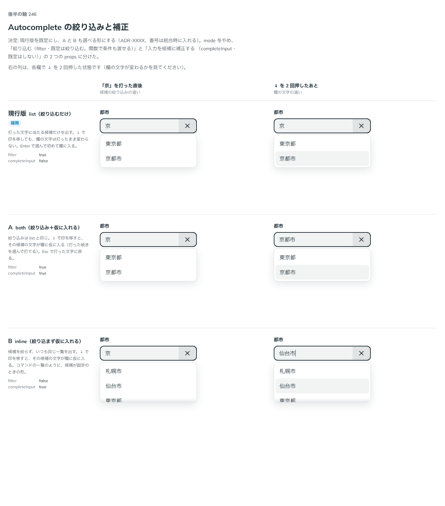

# 0223. Autocomplete は、候補の絞り込みが既定で、関数で条件を渡せる

- ステータス: Accepted
- 日付: 2026-09-21
- ラウンド: 後半 軸246

## 背景

Autocomplete は、打った文字に合わせて候補を出します。候補をどう絞るか、打った文字を候補の文字に補正するかを決める必要がありました。

## 候補

比較は、決めた時点のコミット `cca57dd` の比較のストーリー（`design/stories/axis-246-autocomplete-mode.stories.tsx`）です。

| 案     | 内容                                                                                                 |
| ------ | ---------------------------------------------------------------------------------------------------- |
| 現行版 | list（絞り込むだけ）。打った文字に当たる候補だけを出す。↓ で印を移しても、欄の文字は変わらない       |
| A      | both（絞り込み＋仮に入れる）。絞り込みは現行版と同じで、↓ で印を移すと、その候補の文字が欄に仮に入る |
| B      | inline（絞り込まず仮に入れる）。候補を絞らず、いつも同じ一覧を出し、↓ で印を移すと欄に仮に入る       |

比べた点は、「京」を打った直後の候補の絞り込みと、↓ を 2 回押したあとの欄の文字です。

## 決定

**現行版（list。絞り込むだけ）が既定で、A（both）・B（inline）も選べる形にします。絞り込みは `filter` に関数を渡して条件を決められます。補正は `completeInput` で選べ、既定はしません。**

- `filter` は `boolean | (item, query, itemToString?) => boolean` です。既定は `true` で、`false` は絞り込まず `items` をそのまま出します
- 非同期の検索は、`filter={false}` と `items` の差し替え、`loading` で作ります。`debounce` は使う側が持ちます
- `completeInput` の既定は `false` です。`true` にすると、矢印で印を移した候補の文字を、入力欄に仮に入れます（内部で Base UI の `mode` に写します）
- 選んだ候補のチェックは、完全一致のときだけ出す形（`checkMatch`）も検討しましたが、ユーザーが外しました

## 理由

ユーザーの返事の原文です。

> 現行デフォルト、A と B も選べるようにしたいですが、どちらかというと リストの入力に補正するか（デフォルトはしない）、リストを自動的に絞り込むか（デフォルトはする）にしたいですね。絞り込みについては条件をユーザーが指定したい可能性もあるため、関数を渡せるようにしたいかもですね

> 絞り込みについては条件をユーザーが指定したい可能性もある（とう で東京を出したい、など）ため、関数を渡せるようにしたいかもですね。あとは非同期の検索とかも必要かもしれません。

> 選んだ候補のチェックは、完全一致の場合に出すオプションが必要な可能性はありますね（風邪薬・風邪薬EX ...）デフォルトではなしでいいと思います。

> checkMatch はすみません、外しで OK です。

以下は、決めたときの考えです。

- **比較の 3 案を 2 つの切り替えにした**: 補正するか・絞り込むかは、別々に選びたい組み合わせです。`mode`（list・both・inline）の名前は付けず、`completeInput` と `filter` の組み合わせで表します（[原則 20](../principles.md#20-部品は知らないことを決めない)）
- **条件は関数で渡す**: 「とう」で東京を出すような条件は、部品には分かりません

## 却下した案と理由

- **`mode`（list・both・inline）**: `completeInput` と `filter` の組み合わせで足りるので外しました
- **`filteredItems`**: `filter={false}` と `items` の差し替えで足りるので外しました
- **`checkMatch`**: ユーザーが外しました。必要になったら再検討します

## 影響

- `src/components/autocomplete/Autocomplete.tsx`: `filter`・`completeInput` を足しました

## 原則への反映

反映なしです。既存の原則 20（部品は知らないことを決めない）の適用です。

## 比較画像

決めた時点のコミット `cca57dd` の比較のストーリーで描きました。`git checkout cca57dd && pnpm storybook` で、決めたときの部品のまま開けます。

