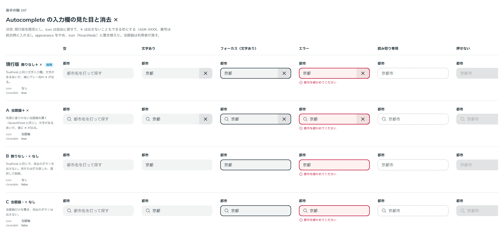

# 0224. Autocomplete の入力欄は、現行の見た目が既定で、アイコンは自由に渡し、消去の × はなしにもできる

- ステータス: Accepted
- 日付: 2026-09-21
- ラウンド: 後半 軸247

## 背景

Autocomplete は SearchField と別の部品にしました（[0222](./0222-autocomplete-scope.md)）。入力欄を、検索風にするか、飾りなしにするかを決める必要がありました。

## 候補

比較は、決めた時点のコミット `cca57dd` の比較のストーリー（`design/stories/axis-247-autocomplete-input-look.stories.tsx`）です。

| 案     | 内容                                                              |
| ------ | ----------------------------------------------------------------- |
| 現行版 | 飾りなし＋ ✕。TextField と同じ入力欄で、文字があるあいだ ✕ が出る |
| A      | 虫眼鏡＋ ✕。先頭に塗りのない虫眼鏡を置く（SearchField と同じ）    |
| B      | 飾りなし・✕ なし。消去のボタンを出さない                          |
| C      | 虫眼鏡・✕ なし。虫眼鏡だけを置き、消去のボタンは出さない          |

比べた点は、空・文字あり・フォーカス・エラー・読み取り専用・押せない状態での見え方です。

## 決定

**現行の見た目が既定です。アイコンは `icon` で自由に渡せ、消去の × は `clearable={false}` でなしにできます。**

- `icon` は `ReactNode` で、既定はなしです。虫眼鏡は使う側が渡します
- `clearable` の既定は `true` です
- 検討の途中にあった `appearance`（検索風・飾りなし）は、`icon` に置き換えました

## 理由

ユーザーの返事の原文です。

> 現行デフォルト、アイコンは自由指定、削除ボタンはなしにもできるように

以下は、決めたときの考えです。

- **アイコンは使う側が決める**: 虫眼鏡が合う場面か、別の絵が合う場面かは、部品には分かりません（[原則 20](../principles.md#20-部品は知らないことを決めない)）

## 却下した案と理由

- **`appearance`（検索風・飾りなし）**: アイコンを渡すかどうかで表せるので外しました

## 影響

- `src/components/autocomplete/Autocomplete.tsx`: `icon`・`clearable` を足しました

## 原則への反映

反映なしです。既存の原則 20 の適用です。

## 比較画像

決めた時点のコミット `cca57dd` の比較のストーリーで描きました。`git checkout cca57dd && pnpm storybook` で、決めたときの部品のまま開けます。

