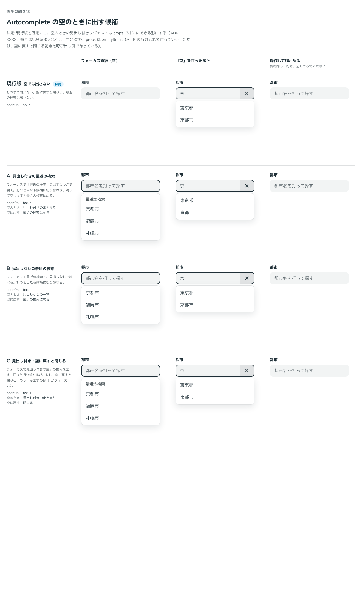

# 0225. Autocomplete は、欄が空のあいだ見出し付きの提案を出せ、当たる候補がないときは emptyText がなければ何も開かない

- ステータス: Accepted
- 日付: 2026-09-21
- ラウンド: 後半 軸248

## 背景

Autocomplete は、欄が空のときにも提案を出す場面があります（最近の検索、人気の候補など）。欄が空のときの見せ方と、当たる候補がないときの見せ方を決める必要がありました。あわせて、当たる候補がないときに下線だけが出る不具合が見つかりました。

## 候補

比較は、決めた時点のコミット `cca57dd` の比較のストーリー（`design/stories/axis-248-autocomplete-empty-suggest.stories.tsx`）です。

| 案     | 内容                                                                                                    |
| ------ | ------------------------------------------------------------------------------------------------------- |
| 現行版 | 空では出さない。打つまで開かず、空に戻すと閉じる                                                        |
| A      | 見出し付きの最近の検索。フォーカスで開き、打つと当たる候補に切り替わり、空に戻すと最近の検索に戻る      |
| B      | 見出しなしの最近の検索。A と同じ動きで、見出しなしで並べる                                              |
| C      | 見出し付き・空に戻すと閉じる。A と同じ見出し付きで、空に戻すと閉じる（もう一度出すのは ↓ かフォーカス） |

比べた点は、フォーカス直後（空）と「京」を打ったあとの面の中身、空に戻したときの開閉です。

## 決定

**現行版（出さない）が既定です。見出し付きの提案は `emptyItems` で出せます。当たる候補がないときは、`emptyText` が渡されていなければ何も開きません。**

- 現行版が既定で、A・B は `emptyItems`（見出しの有無は `items` の作りで決まる）で出せます。C（空に戻すと閉じる）は部品に足さず、使う側が作ります
- `emptyItems` は、見出し付きの `items` です。欄が空のあいだ、`items` の代わりに出します。`openOn` が `'input'` のときは、`'focus'` として扱います
- `emptyText` は `ReactNode` です。渡すと、当たる候補がないときに、その内容を出します。渡さないと、何も開きません
- 当たる候補がないのに、候補の面の下線だけが出る不具合を直しました

## 理由

ユーザーの返事の原文です。

> 現行デフォルト、空の場合は見出し付きのサジェスト表示をオンにできる、としたいです

> AutoComplete ですが、何もヒットしなかった時に下線だけが出てきますね

> emptyText が渡されていないときは表示なしで認識は合っています。Text ではなく ReactNode を渡したいケースがあるかも？

以下は、決めたときの考えです。

- **空のときの提案は使う側が決める**: 何を提案するかは、部品には分かりません。渡さなければ出しません（[原則 20](../principles.md#20-部品は知らないことを決めない)）
- **文は要素でも渡せる**: 「見つかりません」の文に、リンクや説明を添えたい場面があります

## 却下した案と理由

- **`emptyText` を文字列だけにする**: 要素を渡したい場面をふさぎます

## 影響

- `src/components/autocomplete/Autocomplete.tsx`: `emptyItems` を足し、`emptyText` を `ReactNode` にしました。下線だけが出る不具合を直しました

## 原則への反映

原則 20 の文を書き換えました。渡された文を、文字列でも組み立てた要素でも、そのまま出すことです。

## 比較画像

決めた時点のコミット `cca57dd` の比較のストーリーで描きました。`git checkout cca57dd && pnpm storybook` で、決めたときの部品のまま開けます。

