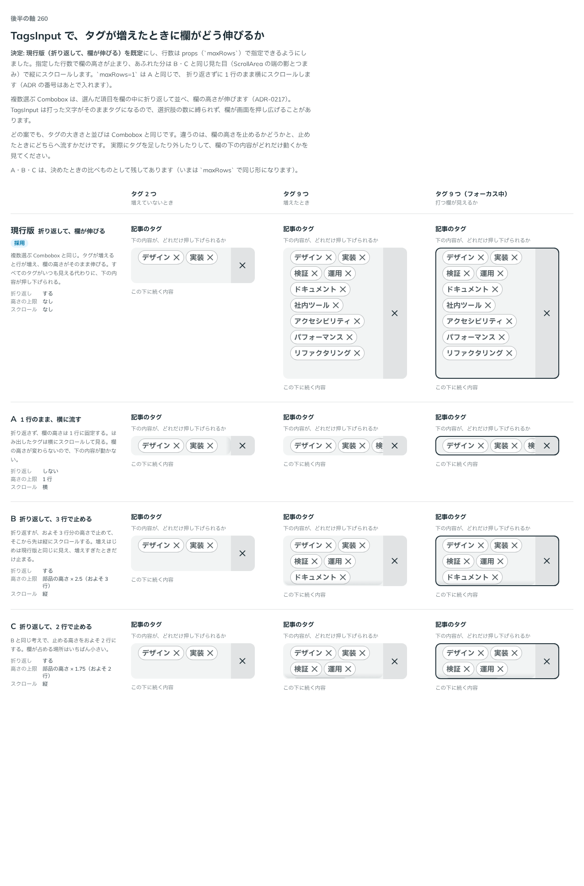

# 0231. TagsInput は、行が増えるほど高くなるのが既定で、行数を指定して止められる

- ステータス: Accepted
- 日付: 2026-09-21
- ラウンド: 後半 軸260

## 背景

TagsInput は、タグが増えると折り返して、欄が高くなります。増えすぎたときの見せ方を決める必要がありました。

## 候補

比較は、決めた時点のコミット `f77a25c` の比較のストーリー（`design/stories/axis-260-tags-input-overflow.stories.tsx`）です。

| 案     | 内容                                                                                          |
| ------ | --------------------------------------------------------------------------------------------- |
| 現行版 | 折り返して、欄が伸びる。タグが増えると行が増え、欄の高さがそのまま伸びる                      |
| A      | 1 行のまま、横に流す。折り返さず、欄の高さは 1 行に固定し、はみ出したタグは横にスクロールする |
| B      | 折り返して、3 行で止める。およそ 3 行分の高さで止め、それより先は縦にスクロールする           |
| C      | 折り返して、2 行で止める。B と同じ考えで、止める高さをおよそ 2 行にする                       |

比べた点は、タグ 2 つ・9 つ・9 つでフォーカス中のときの、欄の高さと下の内容の押し下げられ方、打つ欄が見えるかです。あふれる案のスクロールの見た目は、ScrollArea にそろえました。

## 決定

**現行版（行が増えるほど高くなる）が既定です。`maxRows` で行数を指定できます。**

- `maxRows` の既定はなしです。2 以上を渡すと、その行数で高さを止め、あふれたら縦にスクロールします。見た目は ScrollArea にそろえます
- `maxRows` の 2 以上は B・C を、`maxRows={1}` は A を、指定した形で表します
- `maxRows={1}` は、折り返さず 1 行のまま、横にスクロールします

## 理由

ユーザーの返事の原文です。

> スクロールが発生する場合は ScrollArea を使う・または見た目をそろえてほしいです

> 現行版がデフォルトで、行数を props で指定できるようにしたいですね。スクロールの見た目はこれで OK です。

以下は、決めたときの考えです。

- **スクロールの見た目は部品によらずそろえる**: 続きがあることの見せ方は、[原則 1](../principles.md#1-影はレイヤーの離れを表す) の通りです
- **行数は使う側が決める**: 欄の上下にどれだけ余白があるかは、部品には分かりません（[原則 20](../principles.md#20-部品は知らないことを決めない)）

## 却下した案と理由

- **行数の上限を既定にする**: 入れたタグが見えなくなります

## 影響

- `src/components/tags-input/TagsInput.tsx`: `maxRows` を足しました

## 原則への反映

原則 1 の、スクロールできる面をそろえる文に含まれます（[0226](./0226-autocomplete-list-scroll.md)）。

## 比較画像

決めた時点のコミット `f77a25c` の比較のストーリーで描きました。`git checkout f77a25c && pnpm storybook` で、決めたときの部品のまま開けます。

