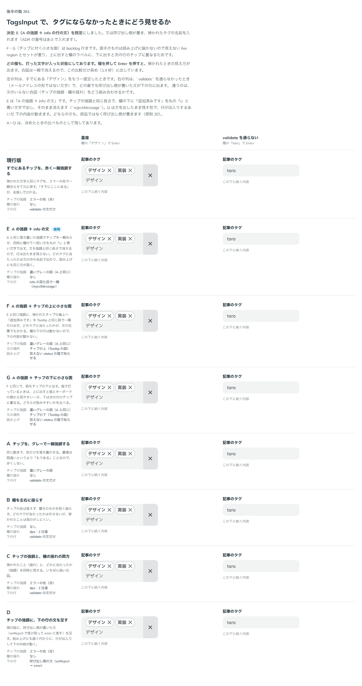
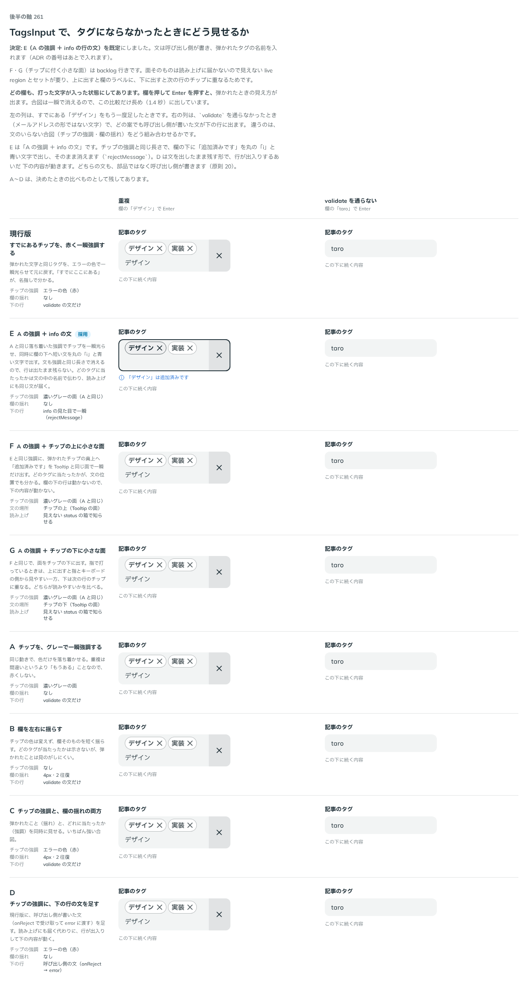

# 0232. TagsInput は、弾いたとき、Chip を強調し、欄の下に短い文を一瞬出す

- ステータス: Accepted
- 日付: 2026-09-21
- ラウンド: 後半 軸261

## 背景

TagsInput は、重複・上限・検査に落ちた文字を弾きます。弾いたことを、どう見せるかを決める必要がありました。

## 候補

比較は、決めた時点のコミット `f77a25c` の比較のストーリー（`design/stories/axis-261-tags-input-reject.stories.tsx`）です。画像は、弾いた直後（`0232-tags-input-reject.png`）と、文を出している途中（`0232-tags-input-reject-shown.png`）です。

| 案  | 内容                                                                   |
| --- | ---------------------------------------------------------------------- |
| A   | すでにあるタグ（Chip）を強調する。チップの色に依存する                 |
| D   | 欄の下の行に、短い文が一瞬出て消える                                   |
| E   | A と D を合わせる。Chip を強調しつつ、欄の下の info の行に文を一瞬出す |
| F   | 弾いた Chip の上に、ツールチップの見た目で文を出す                     |
| G   | 弾いた Chip の下に、ツールチップの見た目で文を出す                     |

## 決定

**E を既定にします。弾いたとき、Chip を強調しつつ、欄の下の info の行に短い文が一瞬出て消えます。文は `rejectMessage(reason, tag)` で渡します。F・G は backlog に置きます。**

- `rejectMessage` は、`ReactNode` か `false`（出さない）を返します。文は、使う側が書きます。例は「「デザイン」は追加済みです」です。名前を入れると、読み上げでも、聞く人に当たった相手が伝わります
- 常に渡す info（ヘルプの行）があるときは、E と競合します。行が弾いた文に入れ替わり、消えると元の info に戻り、読み上げの通知（`aria-live`）が 2 回変わって info が読み直されていました。直しは次の通りです。info も渡されているときだけ、行の中身を 2 つの span に分けます。読み上げに渡す中身（元の info）は sr-only で変えません。見える文（弾いた文）は `aria-hidden` で差し替えます。弾いた文の読み上げは、常に置いた `role="status"` の見えない箱が、1 回だけ担います
- error・warning・success は別の行なので、競合しません

## 理由

ユーザーの返事の原文です。

> 複合的なパターンにしたいです。D のアラートが一瞬出てきて、すでに足してあります → 追加済みです は info の見た目で表示、強調表示はA（チップ色に依存）のパターンを作れますか？

> 追加済みであることを示すテキストが Chip の上または下にツールチップとして出てくるパターンも実装してみてもらえますか？アクセシビリティ的に適していないのかなと思うので、その観点でどう思うかも教えてください

> E がデフォルトにしたいです。これは固定でついているステータステキストとは競合しますか？FとGについては、backlog 行きにしましょう。

以下は、アクセシビリティの見解です。F・G の実験で確かめました。

- ツールチップの面だけでは、読み上げに届きません。`role` も `aria-live` も `aria-describedby` もないためです。`role="status"` の見えない箱を足すと届きます
- WCAG 4.1.3（ステータスメッセージ）は、live region を求めます。F・G は、それとセットで作る必要があります
- 面は自動で消えます（2.2.1 の時間の制限）。拡大すると、周りと重なります。上に出すとラベルに、下に出すと次の行の Chip に重なります
- E は、1 つの要素が、見る人にも聞く人にも同じ文を伝えます
- 以下は、決めたときの考えです。**弾いたあとの読み上げは、見た目と同じ文を 1 回だけ**にします（[原則 15](../principles.md#15-読み上げは見た目の順フォーカスは次に触るものへ)）

## 却下した案と理由

- **A だけ**: 色に頼ります。なぜ弾かれたのかが伝わりません
- **D だけ**: どの Chip と重なったのかが、目では分かりません
- **F・G**: 上の見解の通りです。live region とセットが要り、ラベルや次の行に重なります。backlog に置きます

## 影響

- `src/components/tags-input/TagsInput.tsx`: `rejectMessage` を足し、info との競合を直しました
- backlog に、F・G を足します

## 原則への反映

原則 15 に、見える文だけが一瞬で入れ替わる知らせは、読み上げには、常に置いた知らせの箱が 1 回だけ伝え、元からある説明を読み直させないことを足しました。原則 20 の、文は使う側が書くことは、そのままです。

## 比較画像

決めた時点のコミット `f77a25c` の比較のストーリーで描きました。`git checkout f77a25c && pnpm storybook` で、決めたときの部品のまま開けます。

文を出している途中の画像です。

