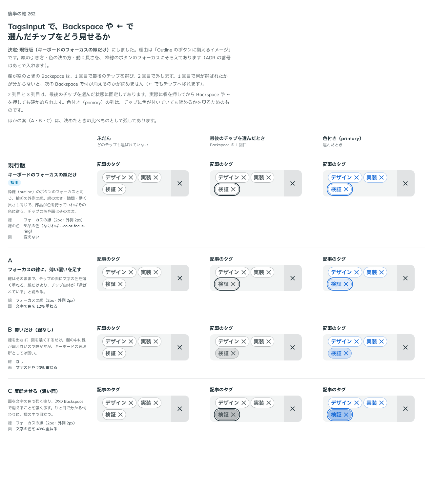

# 0233. TagsInput の選択中の Chip は、Outline のボタンのフォーカスにそろえる

- ステータス: Accepted
- 日付: 2026-09-21
- ラウンド: 後半 軸262

## 背景

TagsInput は、入力欄が空のとき Backspace 1 回で最後の Chip を選択し、2 回目で消します。選択中の Chip の見え方を決める必要がありました。

## 候補

比較は、決めた時点のコミット `f77a25c` の比較のストーリー（`design/stories/axis-262-tags-input-chip-selected.stories.tsx`）です。

| 案     | 内容                                                                                 |
| ------ | ------------------------------------------------------------------------------------ |
| 現行版 | キーボードのフォーカスの線だけ。Outline のボタンのフォーカスと同じ線で、面は変えない |
| A      | フォーカスの線に、薄い覆いを足す。チップの面に文字の色を 12% 重ねる                  |
| B      | 覆いだけ（線なし）。線を出さず、面に文字の色を 20% 重ねる                            |
| C      | 反転させる（濃い面）。線に加えて、面に文字の色を 40% 重ねる                          |

比べた点は、ふだん・最後のチップを選んだとき・色付き（primary）で選んだときの、選ばれていることの読みやすさと、欄の中での目立ち方です。

## 決定

**現行版（線だけ）にします。Outline のボタンのフォーカスの線と、同じ書き方です。**

- 色は neutral のとき標準の線の色で、primary のときは部品の色に追従します

## 理由

ユーザーの返事の原文です。

> 現行版で。Outline のボタンに揃えるイメージです

以下は、決めたときの考えです。

- **フォーカスの線は、部品によらず同じ書き方にする**: 選んだものがどれかを、フォーカスと同じ形で示します（[原則 2](../principles.md#2-フォーカスとエラーは枠線で表す)）

## 却下した案と理由

- **ほかの案**: 選ばれませんでした

## 影響

- 部品の変更はありません（現行版のままです）

## 原則への反映

反映なしです。既存の原則 2 の適用です。

## 比較画像

決めた時点のコミット `f77a25c` の比較のストーリーで描きました。`git checkout f77a25c && pnpm storybook` で、決めたときの部品のまま開けます。

