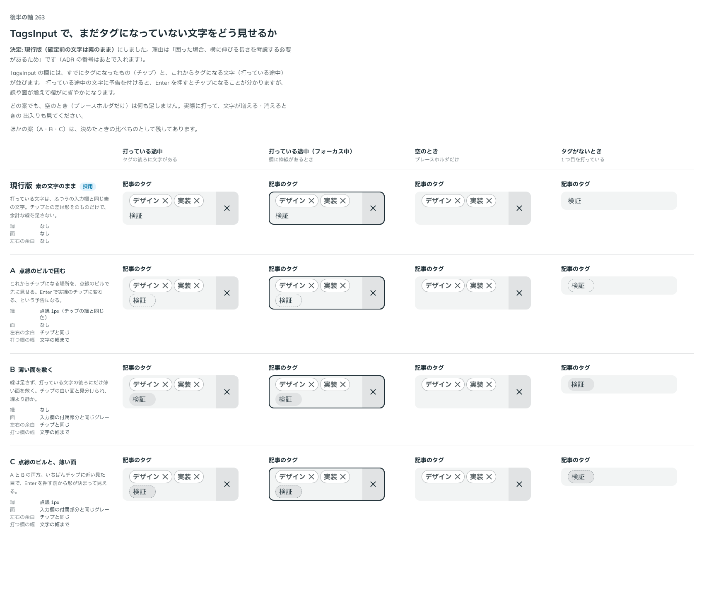

# 0234. TagsInput の確定前の文字は、囲まずに素のまま出す

- ステータス: Accepted
- 日付: 2026-09-21
- ラウンド: 後半 軸263

## 背景

TagsInput の入力欄で打っている文字は、まだタグになっていません。確定前の文字を、囲んで見せるかどうかを決める必要がありました。

## 候補

比較は、決めた時点のコミット `f77a25c` の比較のストーリー（`design/stories/axis-263-tags-input-pending.stories.tsx`）です。

| 案     | 内容                                                                           |
| ------ | ------------------------------------------------------------------------------ |
| 現行版 | 素の文字のまま。ふつうの入力欄と同じで、縁も面も足さない                       |
| A      | 点線のピルで囲む。これからチップになる場所を点線で先に見せる                   |
| B      | 薄い面を敷く。線は足さず、打っている文字の後ろに入力欄の付属部分と同じ面を敷く |
| C      | 点線のピルと、薄い面。A と B の両方                                            |

比べた点は、打っている途中（フォーカス中も）・空のとき・タグがないときの見え方と、文字が増えたときの横の伸びです。

## 決定

**現行版（素のまま）にします。**

## 理由

ユーザーの返事の原文です。

> 現行版で。囲った場合、横に伸びる長さを考慮する必要があるため。

以下は、決めたときの考えです。

- **打つたびに形が変わらない方が読みやすい**: 囲むと、文字が増えるたびに横に伸び、折り返しの位置まで動きます

## 却下した案と理由

- **囲んで出す案**: 上の理由の通りです

## 影響

- 部品の変更はありません（現行版のままです）

## 原則への反映

反映なしです。

## 比較画像

決めた時点のコミット `f77a25c` の比較のストーリーで描きました。`git checkout f77a25c && pnpm storybook` で、決めたときの部品のまま開けます。

