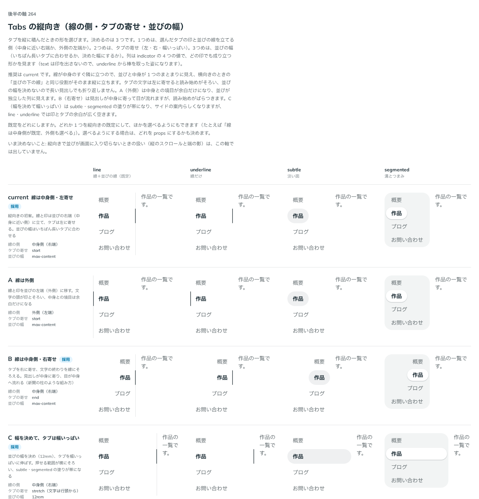

# 0258. Tabs の縦向きは、線を中身側に立てて左寄せ。右寄せと幅いっぱいも選べる

- ステータス: Accepted
- 日付: 2026-09-22
- ラウンド: 後半 軸 264

## 背景

Tabs は `orientation` を型から塞いでいて、縦に積んだタブ（サイドバー型）を作れませんでした（props の監査の P-17、[ADR-0251](./0251-overlay-base-ui-props.md)）。縦向きの見た目は決めていなかったので、`orientation` を開ける前に軸として比べました。

決めるのは 3 つです。選んだタブの印と並びの線を立てる側（中身に近い右端か、外側の左端か）、タブの寄せ（左・右・幅いっぱい）、並びの幅（いちばん長いタブに合わせるか、決めた幅にするか）です。

## 候補

比較は、決めた時点のコミット `d3acff1` の比較のストーリー（`design/stories/axis-264-tabs-vertical.stories.tsx`）です。列は印（`line`・`underline`・`subtle`・`segmented`）で、どの印でも成り立つかを見ました。候補は `--tabs-vertical-*` の上書きだけで作りました。

| 案     | 内容                                                                                                                 |
| ------ | -------------------------------------------------------------------------------------------------------------------- |
| 現行版 | 線は中身側（並びの右端）、タブは左寄せ、並びの幅はいちばん長いタブ。横向きの「並びの下の線」の役割がそのまま縦に立つ |
| A      | 線を外側（並びの左端）に。文字の頭が印とそろい、中身との境目は余白だけになる                                         |
| B      | 線は中身側で、タブを右寄せ。文字の終わりが線にそろい、見出しが中身に寄る（新聞の柱のような組み方）                   |
| C      | 並びの幅を決め（12rem）、タブを幅いっぱいに伸ばす。押せる範囲が横にそろい、`subtle`・`segmented` の塗りが帯になる    |

## 決定

**現行版を既定にします。B（右寄せ）と、C（幅を決めてタブを幅いっぱいにする）も選べるようにします。A（線を外側に）は採りません。**

- `orientation="vertical"` を公開します。並びを左、中身を右に置き、選んだタブの印は縦の棒、並びの線も縦に立てます。棒と線は並びの右端（中身側）に固定です
- `tabAlign`（`start`・`end`、既定 `start`）でタブの寄せを選びます。`end` が B です
- `listWidth`（CSS の長さ）で並びの幅を決めます。決めるとタブは幅いっぱいに伸び、文字は行頭からになります。これが C です。`listWidth` を決めたときは `tabAlign` を使いません
- 縦向きの並びが画面に入り切らないときの扱い（縦のスクロールと端の影）は、この軸では決めていません（backlog）

## 理由

ユーザーの返事の原文です。

> 264 はデフォルト現行、Bも選べる、選択エリアを指定幅いっぱいにするオプションも欲しいです。

現行版を推した理由は、線が中身のすぐ隣に立つので並びと中身が 1 つのまとまりに見え、横向きのときの「並びの下の線」と同じ役割を縦でも果たすことです。タブの文字を左に寄せると読み始めがそろい、並びの幅を決めないので長い見出しでも折り返しません。

## 却下した案と理由

- **A（線を外側に）**: 選ばれませんでした。中身との境目が余白だけになり、並びが独立した列に見えます
- **B を既定にする**: 選ばれませんでした。見出しが中身に寄って目は流れますが、読み始めがばらつきます。選べる形（`tabAlign="end"`）で残します
- **C を既定にする**: 選ばれませんでした。`line`・`underline` では印とタブの余白が広く空きます。幅を決めたい場面（サイドバー）のために `listWidth` で残します

## 影響

- `src/components/tabs/Tabs.tsx`: `orientation`・`tabAlign`・`listWidth` を公開しました。比べるために置いた `--tabs-vertical-side` は中身側（1）に畳んで消し、`--tabs-vertical-tab-align`・`--tabs-vertical-list-width` は props から置く内部の変数にして `tokens.css` から消しました
- `src/index.ts`: `TabsOrientation`・`TabsTabAlign` を公開しました
- `Tabs.stories.tsx`: 縦向きの一覧（既定・`tabAlign="end"`・`listWidth="12rem"` × `line`・`subtle`）を `visual` にしました
- 比較のストーリー `design/stories/axis-264-tabs-vertical.stories.tsx` は消しました

## 原則への反映

反映なし。原則 16（重なる面と帯の出し方）と原則 20（部品は知らないことを決めない。既定を 1 つ決め、ほかの形は選べるようにする）の考え方の中に収まります。

## 比較画像

決めた時点のコミットは `d3acff1` です。`git checkout d3acff1 && pnpm storybook` で、比較のストーリー（`Design Review/264 Tabs の縦向き`）を決めたときの部品のまま開けます。
