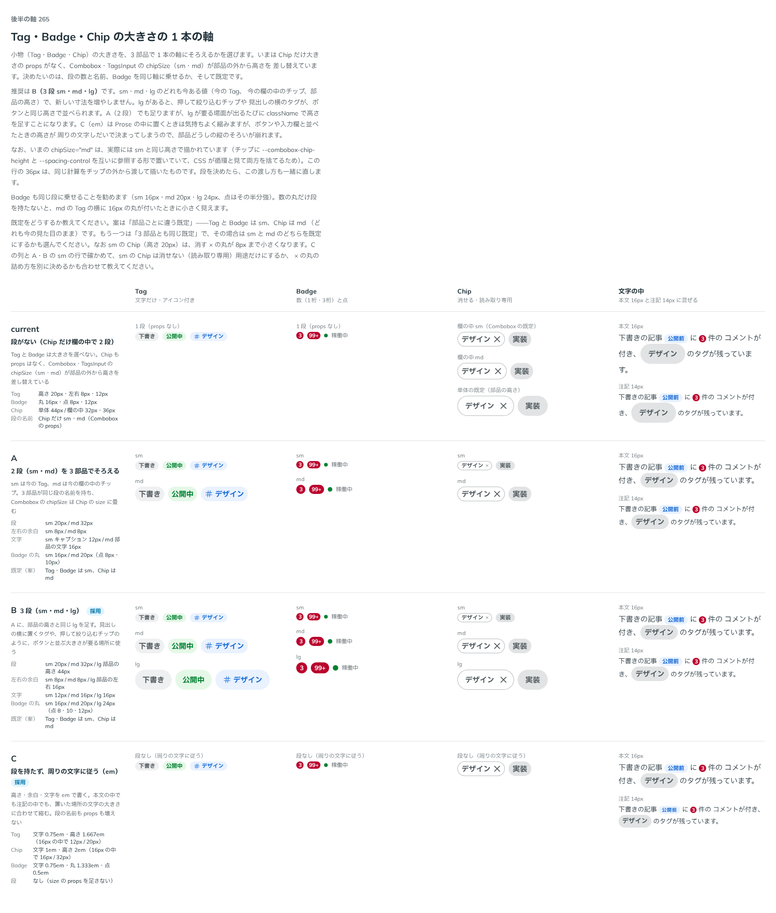

# 0259. Tag・Badge・Chip の大きさは 3 段（sm・md・lg）と inherit の 1 本の軸

- ステータス: Accepted
- 日付: 2026-09-22
- ラウンド: 後半 軸265

## 背景

Tag・Badge は大きさの props を持たず、Chip も同じでした。欄の中に並べる Combobox・TagsInput の `chipSize`（`sm`・`md`）だけが、部品の外から `--spacing-control` を差し替えて大きさを作っていました。

この差し替えには不具合がありました。`chipSize="md"` のとき、Chip の要素に `--combobox-chip-height`（部品の高さ − 8px を計算する）と `--spacing-control`（`--combobox-chip-height` を読む）を同じ要素に置いていたため、2 つの CSS カスタムプロパティが互いを参照する循環になり、両方とも無効な値として扱われていました。結果として、`chipSize="md"` を選んでも見た目は `sm` のまま変わりませんでした。

Tag・Badge・Chip という 3 つの小物に、大きさの段を 1 本の軸としてそろえるかを決める必要がありました。

## 候補

比較は、決めた時点のコミット `d3acff1` の比較のストーリー（`design/stories/axis-265-small-parts-size.stories.tsx`）です。

| 案     | 内容                                                                                                                  |
| ------ | --------------------------------------------------------------------------------------------------------------------- |
| 現行版 | 段がない。Tag・Badge は大きさを選べない。Chip も props はなく、`chipSize`（`sm`・`md`）が部品の外から高さを差し替える |
| A      | 2 段（`sm`・`md`）を 3 部品でそろえる。`sm` は今の Tag、`md` は今の欄の中のチップ                                     |
| B      | A に、部品の高さと同じ `lg` を足した 3 段（`sm`・`md`・`lg`）                                                         |
| C      | 段を持たず、高さ・余白・文字を em で書き、周りの文字の大きさに従わせる                                                |

## 決定

**B（3 段 `sm`・`md`・`lg`）を採用し、周りの文字に従う `inherit` も足します。**

- `sm`（高さ 20px・左右 8px・キャプションの文字 12px）は今までの Tag
- `md`（高さ = 部品の高さ − 12px・左右 8px・部品の中の文字 16px）は今までの欄の中のチップ
- `lg`（高さ = 部品の高さ・左右 = 部品の左右の余白・部品の中の文字 16px）は今までの単体の Chip
- `inherit` は高さ・余白・文字を em で持ち、置いた場所の文字の大きさに従う（C の値）
- Badge の丸も同じ段（`sm` 16px・`md` 20px・`lg` 24px、点はその半分強）に乗せます
- 既定は Tag・Badge が `sm`、Chip が `md`（どれも今までの見た目に一番近い組み合わせ）
- Combobox・TagsInput の `chipSize` は、`Chip` の `size` にそのまま渡す形に畳みます（`inherit` を除く）。これにより、`--spacing-control` を差し替える循環の作りをやめ、`chipSize="md"` は正しく 32px で描かれるようになります

## 理由

ユーザーの返事の原文です。

> 265 はBで、文字サイズに従うオプション（inherit？）も欲しいです。

## 却下した案と理由

- **現行版（段なし）**: Chip だけ大きさを持ち、しかも `chipSize="md"` が不具合で効いていませんでした。Tag・Badge にも段がないと、Badge を Tag の隣に置いたときなど大きさをそろえられません
- **A（2 段）**: `sm`・`md` だけでは、ボタンや入力欄と高さをそろえたい場面（押して絞り込むチップ、見出しの横のタグ）に `lg` がなく、そのたびに `className` で高さを足すことになります
- **C（em のみ、段なし）**: Prose の中では気持ちよく縮みますが、ボタンや入力欄と並べたときの高さが周りの文字しだいで決まってしまい、部品どうしの縦のそろいが崩れます。段を残しつつ、必要な場所だけ `inherit` を選べる形にしました

## 影響

- `src/internal/small-parts-size.ts`: `SmallPartsSize`（`'sm' | 'md' | 'lg' | 'inherit'`）と、Tag・Badge・Chip の tv の `size` 変化に渡すクラス、Combobox・TagsInput が読む Chip の高さの生の値を持ちます。値はここに 1 本だけ持ちます
- `src/components/tag/Tag.tsx`・`src/components/badge/Badge.tsx`・`src/components/chip/Chip.tsx`: `size` props を足しました（Tag・Badge は既定 `sm`、Chip は既定 `md`）。`--tag-*`・`--badge-*`・`--chip-*` は、`size` の tv 変化がそのつど差し替えます
  - 単体の Chip の既定の高さは、44px（部品の高さ）から 32px（`md`）に変わります。今までの高さは `size="lg"` で選べます
  - `sm` の Chip（高さ 20px）は、消す × の丸の計算式（高さ − 12px）だと 8px まで小さくなり押しにくいので、`sm` のときだけ丸をチップの高さいっぱいに、中の × を 12px に固定します（この ADR で決めました）
- `src/internal/combobox-base/combobox-control-styles.ts`: `ChipSize`（`'sm' | 'md'`）を削除し、`ComboboxChipSize`（`Exclude<SmallPartsSize, 'inherit'>`）に差し替えました。`comboboxChipStyle` は、チップの最大幅だけを返す `comboboxChipMaxWidthStyle` と、打つ欄の高さをチップにそろえるための `comboboxChipHeightStyle` に分けました。`comboboxChipClass` から `--spacing-control`・`--spacing-control-x` を差し替える記述を外しました（循環の作りをやめ、Chip の `size` に任せる）
- `src/components/combobox/Combobox.tsx`・`src/components/tags-input/TagsInput.tsx`: `chipSize` の型を `ComboboxChipSize` にし、既定を `'sm'` から `'md'`（今までの欄の中のチップと同じ見た目）に変えました。`ComboboxChips`・`ComboboxTriggerChips`・`TagsInputChips` に `chipSize` を通し、`Chip` の `size` にそのまま渡します
- `design/tokens.css`: `--tag-*`・`--badge-size`・`--badge-pad-x`・`--badge-dot`・`--combobox-chip-height`・`--combobox-chip-padding-x` の既定値を削除しました（値は `src/internal/small-parts-size.ts` に移りました）。`--badge-ring-width`・`--badge-overlay-inset`・Chip の色や縁のトークンは残ります
- ストーリー: Tag・Badge・Chip に `Sizes`（`tags: ['visual']`）を足しました。Combobox・TagsInput の欄の中のチップの高さが変わる分（`chipSize` の既定が変わったもの・`md` が正しく描かれるようになったもの）、見た目の基準画像を撮り直しました
- backlog: Chip の押せる・選べる形（pressable・selected）と、`inherit` を選んだときの読み取り専用チップの文字色（3.96:1 の暫定値）は、まだ決めていません

## 原則への反映

反映なし。原則 11（文字の大きさは入力方式で切り替える）は、マウス・指という入力方式で切り替える軸です。今回の `sm`・`md`・`lg`・`inherit` は、置き場所（本文の中か、欄の中か、単体で並べるか）で選ぶ軸で、入力方式では切り替えません。原則 11 の「タグは押さないので、文字の大きさに従います」という一文とは、`inherit` が対応します。

## 比較画像

決めた時点のコミット `d3acff1` の比較のストーリー（`design/stories/axis-265-small-parts-size.stories.tsx`）で描きました。`git checkout d3acff1 && pnpm storybook` で、決めたときの部品のまま開けます。

