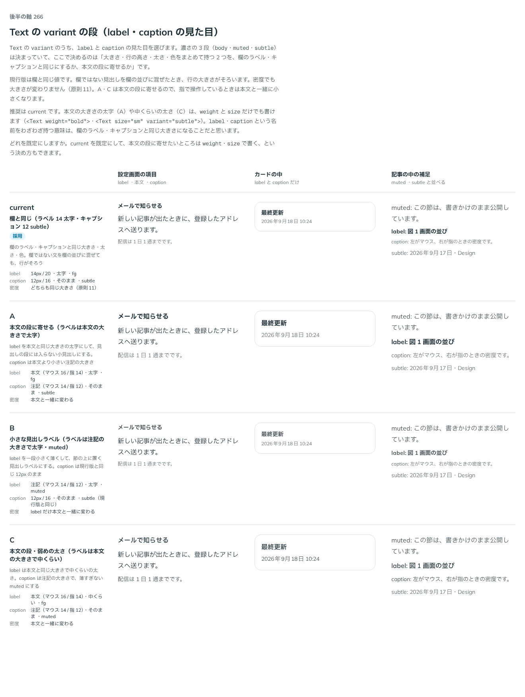

# 0260. Text の variant（label・caption）の見た目

- ステータス: Accepted
- 日付: 2026-09-22
- ラウンド: 後半 軸 266

## 背景

[ADR-0236](./0236-variant.md) で `Text` の `tone` を `variant` に改名したとき、`label`・`caption` は大きさ・行の高さ・太さ・色をまとめて決める組として残りましたが、値は欄のラベル・キャプション（`src/internal/field/field-styles.ts`）と同じ値のまま仮置きでした。軸 266 は、この 2 つを本文の段に寄せるか、欄と同じ値のまま決めるかを比べました。比較は `design/stories/axis-266-text-variants.stories.tsx` に置き、候補は `design/tokens.css` の `--text-variant-label-*`・`--text-variant-caption-*` の上書きだけで作りました（コミット d3acff1）。

## 候補

| 案      | 内容                                                                                                                                       |
| ------- | ------------------------------------------------------------------------------------------------------------------------------------------ |
| current | 欄と同じ（label: 14px / 20・太字・fg、caption: 12px / 16・そのまま・subtle）。密度で大きさが変わらない                                     |
| A       | 本文の段に寄せる（label: 本文（マウス 16 / 指 14）・太字・fg、caption: 注記（マウス 14 / 指 12）・そのまま・subtle）。密度で大きさが変わる |
| B       | 小さな見出しラベル（label: 注記（マウス 14 / 指 12）・太字・muted、caption: 現行版と同じ 12px）                                            |
| C       | 本文の段・弱めの太さ（label: 本文（マウス 16 / 指 14）・中くらい・fg、caption: 注記（マウス 14 / 指 12）・muted）                          |

## 決定

**current を採用します。** `label`・`caption` は、いまのとおり欄のラベル・キャプションと同じ大きさ・行の高さ・太さ・色のままにします。本文の段に寄せたいところは `weight`・`size` で書きます（`<Text weight="bold">`・`<Text size="sm" variant="subtle">`）。

## 理由

ユーザーの返事の原文です。

> 266は現行でお願いします！

ストーリーの説明にある判断は次のとおりです。`label`・`caption` という名前をわざわざ持つ意味は、欄のラベル・キャプションと同じ大きさになることです。欄ではない見出しを欄の並びに混ぜたとき、行の大きさがそろいます。密度でも大きさが変わりません（[原則 11](../principles.md#11-文字の大きさは入力方式で切り替える)「ラベル、ヘルプテキスト、キャプションは、入力方式によらず同じ大きさです」）。A・C は本文の段に寄せるため、指で操作しているときは本文と一緒に小さくなり、この性質を失います。

## 却下した案と理由

- A（本文の段に寄せる）: 密度で大きさが変わってしまい、欄のラベル・キャプションとそろわなくなるため
- B（小さな見出しラベルで muted）: label が本文より小さくなり、A と同じく密度で変わる。文字色も muted に変わり、欄のラベルと別の見た目になるため
- C（本文の段・弱めの太さ）: A と同じ理由に加え、太さも欄のラベル（太字）と変わるため

## 影響

比較用に足していた `design/tokens.css` の `--text-variant-label-*`・`--text-variant-caption-*`（8 個）を削除し、`src/internal/reading/text.ts` の `fieldVariant` を欄のトークン（`--text-label`・`--leading-label`・`--text-caption`・`--leading-caption`）を直接読む形に戻しました。`weight` variant はそのまま残します。部品の見た目は変わっていません（`pnpm test src/components/text` の基準画像は不変）。

## 原則への反映

反映なし。[原則 11](../principles.md#11-文字の大きさは入力方式で切り替える)の「ラベル、ヘルプテキスト、キャプションは、入力方式によらず同じ大きさです」の範囲内の決定です。

## 比較画像

比較の記録はコミット d3acff1（`design/stories/axis-266-text-variants.stories.tsx`）です。`git checkout d3acff1 && pnpm storybook` で、決めたときの部品のまま開けます。
