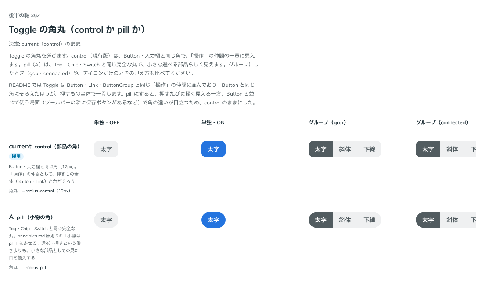

# 0261. Toggle の角丸は control（Button と同じ角）

- ステータス: Accepted
- 日付: 2026-09-23
- ラウンド: 後半 軸 267

## 背景

Toggle（押した・押していないを切り替えるボタン）を新しく作るにあたって、角丸をどちらの仲間に寄せるかが未決でした。Button・入力欄と同じ角（control）にするか、Tag・Chip・Switch と同じ小物の pill にするかです。

principles.md 原則5 には「pill は、小物（タグ、トグル）と…」とあり、ここでの「トグル」は Switch（トラックが pill）を指していましたが、新しい Toggle（押すボタン）がどちらの仲間かは、原則の文だけでは決まっていませんでした。

## 候補

比較は、決めた時点のコミット `9944d66` の比較のストーリー（`design/stories/axis-267-toggle-radius.stories.tsx`）です。列は単独・グループ（gap・connected）・アイコンだけです。

| 案     | 内容                                                                                                |
| ------ | --------------------------------------------------------------------------------------------------- |
| 現行版 | control（`--radius-control`）。Button・入力欄と同じ角。「操作」の仲間として押すもの全体と角がそろう |
| A      | pill（`--radius-pill`）。Tag・Chip・Switch と同じ完全な丸。小さな部品としての見た目を優先する       |

## 決定

**現行版（control）のままにします。**

- Toggle の角丸は `--toggle-radius: var(--radius-control)` で固定です。props では選べません
- README では Toggle は Button・Link・ButtonGroup と同じ「操作」の仲間に並んでおり、Button と同じ角にそろえたほうが、押すもの全体で一貫します

## 理由

ユーザーの返事の原文です。

> 267: 現行で良さそう

pill にすると押すたびに軽く見える一方、Button と並べて使う場面（ツールバーの隣に保存ボタンがあるなど）で角の違いが目立つため、control のままにしました。

## 却下した案と理由

- **A（pill）**: 選ばれませんでした。Tag・Chip・Switch と見た目がそろう利点はありますが、Button と並ぶ場面で角が揃わなくなります

## 影響

- `src/components/toggle/Toggle.tsx`: `--toggle-radius: var(--radius-control)` を固定値として使いました（props では選べません）
- `design/principles.md` 原則5: 「pill は、小物（タグ、トグル）と…」の「トグル」が Switch を指すことが、新しい Toggle の登場であいまいになったため、「スイッチ」に改め、「押して切り替わるボタン（トグル）は、部品と同じ角です」を一文足しました
- 比較のストーリー `design/stories/axis-267-toggle-radius.stories.tsx` は消しました

## 原則への反映

原則5（角丸は部品と包むもので分ける）の「トグル」の語を「スイッチ」に改め、Toggle が control の角であることを一文足しました（上の「影響」参照）。

## 比較画像

決めた時点のコミットは `9944d66` です。`git checkout 9944d66 && pnpm storybook` で、比較のストーリー（`Design Review/267 Toggle の角丸`）を決めたときの部品のまま開けます。
