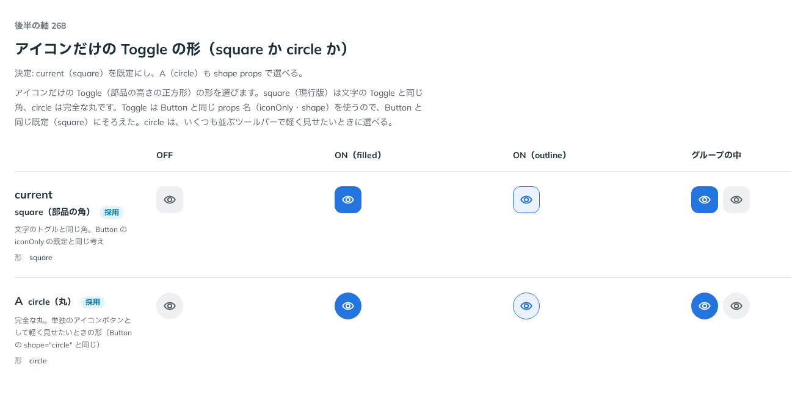

# 0262. アイコンだけの Toggle の形は square が既定（circle も選べる）

- ステータス: Accepted
- 日付: 2026-09-23
- ラウンド: 後半 軸 268

## 背景

アイコンだけの Toggle（部品の高さの正方形）の形を、Button の `iconOnly` と同じ考えの `shape` props（square・circle）で選べるようにするかを決めました。

## 候補

比較は、決めた時点のコミット `9944d66` の比較のストーリー（`design/stories/axis-268-toggle-icon-shape.stories.tsx`）です。列は OFF・ON（filled）・ON（outline）・グループの中です。候補は `shape` の指定を行ごとに変えました。

| 案     | 内容                                                                  |
| ------ | --------------------------------------------------------------------- |
| 現行版 | square。文字の Toggle と同じ角。Button の `iconOnly` の既定と同じ考え |
| A      | circle。完全な丸。単独のアイコンボタンとして軽く見せたいときの形      |

## 決定

**現行版（square）を既定にし、A（circle）も `shape` props で選べるようにします。**

- `ToggleShape`（`'square' | 'circle'`）を公開し、`shape` props で選べます
- 既定は `square` です

## 理由

ユーザーの返事の原文です。

> 268: 現行がデフォルトで、丸にもできるようにしたいです

Toggle は Button と同じ props 名（`iconOnly`・`shape`）を使うので、Button と同じ既定（square）にそろえました。circle は、いくつも並ぶツールバーで軽く見せたいときに選べます。

## 却下した案と理由

なし（現行版・A のどちらも採用しました）。

## 影響

- `src/components/toggle/Toggle.tsx`: `shape` props（`ToggleShape`）を公開しました
- `src/index.ts`: `ToggleShape` を公開しました
- 比較のストーリー `design/stories/axis-268-toggle-icon-shape.stories.tsx` は消しました

## 原則への反映

反映なし。原則18（働きで部品を選び、見た目は別に選ぶ）の、見た目は働きとは別に選べるという考え方の範囲内です。

## 比較画像

決めた時点のコミットは `9944d66` です。`git checkout 9944d66 && pnpm storybook` で、比較のストーリー（`Design Review/268 アイコンだけの Toggle の形`）を決めたときの部品のまま開けます。
