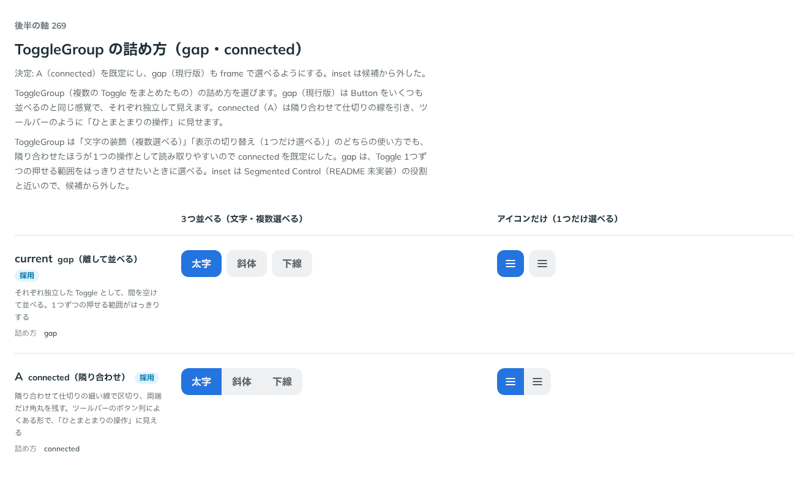

# 0263. ToggleGroup の詰め方は connected が既定（gap も選べる）

- ステータス: Accepted
- 日付: 2026-09-23
- ラウンド: 後半 軸 269

## 背景

ToggleGroup（複数の Toggle をまとめたもの）の詰め方（`frame`）を決めました。値は `design/tokens.css` の `--toggle-group-*` です。Segmented Control（README「入力」の未実装）と役割が重ならないよう、track で滑る印は持たせていません。

## 候補

比較は、決めた時点のコミット `9944d66` の比較のストーリー（`design/stories/axis-269-toggle-group-frame.stories.tsx`）です。列は「3つ並べる（文字・複数選べる）」「アイコンだけ（1つだけ選べる）」です。候補は `frame` の指定を行ごとに変えました。

| 案             | 内容                                                                                                                       |
| -------------- | -------------------------------------------------------------------------------------------------------------------------- |
| gap            | それぞれ独立した Toggle として、間を空けて並べる。1つずつの押せる範囲がはっきりする                                        |
| A（connected） | 隣り合わせて仕切りの細い線で区切り、両端だけ角丸を残す。ツールバーのボタン列によくある形で、「ひとまとまりの操作」に見える |

## 決定

**A（connected）を既定にし、gap（現行版）も `frame` で選べるようにします。inset は候補から外しました。**

- `ToggleGroupFrame`（`'gap' | 'connected'`）を公開し、既定は `connected` です
- `connected` は、隣り合わせ・仕切りの細い線・両端だけ角丸です。Toggle 自身が `data-frame` を見て、両端以外の角丸を消します

## 理由

ユーザーの返事の原文です。

> 269: Aがデフォルトで、現行もできるようにしたいです

ToggleGroup は「文字の装飾（複数選べる）」「表示の切り替え（1つだけ選べる）」のどちらの使い方でも、隣り合わせたほうが1つの操作として読み取りやすいので connected を既定にしました。gap は、Toggle 1つずつの押せる範囲をはっきりさせたいときに選べます。

## 却下した案と理由

- **inset**: 候補から外しました。Segmented Control（README 未実装）の役割と近いためです

## 影響

- `src/components/toggle/ToggleGroup.tsx`: `frame` props（`ToggleGroupFrame`）を公開し、既定を `connected` にしました
- `src/components/toggle/Toggle.tsx`: 親の `data-frame="connected"` を見て、両端以外の角丸を消す指定を足しました
- `src/index.ts`: `ToggleGroupFrame` を公開しました
- 比較のストーリー `design/stories/axis-269-toggle-group-frame.stories.tsx` は消しました

## 原則への反映

反映なし。`frame` は選択肢の囲み方で値は部品ごと、という [ADR-0257](./0257-frame.md) の範囲内です。

## 比較画像

決めた時点のコミットは `9944d66` です。`git checkout 9944d66 && pnpm storybook` で、比較のストーリー（`Design Review/269 ToggleGroup の詰め方`）を決めたときの部品のまま開けます。
