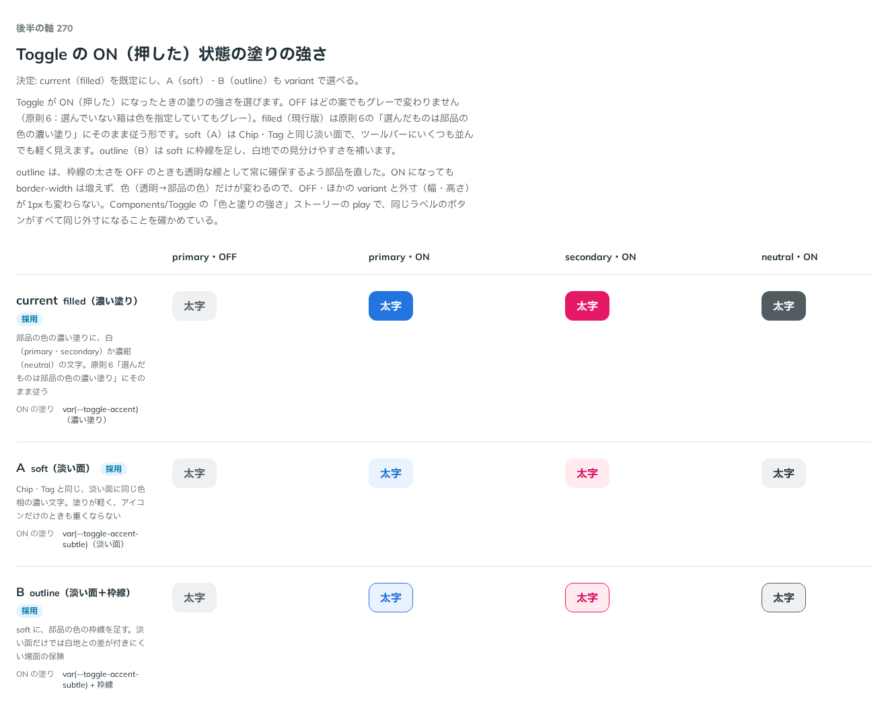

# 0264. Toggle の ON の塗りは filled が既定（soft・outline も選べる）

- ステータス: Accepted
- 日付: 2026-09-23
- ラウンド: 後半 軸 270

## 背景

Toggle が ON（押した）になったときの塗りの強さ（`variant`）を決めました。OFF はどの案でもグレーで固定です（原則6: 選んでいない箱は色を指定していてもグレー）。変わるのは ON の見え方だけです。

## 候補

比較は、決めた時点のコミット `9944d66` の比較のストーリー（`design/stories/axis-270-toggle-pressed-fill.stories.tsx`）です。列は primary・OFF、primary・ON、secondary・ON、neutral・ON です。

| 案               | 内容                                                                                       |
| ---------------- | ------------------------------------------------------------------------------------------ |
| 現行版（filled） | 部品の色の濃い塗りに、白（primary・secondary）か濃紺（neutral）の文字。原則6にそのまま従う |
| A（soft）        | Chip・Tag と同じ、淡い面に同じ色相の濃い文字。塗りが軽く、アイコンだけのときも重くならない |
| B（outline）     | soft に、部品の色の枠線を足す。淡い面だけでは白地との差が付きにくい場面の保険              |

## 決定

**現行版（filled）を既定にし、A（soft）・B（outline）も `variant` で選べるようにします。**

- `ToggleVariant`（`'filled' | 'soft' | 'outline'`）を公開し、既定は `filled` です
- `outline` は、枠線の太さを OFF のときも透明な線として常に確保するよう部品を直しました。ON になっても `border-width` は増えず、色（透明→部品の色）だけが変わるので、OFF・ほかの variant と外寸（幅・高さ）が1pxも変わりません

## 理由

ユーザーの返事の原文です。

> 270: 現行がデフォルトで、Aも選べるようにしたいです。B も選びたいですが、枠線が増えて膨らんで見えるので、同じサイズのまま変化するように調整してほしいです。

filled（現行版）は原則6の「選んだものは部品の色の濃い塗り」にそのまま従う形です。soft（A）は Chip・Tag と同じ淡い面で、ツールバーにいくつも並んでも軽く見えます。outline（B）は soft に枠線を足し、白地での見分けやすさを補いますが、最初の案では枠線の太さの分だけ ON でボタンが膨らんで見えたため、OFF のときも透明な枠線の太さを確保する直しを入れました。

## 却下した案と理由

なし（3 案とも採用しました）。

## 影響

- `src/components/toggle/Toggle.tsx`: `variant` props（`ToggleVariant`）を公開し、既定を `filled` にしました。枠線は常に `--border-width-medium` を確保し、色（`--toggle-border-color`）だけを透明⇄部品の色で切り替える作りにしました
- `src/index.ts`: `ToggleVariant`・`ToggleColor` を公開しました
- `Components/Toggle` の「色と塗りの強さ」ストーリーの `play` で、同じラベルのボタンがすべて同じ外寸になることを確かめました
- 比較のストーリー `design/stories/axis-270-toggle-pressed-fill.stories.tsx` は消しました

## 原則への反映

反映なし。原則6（色は役割で持つ）の「選んだものは部品の色の濃い塗り」という考え方の範囲内です。

## 比較画像

決めた時点のコミットは `9944d66` です。`git checkout 9944d66 && pnpm storybook` で、比較のストーリー（`Design Review/270 Toggle の ON の塗り`）を決めたときの部品のまま開けます。
