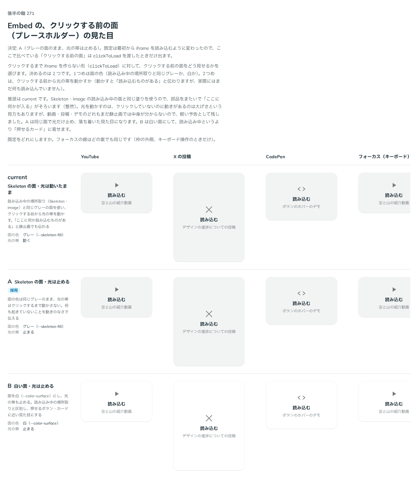

# 0265. Embed の読み込む前の面は、グレーのまま光を止める

- ステータス: Accepted
- 日付: 2026-09-23
- ラウンド: 後半 軸 271

## 背景

Embed をクリックするまで iframe を作らない形（`clickToLoad`）に対して、クリックする前の面（プレースホルダー）をどう見せるかを決めました。決めるのは 2 つです。1つめは面の色（読み込み中の場所取りと同じグレーか、白か）。2つめは、クリックする前から光の帯を動かすか（動かすと「読み込むものがある」と伝わりますが、実際にはまだ何も読み込んでいません）。

## 候補

比較は、決めた時点のコミット `9944d66` の比較のストーリー（`design/stories/axis-271-embed-idle-face.stories.tsx`）です。列は YouTube・X の投稿・CodePen・フォーカス（キーボード）です。

| 案     | 内容                                                                                        |
| ------ | ------------------------------------------------------------------------------------------- |
| 現行版 | Skeleton の面（グレー）・光は動いたまま。「ここに何か読み込むものがある」と静止画でも伝わる |
| A      | Skeleton の面（グレー）のまま、光は止める。何も起きていないことを動きのなさで伝える         |
| B      | 白い面・光は止める。読み込み中の場所取りと区別し、押せるボタン・カードに近い見た目にする    |

## 決定

**A（グレーの面のまま、光の帯は止める）を既定にします。**

既定は最初から iframe を読み込むように変わったので、ここで比べている「クリックする前の面」は `clickToLoad` を渡したときだけ出ます。

## 理由

ユーザーの返事の原文です。

> 271: Embed が押すまで読み込まれない挙動にするなら、A が良いかなと思います。現行だとずっと読み込んでいるままの印象です。

現行版（光が動いたまま）は、まだ何も読み込んでいないのに「読み込んでいる」という印象を与えてしまいます。A は面の色を Skeleton・Image の読み込み中の面とそろえたまま（整然）、光だけ止めて「まだ何も始まっていない」ことを動きのなさで伝えます。B（白い面）は読み込み中の場所取りの語彙から外れるため採りませんでした。

## 却下した案と理由

- **現行版（光が動いたまま）**: 選ばれませんでした。クリックしていないのに動きがあるのは大げさで、「読み込んでいる」という誤った印象を与えます
- **B（白い面）**: 選ばれませんでした。Skeleton・Image の読み込み中の面と塗りがそろわなくなります

## 影響

- `src/components/embed/Embed.tsx`: `clickToLoad` の idle 状態の面は `--embed-idle-fill: var(--skeleton-fill)` のまま、`--embed-idle-motion-play-state: paused` にしました
- `design/tokens.css`: `--embed-idle-motion-play-state` を追加しました
- 比較のストーリー `design/stories/axis-271-embed-idle-face.stories.tsx` は消しました

## 原則への反映

原則14（動きは手応えと待ちを伝える）に「押せばこれから読み込むと分かっているだけで、まだ何も求めていない面は、動かさずに置きます。待っていることを動きで伝えるのは、実際に読み込みはじめてからです。」を足しました。[ADR-0268](./0268-embed-loading.md)（クリックしたあとは光を動かす）と対になる決定です。

## 比較画像

決めた時点のコミットは `9944d66` です。`git checkout 9944d66 && pnpm storybook` で、比較のストーリー（`Design Review/271 Embed の読み込む前の面`）を決めたときの部品のまま開けます。
