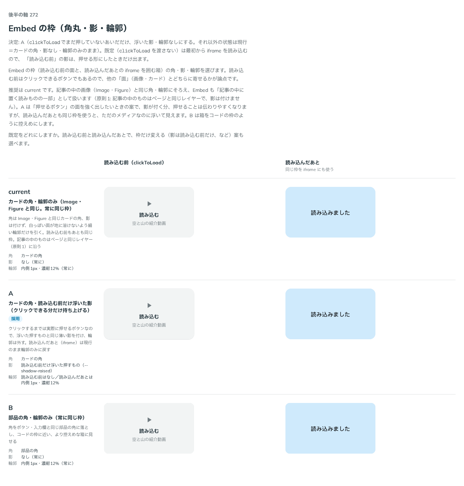

# 0266. Embed の枠は、読み込む前だけ浮いた影にする

- ステータス: Accepted
- 日付: 2026-09-23
- ラウンド: 後半 軸 272

## 背景

Embed の枠（読み込む前の面と、読み込んだあとの iframe を囲む箱）の角・影・輪郭を決めました。読み込む前はクリックできるボタンでもあるので、他の「面」（画像・カード）とどちらに寄せるかが論点です。

## 候補

比較は、決めた時点のコミット `9944d66` の比較のストーリー（`design/stories/axis-272-embed-frame.stories.tsx`）です。列は「読み込む前（clickToLoad）」「読み込んだあと」です。

| 案     | 内容                                                                                                                 |
| ------ | -------------------------------------------------------------------------------------------------------------------- |
| 現行版 | カードの角・輪郭のみ（Image・Figure と同じ。常に同じ枠）。記事の中のものはページと同じレイヤー（原則1）に沿う        |
| A      | カードの角・読み込む前だけ浮いた影（クリックできる分だけ持ち上げる）。読み込んだあとは現行のまま輪郭のみに戻す       |
| B      | 部品の角・輪郭のみ（常に同じ枠）。角をボタン・入力欄と同じ部品の角に落とし、コードの枠に近い、より控えめな箱に見せる |

## 決定

**A（`clickToLoad` でまだ押していないあいだだけ、浮いた影・輪郭なしにする。それ以外の状態は現行＝カードの角・影なし・輪郭のみのまま）を既定にします。**

既定（`clickToLoad` を渡さない）は最初から iframe を読み込むので、「読み込む前」の影は、押せる形にしたときだけ出ます。

## 理由

ユーザーの返事の原文です。

> 272: 押せるならAにしたいです。

記事の中の画像（Image・Figure）と同じ角・輪郭を土台にしつつ、読み込む前はクリックできるボタンでもあるので、浮いた影を付けて押せることを伝えます。読み込んだあとまで同じ影を使うと、ただのメディアなのに浮いて見えるため、状態ごとに枠の値を分けて持つ作りにしました。

## 却下した案と理由

- **現行版（常に輪郭のみ）**: 既定にはしませんでした。読み込む前が「押せる」ことを、影で伝えられません
- **B（部品の角）**: 選ばれませんでした。角をコードの枠寄りに控えめにする案でしたが、Image・Figure と角がそろわなくなります

## 影響

- `src/components/embed/Embed.tsx`: `--embed-idle-shadow: var(--shadow-raised)`・`--embed-idle-outline-width: 0px` にし、状態（idle・loading・loaded）で枠の値を分けて持つ作りにしました
- `design/tokens.css`: `--embed-radius`・`--embed-shadow`・`--embed-outline-width`・`--embed-outline-color`（常時の枠）と `--embed-idle-shadow`・`--embed-idle-outline-width`（idle だけの枠）を追加しました
- 比較のストーリー `design/stories/axis-272-embed-frame.stories.tsx` は消しました

## 原則への反映

反映なし。原則1（影はレイヤーの離れを表す）の「浮いた押すものには、輪郭程度の薄い影を付けます」「ページと同じレイヤーにあるものには、影を付けません」の範囲内です。読み込む前は押すもの、読み込んだあとは記事の中のメディアとして、それぞれ既存の考え方に沿って扱いを分けました。

## 比較画像

決めた時点のコミットは `9944d66` です。`git checkout 9944d66 && pnpm storybook` で、比較のストーリー（`Design Review/272 Embed の枠`）を決めたときの部品のまま開けます。
