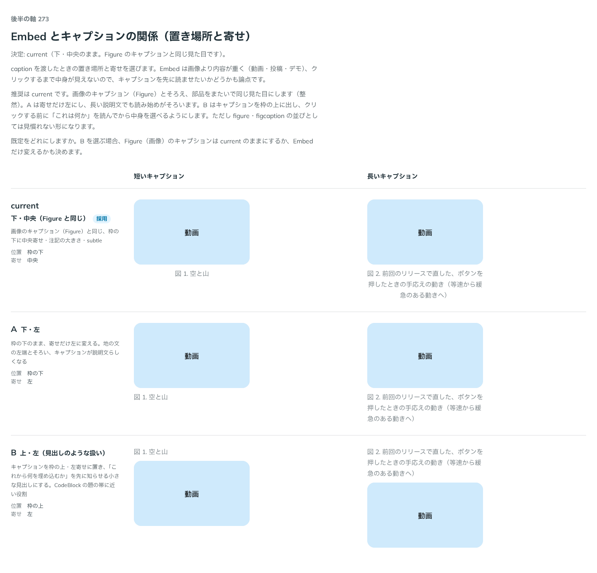

# 0267. Embed のキャプションは Figure と同じ、下・中央のまま

- ステータス: Accepted
- 日付: 2026-09-23
- ラウンド: 後半 軸 273

## 背景

`caption` を渡したときの Embed の置き場所と寄せを決めました。Embed は画像より内容が重く（動画・投稿・デモ）、クリックするまで中身が見えないので、キャプションを先に読ませたいかどうかも論点でした。

## 候補

比較は、決めた時点のコミット `9944d66` の比較のストーリー（`design/stories/axis-273-embed-caption.stories.tsx`）です。列は短いキャプション・長いキャプションです。

| 案     | 内容                                                                                           |
| ------ | ---------------------------------------------------------------------------------------------- |
| 現行版 | 下・中央（Figure と同じ）。画像のキャプションと同じ、枠の下に中央寄せ・注記の大きさ・subtle    |
| A      | 下・左。枠の下のまま、寄せだけ左に変える。地の文の左端とそろい、キャプションが説明文らしくなる |
| B      | 上・左（見出しのような扱い）。「これから何を埋め込むか」を先に知らせる小さな見出しにする       |

## 決定

**現行版（下・中央のまま。Figure のキャプションと同じ見た目）を既定にします。**

## 理由

ユーザーの返事の原文です。

> 273: 現行でお願いします。Figure に揃えるイメージです。

画像のキャプション（Figure）とそろえ、部品をまたいで同じ見た目にします（整然）。B（上・左）は figure・figcaption の並びとしては見慣れない形になるため採りませんでした。

## 却下した案と理由

- **A（下・左）**: 選ばれませんでした。長い説明文では読み始めがそろう利点がありますが、Figure と寄せが変わります
- **B（上・左）**: 選ばれませんでした。「これは何か」を先に読ませられますが、figure・figcaption の慣習から外れます

## 影響

- `src/components/embed/Embed.tsx`: `--embed-caption-align: center`・`--embed-caption-order: 0`（変更なし。既存の Figure と同じ値）
- 比較のストーリー `design/stories/axis-273-embed-caption.stories.tsx` は消しました

## 原則への反映

反映なし。既存の Figure のキャプションの見た目をそのまま使うだけで、判断を変えていません。

## 比較画像

決めた時点のコミットは `9944d66` です。`git checkout 9944d66 && pnpm storybook` で、比較のストーリー（`Design Review/273 Embed のキャプション`）を決めたときの部品のまま開けます。
